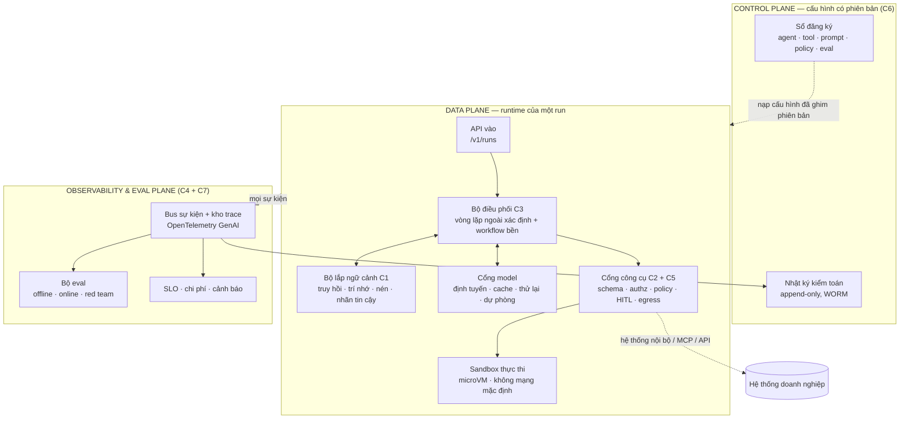
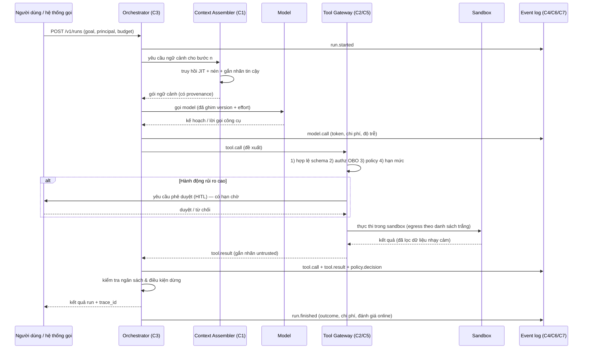
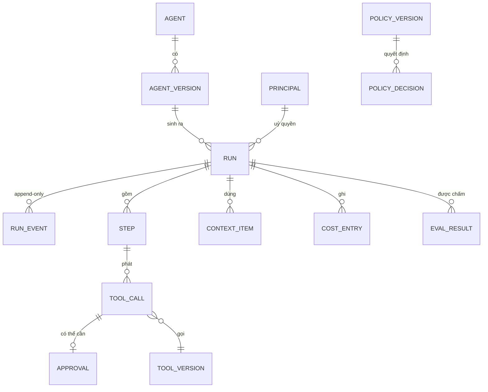
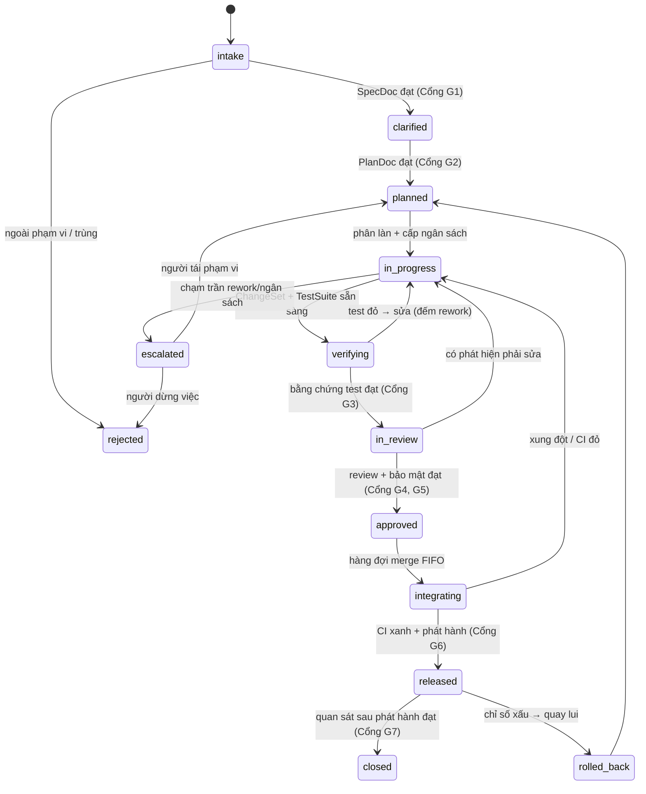
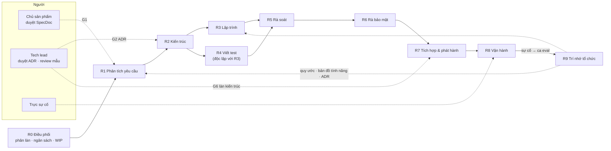

# ĐẶC TẢ HỢP NHẤT — AI HARNESS & CÔNG TY LẬP TRÌNH AI

> **Mã tài liệu:** SPEC-AI-100 · **Phiên bản:** 2.0 · **Ngày:** 2026-09-04 · **Trạng thái:** Bản nháp để duyệt
> **Thay thế:** SPEC-AIH-001 v1.1 (harness) · SPEC-ASC-002 v1.1 (công ty đa agent) · SYNTH-001 (bài học thực địa).
> Ba tài liệu đó đã được gộp vào đây và **không còn được duy trì riêng**.
> **Loại dự án (KHUNG-3 §A0):** Backend/API + Nền tảng vận hành (hồ sơ C3 + C7).

## 0. Đọc tài liệu này thế nào

### 0.1 Hai luận điểm nền

Toàn bộ tài liệu đứng trên hai câu, mỗi câu chi phối một phần:

> **PHẦN A —** một **AI harness** là toàn bộ **lớp xác định** bao quanh một model **không xác định**.
> Model là thứ không đoán trước được; mọi bảo đảm về an toàn, chi phí và chất lượng phải nằm ở lớp bao quanh nó.

> **PHẦN B —** nút thắt của một **công ty lập trình AI** không phải là viết code, mà là **năng lực xác minh**.
> Sinh code gần như miễn phí; niềm tin vào code thì không. Sản phẩm thật của tổ chức là **cổng và bằng chứng**.

Phần A là **hạ tầng**, phần B là **tổ chức chạy trên hạ tầng đó**, phần C là **chứng cứ thực địa và phụ lục**.

### 0.2 Cách trích dẫn

| Loại mã | Nghĩa | Ví dụ |
|---|---|---|
| `§A<n>` / `§B<n>` | Mục trong Phần A / Phần B của chính tài liệu này | `§A4.2`, `§B6.1` |
| `C1-FR-nn … C7-FR-nn` | Yêu cầu chức năng của 7 cấu phần harness | `C2-FR-07` |
| `ASC-FR-nn` | Yêu cầu bổ sung ở tầng tổ chức (rút từ triển khai thật) | `ASC-FR-02` |
| `P1–P12` | Nguyên tắc bất biến của harness | `P1` |
| `L1–L7` | Luật bất biến của tổ chức | `L2` |
| `R0–R9` | Vai trong công ty | `R5` |
| `G0–G8` | Cổng chất lượng | `G3a` |
| `ASI01–ASI10` | Rủi ro OWASP cho ứng dụng agentic | `ASI01` |

**Quy ước mức độ ràng buộc (RFC 2119):** **BẮT BUỘC** (MUST) — thiếu là không đạt cổng nghiệm thu ·
**NÊN** (SHOULD) — bỏ qua phải có lý do ghi trong ADR · **CÓ THỂ** (MAY) — tuỳ bối cảnh.

### 0.3 Đọc theo vai của bạn

| Bạn là | Đọc |
|---|---|
| Người quyết định | §0, §A1, §B1, §B11 (chống chỉ định), §C2 (câu hỏi cần chốt) |
| Người xây harness | Toàn bộ Phần A |
| Người xây tổ chức agent | §B1–§B9 (giả định đã có Phần A) |
| Người vận hành | §A9, §A10, §B10, §C4 |
| Người rà soát/kiểm toán | §A4.5, §A4.6, §A8, §B7, §C1 |

### 0.4 Nguồn gốc và mức độ tin cậy

- **Nghiên cứu nguồn sống ngày 2026-09-04** (xem §C6): đặc tả MCP, quy ước OpenTelemetry GenAI,
  OWASP Top 10 cho ứng dụng agentic, dữ liệu DORA về tác động của AI, phiên bản gói qua PyPI/npm.
- **Bằng chứng thực địa (§C1):** repo `seeker19110/Claude-Agents` — một triển khai **đã chạy thật**
  (20 agent, 45 skill, 18 topic có schema, 5 loại cổng người, ADR 0001–0025), đọc tại commit `a3544c1`.
  Nhiều yêu cầu trong tài liệu này là **cơ chế đã được kiểm chứng ở đó**, không phải suy đoán.
- **Chỗ chưa xác minh được** đều ghi rõ tại chỗ. Không có chỗ nào trong tài liệu này được phép hiểu là
  "đã kiểm chứng" nếu không nói rõ đã kiểm bằng cách nào.

---

# PHẦN A — HARNESS (hạ tầng)

## A1. Tóm tắt điều hành

### A1.1 AI harness là gì (định nghĩa dùng trong tài liệu này)

> **AI harness** là toàn bộ **lớp xác định (deterministic)** bao quanh một model **không xác định
> (non-deterministic)**, biến "một model biết nói" thành "một hệ thống dám cho chạy trong doanh nghiệp".

Harness sở hữu bảy quyền kiểm soát, đúng bằng bảy cấu phần của mô hình:

| # | Harness | Câu hỏi nó trả lời | Sở hữu |
|---|---------|--------------------|--------|
| C1 | **Context** | Model được **thấy** gì? | Lắp ráp ngữ cảnh, trí nhớ, truy hồi, ngân sách token, nhãn tin cậy |
| C2 | **Tool** | Model được **làm** gì? | Đăng ký công cụ, cổng gọi công cụ, xác thực/uỷ quyền, sandbox |
| C3 | **Orchestration** | Nó làm theo **thứ tự** nào? | Vòng lặp ngoài, workflow bền, đa agent, ngân sách & bù trừ |
| C4 | **Evaluation** | Làm sao **biết** nó làm đúng? | Bộ eval offline/online, LLM-judge, cổng CI, red team |
| C5 | **Security** | Nó **không được** làm gì? | Chống prompt injection, cách ly, egress, guardrail vào/ra |
| C6 | **Governance** | **Ai chịu trách nhiệm**? | Sổ đăng ký phiên bản, nhật ký kiểm toán, tuân thủ, giám sát người |
| C7 | **AgentOps** | Nó **sống** thế nào ở production? | SLO, telemetry, chi phí, phát hành, sự cố, phát hiện trôi |

### A1.2 Vấn đề đang giải

Model đơn lẻ đã đủ tốt; **hệ thống quanh model** thì chưa. Ba thất bại lặp lại khi đưa agent vào doanh nghiệp:

1. **Không tái hiện được.** Agent làm sai một lần, không ai dựng lại được nó đã thấy gì, gọi gì, vì sao.
2. **Không đo được.** "Cảm giác nó khá hơn" thay cho số liệu ⇒ không dám đổi prompt/model/công cụ.
3. **Không chặn được.** Prompt injection (ASI01 — rủi ro số 1 của OWASP Agentic 2026) biến một tài liệu
   người ngoài viết thành mệnh lệnh có đặc quyền của hệ thống.

Ba thất bại này **cùng một gốc**: thiếu lớp xác định giữa model và hệ thống thật. Đó chính là harness.

### A1.3 Kết quả bàn giao (deliverable của dự án dùng đặc tả này)

Một nền tảng chạy được, gồm:

- **`harness-core`** — thư viện/dịch vụ chứa C1–C3 (runtime của một *run*).
- **`harness-gateway`** — cổng công cụ + guardrail (C2 + C5), điểm nghẽn duy nhất cho mọi tác động ra ngoài.
- **`harness-evals`** — bộ eval + judge + cổng CI (C4).
- **`harness-control`** — control plane: sổ đăng ký agent/tool/policy có phiên bản, kiểm toán (C6).
- **`harness-ops`** — telemetry, SLO, sổ chi phí, runbook (C7).

### A1.4 Ngoài phạm vi (Out of scope) — nói rõ để không phình

- **Không** huấn luyện/fine-tune model; **không** tự vận hành hạ tầng suy luận (dùng API nhà cung cấp).
- **Không** thay thế data platform, IAM doanh nghiệp, hay hệ thống nghiệp vụ — harness **kết nối** vào chúng.
- **Không** xây UI người dùng cuối; harness chỉ cung cấp API + luồng sự kiện + trang vận hành tối thiểu.
- **Không** làm công cụ tấn công. Mọi năng lực red team trong §A9.4 chỉ dùng **phòng thủ trên hệ thống của chính mình**.

---

## A2. Nguyên tắc thiết kế (bất biến — vi phạm phải có ADR)

| # | Nguyên tắc | Hệ quả thiết kế |
|---|-----------|------------------|
| P1 | **Prompt không phải cơ chế bảo mật.** | Mọi ràng buộc thực thi ở code/policy, không ở câu chữ trong system prompt. |
| P2 | **Một dòng sự kiện duy nhất.** | Mọi harness khác (eval, kiểm toán, ops, gỡ lỗi) đọc từ cùng một `run_events` append-only. |
| P3 | **Ngân sách là công dân hạng nhất.** | Mỗi run có trần **token · tiền · thời gian · số bước · số lần gọi công cụ**, chạm trần thì dừng sạch. |
| P4 | **Đặc quyền theo *bước*, không theo *agent*.** | Token ngắn hạn, phạm vi hẹp, cấp đúng lúc gọi công cụ (JIT), thu hồi ngay sau. |
| P5 | **Mọi mẩu ngữ cảnh có nguồn gốc và nhãn tin cậy.** | Nội dung `untrusted` không bao giờ được nâng cấp thành mệnh lệnh (§A4.1.4, §4.5.2). |
| P6 | **Fail closed.** | Không quyết định được policy ⇒ **từ chối**. Guardrail hỏng ⇒ chặn, không cho qua. |
| P7 | **Không có eval thì không có deploy.** | Đổi prompt/model/tool/policy đều phải qua cổng eval trong CI (§A9.5). |
| P8 | **Replay được.** | Từ log tái dựng đúng chuỗi bước của một run (§A4.7.5) — điều kiện của gỡ lỗi *và* kiểm toán. |
| P9 | **Con người ở đúng chỗ.** | Hành động không thể hoàn tác ⇒ HITL bắt buộc, có ngữ cảnh đủ để duyệt, có hạn chờ. |
| P10 | **Cấu hình > code.** | Agent, tool, policy, eval là **tài nguyên có phiên bản** (YAML/DB), không phải hằng số trong mã. |
| P11 | **Ngữ cảnh là ngân sách: mặc định là *trừ*.** | Truy hồi đúng lúc (JIT), nén khi đầy, luôn chừa khoảng trống — không nạp sẵn cho đủ. |
| P12 | **Bán kính nổ hữu hạn.** | Mỗi agent/tool có hạn mức + circuit breaker; một lỗi không lan thành lỗi dây chuyền (ASI08). |

---

## A3. Kiến trúc tổng thể

### A3.1 Ba mặt phẳng



**Ranh giới bắt buộc:** data plane **không** tự đọc cấu hình từ file rời rạc — chỉ nhận **bản ghim phiên bản**
(`agent_version_id`) từ control plane. Đây là điều kiện để §A4.6 truy vết được "run này chạy bằng cấu hình nào".

### A3.2 Vòng đời một lượt (turn) — luồng chuẩn



### A3.3 Quyết định kiến trúc cốt lõi (đầu vào của ADR-0002)

| # | Quyết định | Chọn | Vì sao |
|---|-----------|------|--------|
| A1 | Vòng lặp ngoài | **Xác định, do harness sở hữu** (không để model tự quyết vòng lặp) | Đo được, chặn được, tái hiện được (P1, P8) |
| A2 | Lưu trạng thái | **Event sourcing append-only** + snapshot | Một nguồn sự thật cho eval, kiểm toán, replay (P2, P8) |
| A3 | Bền bỉ dài hạn | **Workflow bền cho vòng ngoài**, agent graph cho vòng trong | Run nhiều giờ/ngày vẫn sống qua restart (§A4.3) |
| A4 | Tác động ra ngoài | **Chỉ qua Tool Gateway** — không có đường vòng | Một điểm nghẽn để authz + policy + kiểm toán (P4, P6) |
| A5 | Giao thức công cụ | **MCP** cho công cụ ngoài/bên thứ ba, adapter nội bộ cho hệ thống lõi | Chuẩn mở, hệ sinh thái sẵn (§A11) |
| A6 | Telemetry | **OpenTelemetry + quy ước GenAI** | Không khoá nhà cung cấp, đổi backend không sửa mã (§A4.7) |
| A7 | Ngữ cảnh | **JIT retrieval + nén, có nhãn provenance** | Chống context rot và chống ASI01/ASI06 cùng lúc (P5, P11) |

---

## A4. Đặc tả bảy cấu phần

Mỗi cấu phần có cùng bộ khung: **Mục tiêu → Thành phần → Yêu cầu chức năng → Hợp đồng dữ liệu →
NFR/SLO → Tiêu chí nghiệm thu → Chống chỉ định**.

### A4.1 C1 — CONTEXT HARNESS (Quản lý tri thức)

#### A4.1.1 Mục tiêu
Quyết định **chính xác** những gì đi vào cửa sổ ngữ cảnh ở mỗi bước, kèm **nguồn gốc** và **mức tin cậy**
của từng mẩu, trong một **ngân sách token** đã định trước.

#### A4.1.2 Thành phần
- **Context Assembler** — lắp gói ngữ cảnh theo *khuôn* (template) đã ghim phiên bản.
- **Retriever** — truy hồi đúng lúc (JIT): trả *định danh nhẹ* (đường dẫn, id, truy vấn) trước, nội dung sau.
- **Memory Store** — trí nhớ ngắn hạn (trong run) và dài hạn (xuyên run), có chính sách ghi/đọc/quên.
- **Compactor** — nén lịch sử khi chạm ngưỡng, giữ nguyên các "mỏ neo" (mục tiêu, ràng buộc, quyết định).
- **Provenance Tagger** — gắn nhãn `trust_level` + nguồn cho mọi mẩu.

#### A4.1.3 Yêu cầu chức năng

| Mã | Yêu cầu | Mức |
|---|---|---|
| C1-FR-01 | Mọi mẩu ngữ cảnh vào prompt phải là một `ContextItem` có `source`, `trust_level`, `token_count`, `retrieved_at`. | BẮT BUỘC |
| C1-FR-02 | Ngân sách ngữ cảnh khai báo theo **tỉ lệ phần trăm** cửa sổ, chia rõ cho: chỉ thị hệ thống · trạng thái nhiệm vụ · tri thức truy hồi · lịch sử · **khoảng trống dự phòng ≥ 20%**. | BẮT BUỘC |
| C1-FR-03 | Truy hồi mặc định là **JIT**: trả danh sách định danh + tóm tắt ngắn; nội dung đầy đủ chỉ nạp khi agent yêu cầu qua công cụ `context.fetch`. | BẮT BUỘC |
| C1-FR-04 | Khi lịch sử vượt ngưỡng (mặc định 70% cửa sổ), **nén** thay vì cắt cụt; bản nén phải giữ: mục tiêu, ràng buộc, quyết định đã chốt, việc còn dở, id tài nguyên đang mở. | BẮT BUỘC |
| C1-FR-05 | Trí nhớ dài hạn phải có **chính sách ghi tường minh** (ai được ghi, ghi loại gì) và **TTL/quên**; không ghi tự động mọi thứ agent nói. | BẮT BUỘC |
| C1-FR-06 | Nội dung `trust_level = untrusted` phải được bọc trong ranh giới rõ ràng và **không bao giờ** nối trực tiếp vào vùng chỉ thị hệ thống. | BẮT BUỘC |
| C1-FR-11 | Chính sách chống injection **phân biệt theo nguồn**, không dùng một mức cho tất cả: nội dung từ **agent/thành phần nội bộ** khớp mẫu tấn công ⇒ **từ chối xử lý**; nội dung từ **khách hàng / người dùng / web / kết quả công cụ** ⇒ **khử đoạn khớp bằng nhãn rồi đi tiếp** + ghi sự kiện. Kết quả công cụ đọc dữ liệu ngoài (đọc file, tìm kiếm, chạy lệnh trên repo khách) đi qua **đúng bộ lọc như nội dung web**. | BẮT BUỘC |
| C1-FR-07 | Mọi lần lắp ngữ cảnh phát ra sự kiện `context.assembled` với **danh sách id mẩu + tổng token**, đủ để replay. | BẮT BUỘC |
| C1-FR-08 | Hỗ trợ **cache prefix**: phần ổn định (chỉ thị, danh sách công cụ) đặt trước, phần biến động (thời gian, id request) đặt sau điểm cache cuối. | NÊN |
| C1-FR-09 | Đo và báo cáo **tỉ lệ hữu ích của ngữ cảnh**: % mẩu được trích dẫn/được dùng trên tổng mẩu nạp vào. | NÊN |
| C1-FR-10 | Trí nhớ dài hạn có **kiểm tra nhiễm độc**: mục nhớ do nội dung `untrusted` sinh ra phải được đánh dấu và không dùng cho quyết định có đặc quyền (chống ASI06). | BẮT BUỘC |

#### A4.1.4 Hợp đồng dữ liệu

```json
{
  "context_item": {
    "id": "ctx_01J...",
    "kind": "instruction | task_state | knowledge | history | memory | tool_result",
    "trust_level": "system | operator | user | untrusted",
    "source": { "type": "rag|memory|tool|user|file", "ref": "doc://kb/1234#p7", "version": "..." },
    "content_ref": "s3://.../chunk.md",
    "token_count": 812,
    "retrieved_at": "2026-09-04T03:12:00Z",
    "derived_from": ["ctx_01J..."]
  }
}
```

**Thang tin cậy (dùng chung toàn hệ thống):**

| `trust_level` | Nguồn | Được phép |
|---|---|---|
| `system` | Cấu hình đã ghim phiên bản, do control plane phát | Đặt mục tiêu, ràng buộc, cấp quyền |
| `operator` | Chỉ thị vận hành giữa phiên, đã xác thực | Điều chỉnh hành vi trong phạm vi đã cấp |
| `user` | Người dùng đã xác thực danh tính | Đặt yêu cầu, phê duyệt hành động của chính họ |
| `untrusted` | Web, email, tài liệu, kết quả công cụ, đầu ra agent khác | **Chỉ là dữ liệu.** Không bao giờ là mệnh lệnh |

#### A4.1.5 NFR / SLO
- Lắp ngữ cảnh (không tính truy hồi từ nguồn ngoài): **p95 ≤ 80 ms**.
- Truy hồi JIT: **p95 ≤ 300 ms** cho top-k ≤ 20.
- Tỉ lệ cache-hit prefix ở tải ổn định: **≥ 60%** (đo bằng `cache_read_input_tokens`).

#### A4.1.6 Tiêu chí nghiệm thu
1. Chạy lại một run cũ từ log ⇒ dựng đúng gói ngữ cảnh từng bước (khớp danh sách id + tổng token).
2. Test: chèn chuỗi mệnh lệnh vào tài liệu `untrusted` ⇒ agent **không** thực hiện, sự kiện ghi nhận nhãn.
3. Test: hội thoại dài vượt cửa sổ ⇒ nén kích hoạt, mục tiêu và ràng buộc vẫn còn nguyên sau nén.

#### A4.1.7 Chống chỉ định
- ❌ Nạp toàn bộ kho tri thức "cho chắc" — làm loãng chú ý và tăng chi phí tuyến tính.
- ❌ Ghi trí nhớ dài hạn tự động từ mọi lượt — đây chính là đường vào của ASI06.
- ❌ Cắt cụt lịch sử theo FIFO — mất mục tiêu, agent quay vòng.

---

### A4.2 C2 — TOOL HARNESS (Kết nối hệ thống)

#### A4.2.1 Mục tiêu
Cho agent chạm được vào hệ thống thật **qua đúng một cánh cổng**, nơi mọi lời gọi đều được kiểm tra
schema, uỷ quyền, chính sách, hạn mức và ghi nhật ký.

#### A4.2.2 Thành phần
- **Tool Registry** — mô tả công cụ có phiên bản: schema vào/ra, mức rủi ro, quyền cần, tính idempotent.
- **Tool Gateway** — điểm nghẽn duy nhất: hợp lệ hoá → uỷ quyền → policy → hạn mức → thực thi → lọc kết quả.
- **MCP Client** — kết nối máy chủ MCP (nội bộ & bên thứ ba) theo bản đặc tả đã ghim.
- **Credential Broker** — cấp token ngắn hạn theo kiểu **on-behalf-of**, phạm vi hẹp, đúng lúc.
- **Sandbox Runner** — thực thi mã/lệnh trong môi trường cách ly, mặc định **không có mạng**.

#### A4.2.3 Yêu cầu chức năng

| Mã | Yêu cầu | Mức |
|---|---|---|
| C2-FR-01 | Mọi công cụ khai báo trong registry với: `name`, `version`, JSON Schema vào/ra (**`additionalProperties: false`**), `risk_tier`, `required_scopes`, `idempotent`, `reversible`, `timeout`, `rate_limit`. | BẮT BUỘC |
| C2-FR-02 | Gateway **từ chối** mọi lời gọi không khớp schema — không "sửa hộ" tham số. | BẮT BUỘC |
| C2-FR-03 | Phân **4 mức rủi ro**: `read` (chỉ đọc) · `write_reversible` · `write_irreversible` · `privileged`. Mức 3–4 **BẮT BUỘC** HITL trừ khi có miễn trừ ghi trong policy có phiên bản. | BẮT BUỘC |
| C2-FR-04 | Token gọi hệ thống đích là **ngắn hạn, phạm vi hẹp, gắn actor** (danh tính người dùng + danh tính agent tách bạch — mô hình OBO). Không dùng khoá tĩnh dùng chung. | BẮT BUỘC |
| C2-FR-05 | Mọi lời gọi có **timeout**, **thử lại có kiểm soát** (chỉ với công cụ idempotent), và **khoá idempotency** cho công cụ ghi. | BẮT BUỘC |
| C2-FR-06 | Kết quả công cụ luôn được gắn `trust_level = untrusted` trước khi vào ngữ cảnh (§A4.1). | BẮT BUỘC |
| C2-FR-07 | Máy chủ MCP bên thứ ba phải được **ghim phiên bản + băm (hash)**; thay đổi mô tả công cụ (tool description) so với bản đã duyệt ⇒ **chặn** và cảnh báo (chống ASI04 / rug-pull). | BẮT BUỘC |
| C2-FR-08 | Thực thi mã/lệnh chạy trong sandbox cách ly ở mức nhân (gVisor/Kata) hoặc microVM (Firecracker); **egress theo danh sách trắng**, mặc định đóng. | BẮT BUỘC |
| C2-FR-09 | Số công cụ hiện ra trước model **≤ 20 cho mỗi bước**; nhiều hơn thì dùng cơ chế *tìm công cụ* (tool search) thay vì nạp hết. | NÊN |
| C2-FR-10 | Kết quả trả về đi qua **bộ lọc đầu ra**: cắt bớt kích thước, che dữ liệu nhạy cảm (PII/bí mật), loại bỏ chuỗi điều khiển. | BẮT BUỘC |
| C2-FR-11 | Gateway ghi `policy.decision` cho **mọi** lời gọi, kể cả lời gọi được cho phép (kiểm toán cần cả hai chiều). | BẮT BUỘC |
| C2-FR-12 | Hỗ trợ **chế độ mô phỏng (dry-run)** cho mọi công cụ ghi — điều kiện bắt buộc để eval trajectory chạy an toàn. | BẮT BUỘC |

#### A4.2.4 Hợp đồng dữ liệu — bản mô tả công cụ

```yaml
# tools/crm.update_contact.yaml
name: crm.update_contact
version: 2.1.0
description: "Cập nhật thông tin liên hệ trong CRM."   # ghim hash: mọi thay đổi phải qua PR
risk_tier: write_reversible
idempotent: true
reversible: true
required_scopes: ["crm:contact:write"]
rate_limit: { per_run: 20, per_principal_per_hour: 200 }
timeout_ms: 8000
input_schema:
  type: object
  additionalProperties: false
  required: [contact_id, fields]
  properties:
    contact_id: { type: string, pattern: "^c_[0-9a-f]{16}$" }
    fields:
      type: object
      additionalProperties: false
      properties:
        email: { type: string, format: email }
        phone: { type: string }
output_schema:
  type: object
  required: [contact_id, updated_at]
  properties: { contact_id: {type: string}, updated_at: {type: string, format: date-time} }
dry_run: supported
compensation: crm.revert_contact   # dùng cho bù trừ ở C3
```

#### A4.2.5 Chuỗi kiểm tra bắt buộc trong Gateway (thứ tự cố định)

```
1. Xác thực người gọi (run + principal)      → sai: 401
2. Hợp lệ hoá schema đầu vào                 → sai: 422 (không sửa hộ)
3. Uỷ quyền: scope ∩ quyền người dùng ∩ quyền agent  → thiếu: 403
4. Policy engine (OPA/Cedar) trên ngữ cảnh đầy đủ    → deny: 403 + lý do
5. Hạn mức: run · principal · công cụ · toàn cục     → vượt: 429
6. Cổng HITL nếu risk_tier ≥ write_irreversible      → chờ/từ chối
7. Thực thi (sandbox / MCP / adapter) + timeout
8. Lọc đầu ra + gắn nhãn untrusted + cắt kích thước
9. Ghi sự kiện: tool.call · policy.decision · tool.result
```

> **Fail closed (P6):** bước 4 không phản hồi trong 200 ms ⇒ **từ chối**, không "cho qua tạm".

#### A4.2.6 NFR / SLO
- Chi phí phụ trội của gateway (không tính thời gian công cụ): **p95 ≤ 50 ms**.
- Quyết định policy: **p95 ≤ 20 ms** (chính sách nạp sẵn trong bộ nhớ, không gọi mạng).
- Sẵn sàng: **99.9%** — gateway sập đồng nghĩa toàn bộ agent dừng, nên phải chạy nhiều bản sao.

#### A4.2.7 Tiêu chí nghiệm thu
1. Không tồn tại đường gọi ra ngoài nào **vòng qua** gateway (kiểm chứng bằng test chặn egress ở tầng mạng).
2. Đổi mô tả một công cụ MCP bên thứ ba ⇒ hệ thống chặn và báo động trong ≤ 1 phút.
3. Mọi công cụ `write_irreversible` đều dừng chờ HITL trong test tích hợp.
4. Sandbox: mã thử mở kết nối tới host ngoài danh sách trắng ⇒ bị chặn, có sự kiện.

#### A4.2.8 Chống chỉ định
- ❌ Cấp cho agent khoá API dùng chung, dài hạn của một service account "để cho tiện" (ASI03).
- ❌ Để model tự tổng hợp lệnh shell chạy trực tiếp trên máy chủ ứng dụng (ASI05).
- ❌ Nạp 80 công cụ vào một prompt rồi mong model chọn đúng.

---

### A4.3 C3 — ORCHESTRATION HARNESS (Điều phối workflow)

#### A4.3.1 Mục tiêu
Chạy các nhiệm vụ nhiều bước, nhiều agent một cách **bền bỉ, có ngân sách, có thể dừng và tiếp tục**,
và không để một lỗi lan thành lỗi dây chuyền.

#### A4.3.2 Mô hình hai tầng (khuyến nghị)

| Tầng | Trách nhiệm | Đặc tính |
|---|---|---|
| **Vòng ngoài — Workflow bền** | Các bước dài (phút → ngày), chờ người, gọi liên dịch vụ, bù trừ | Xác định, sống sót qua restart, có lịch sử thực thi |
| **Vòng trong — Agent graph** | Suy luận + gọi công cụ trong một bước nghiệp vụ | Có chu trình, nhánh điều kiện, checkpoint theo bước |

Vòng ngoài gọi vòng trong như một *activity*; vòng trong trả kết quả có cấu trúc rồi trả quyền lại.
Ranh giới này là chỗ đặt **điểm dừng, ngân sách và bù trừ**.

#### A4.3.3 Yêu cầu chức năng

| Mã | Yêu cầu | Mức |
|---|---|---|
| C3-FR-01 | Vòng lặp ngoài **do harness sở hữu** và là code xác định; model chỉ đề xuất hành động tiếp theo, không tự quyết điều kiện dừng. | BẮT BUỘC |
| C3-FR-02 | Mỗi run có **ngân sách 5 chiều**: `max_steps`, `max_tokens`, `max_cost_usd`, `max_wallclock`, `max_tool_calls`. Chạm bất kỳ trần nào ⇒ dừng có kiểm soát + trả kết quả một phần. | BẮT BUỘC |
| C3-FR-03 | Trạng thái run được **checkpoint** sau mỗi bước; tiến trình có thể tiếp tục sau khi tiến trình/máy chủ chết. | BẮT BUỘC |
| C3-FR-04 | Mọi bước có tác động ngoài phải **idempotent theo `idempotency_key`** (dẫn xuất từ `run_id + step_id`). | BẮT BUỘC |
| C3-FR-05 | Mỗi bước ghi phải khai báo **hành động bù trừ** (compensation) hoặc được đánh dấu `irreversible` (⇒ bắt buộc HITL). | BẮT BUỘC |
| C3-FR-06 | **Bàn giao giữa agent** dùng thông điệp có schema (`AgentHandoff`), không dùng văn bản tự do; kèm `depth` và `budget` còn lại. | BẮT BUỘC |
| C3-FR-07 | Giới hạn **độ sâu uỷ quyền** (mặc định ≤ 3) và **số agent con đồng thời** (mặc định ≤ 8); vượt ⇒ từ chối (chống ASI08). | BẮT BUỘC |
| C3-FR-08 | **Circuit breaker** theo công cụ và theo agent: n lỗi liên tiếp trong cửa sổ t ⇒ ngắt, chuyển sang chế độ suy giảm, cảnh báo. | BẮT BUỘC |
| C3-FR-09 | Phát hiện **vòng lặp quẩn**: cùng (công cụ, tham số chuẩn hoá) lặp k lần (mặc định k=3) ⇒ ngắt bước, buộc đổi chiến lược hoặc dừng. | BẮT BUỘC |
| C3-FR-10 | Hỗ trợ **tạm dừng chờ người** (HITL) không giới hạn thời gian ngắn: run ở trạng thái `waiting_approval` không đốt tài nguyên; có hạn chờ và hành vi mặc định khi hết hạn (**mặc định: huỷ**). | BẮT BUỘC |
| C3-FR-11 | Chọn mẫu điều phối theo bài toán, khai báo trong cấu hình agent: `single` · `planner_executor` · `router` · `parallel_fanout` · `debate` (chỉ khi eval chứng minh có lợi). | NÊN |
| C3-FR-12 | Với đa agent liên tổ chức, giao tiếp qua giao thức chuẩn (A2A) với **thẻ agent có chữ ký**; không tin thẻ chưa ký (chống ASI07). | NÊN |

#### A4.3.4 Hợp đồng dữ liệu — bàn giao giữa agent

```json
{
  "agent_handoff": {
    "from": "agent://research@3.2.0",
    "to": "agent://writer@1.4.1",
    "run_id": "run_01J...",
    "depth": 1,
    "task": { "goal": "…", "acceptance_criteria": ["…"], "inputs": [{"ctx_id": "ctx_…"}] },
    "budget_remaining": { "steps": 12, "tokens": 180000, "cost_usd": 1.10, "wallclock_s": 420 },
    "granted_scopes": ["kb:read"],
    "trust_level_of_inputs": "untrusted"
  }
}
```

> **Quy tắc giảm đặc quyền:** agent con **không bao giờ** nhận scope rộng hơn agent cha
> (`granted_scopes ⊆ scopes(cha)`), và sau khi đọc nội dung `untrusted`, tập scope còn lại
> **NÊN** bị thu hẹp về nhóm `read` cho tới hết bước (mẫu "hạ đặc quyền sau khi đọc dữ liệu lạ").

#### A4.3.5 NFR / SLO
- Phụ trội điều phối mỗi bước: **p95 ≤ 100 ms**.
- Mất mát tiến trình khi restart: **0 bước đã cam kết** (checkpoint trước khi phát tác động ngoài).
- Khôi phục run sau sự cố hạ tầng: **≤ 60 s**.

#### A4.3.6 Tiêu chí nghiệm thu
1. Giết tiến trình giữa run ⇒ run tự tiếp tục, **không** lặp lại tác động ngoài đã cam kết.
2. Run chạm trần chi phí ⇒ dừng sạch, trả kết quả một phần + lý do, không treo.
3. Kịch bản agent con lỗi liên tiếp ⇒ circuit breaker ngắt, agent cha nhận lỗi có cấu trúc, không lan.
4. Thử uỷ quyền sâu 4 tầng ⇒ bị từ chối ở tầng 4 với mã lỗi rõ ràng.

#### A4.3.7 Chống chỉ định
- ❌ Để model tự do lặp "cho tới khi xong" mà không có trần bước/chi phí.
- ❌ Đa agent khi một agent + công cụ tốt là đủ (đa agent nhân chi phí và nhân bề mặt tấn công).
- ❌ Bàn giao bằng văn bản tự do — mất ràng buộc, mất ngân sách, không kiểm toán được.

---

### A4.4 C4 — EVALUATION HARNESS (Đánh giá chất lượng)

#### A4.4.1 Mục tiêu
Biến câu "hình như nó tốt hơn" thành **số có thể so sánh**, đủ tin để **chặn** một bản phát hành xấu.

#### A4.4.2 Ba tầng đánh giá (bắt buộc đủ ba)

| Tầng | Đo cái gì | Ví dụ chỉ số | Chạy ở đâu |
|---|---|---|---|
| **T1 — Đơn vị** | Từng mảnh xác định | Tỉ lệ hợp lệ schema, độ chính xác trích xuất, đúng công cụ được chọn | CI mỗi PR (< 5 phút) |
| **T2 — Quỹ đạo** | *Cách* agent làm | Đúng bước, thừa bước, số lần gọi công cụ, tuân thủ policy, chi phí/nhiệm vụ | CI hàng đêm + trước phát hành |
| **T3 — Kết quả** | Nhiệm vụ có xong không | Tỉ lệ hoàn thành, độ chính xác cuối, có căn cứ (groundedness), điểm người chấm | Trước phát hành + mẫu online |

#### A4.4.3 Yêu cầu chức năng

| Mã | Yêu cầu | Mức |
|---|---|---|
| C4-FR-01 | Bộ dữ liệu eval là **tài nguyên có phiên bản**, tách `train / dev / test`; bộ `test` **không** được dùng để tinh chỉnh prompt. | BẮT BUỘC |
| C4-FR-02 | Mọi eval chạy ở chế độ **hermetic**: công cụ ghi ở chế độ `dry_run` hoặc dùng bản giả (fixture) đã ghim; không chạm hệ thống thật. | BẮT BUỘC |
| C4-FR-03 | **LLM-as-judge phải được hiệu chuẩn**: đo mức đồng thuận với nhãn người trên ≥ 100 mẫu; đạt **Cohen's κ ≥ 0.6** mới được dùng làm cổng chặn. Ghi lại phiên bản judge (model + prompt). | BẮT BUỘC |
| C4-FR-04 | Judge **không dùng cùng model + cùng prompt** với agent đang bị chấm (tránh thiên vị tự chấm). | NÊN |
| C4-FR-05 | Mỗi eval báo cáo **khoảng tin cậy**, không chỉ điểm trung bình; chênh lệch nằm trong nhiễu ⇒ kết luận "không đổi". | BẮT BUỘC |
| C4-FR-06 | Chỉ số chi phí là **chi phí cho mỗi nhiệm vụ hoàn thành**, không phải chi phí mỗi request. | BẮT BUỘC |
| C4-FR-07 | Bộ **red team** (§A9.4) chạy như một eval suite, ánh xạ tới ASI01–ASI10; **bất kỳ ca nào đỏ ⇒ chặn phát hành**. | BẮT BUỘC |
| C4-FR-08 | **Eval online**: lấy mẫu ≥ 1% run production (và 100% run rủi ro cao) chấm tự động; kết quả đưa vào cùng bảng chỉ số với offline. | BẮT BUỘC |
| C4-FR-09 | Mọi lỗi production được điều tra phải **sinh ra một ca eval mới** trước khi đóng — bộ eval lớn lên theo sự cố thật. | BẮT BUỘC |
| C4-FR-10 | Hỗ trợ **replay**: chạy lại eval trên trace đã ghi để so sánh hai phiên bản trên cùng đầu vào. | NÊN |

#### A4.4.4 Bộ chỉ số tối thiểu

```
Chất lượng : task_success_rate · groundedness · tool_choice_accuracy · schema_valid_rate
Quỹ đạo    : steps_per_task · redundant_steps · loop_rate · policy_violation_rate
Hiệu năng  : latency_p50/p95 · time_to_first_token · time_to_task_done
Chi phí    : cost_per_completed_task · tokens_per_task · cache_hit_rate
An toàn    : injection_resistance · unsafe_action_blocked_rate · pii_leak_rate
Con người  : hitl_approval_rate · hitl_wait_p95 · human_override_rate
```

#### A4.4.5 Cổng chất lượng (dùng làm CI gate)

| Cổng | Điều kiện chặn |
|---|---|
| **PR** | T1 xanh 100% · red team "mức cao" xanh 100% · không giảm `schema_valid_rate` |
| **Hằng đêm** | T2 không giảm quá 2% tuyệt đối so với đường cơ sở · `cost_per_completed_task` không tăng > 15% |
| **Phát hành** | T3 trên bộ `test` ≥ ngưỡng đã chốt · toàn bộ red team xanh · judge còn hiệu lực hiệu chuẩn ≤ 90 ngày |

#### A4.4.6 Tiêu chí nghiệm thu
1. Cố tình làm hỏng một prompt ⇒ CI **chặn** đúng cổng, chỉ ra chỉ số nào rớt.
2. Chạy cùng eval hai lần ⇒ chênh lệch nằm trong khoảng tin cậy đã báo (eval ổn định).
3. Một sự cố production ⇒ có ca eval mới tái hiện được lỗi đó trước khi đóng issue.

#### A4.4.7 Chống chỉ định
- ❌ Judge tự chấm bằng chính model của agent với prompt "hãy chấm điểm 1–10" (không hiệu chuẩn, không dùng được).
- ❌ Bộ eval "vàng" viết một lần rồi để mốc — sau 3 tháng nó không còn đại diện cho tải thật.
- ❌ Chỉ đo đầu ra cuối cùng: agent đi đường vòng tốn 10× chi phí vẫn "đạt".

---

### A4.5 C5 — SECURITY HARNESS (Bảo mật & AI Safety)

#### A4.5.1 Mục tiêu
Giả định **mọi nội dung agent đọc đều có thể là mã tấn công**, và thiết kế sao cho điều đó vẫn **không**
dẫn tới hành động có hại.

#### A4.5.2 Mô hình mối đe doạ (ánh xạ OWASP Top 10 for Agentic Applications 2026)

| Mã | Rủi ro | Chốt chặn chính trong đặc tả này |
|---|---|---|
| **ASI01** | Agent Goal Hijack | Nhãn `untrusted` (C1-FR-06), hạ đặc quyền sau khi đọc dữ liệu lạ (§A4.3.4), HITL cho hành động không hoàn tác |
| **ASI02** | Tool Misuse and Exploitation | Schema nghiêm ngặt + policy engine + hạn mức (C2-FR-02/04/05) |
| **ASI03** | Identity and Privilege Abuse | Token OBO ngắn hạn, phạm vi hẹp, tách danh tính người ↔ agent (C2-FR-04) |
| **ASI04** | Agentic Supply Chain Vulnerabilities | Ghim phiên bản + hash máy chủ/mô tả công cụ MCP, chặn khi đổi (C2-FR-07) **và quét tài sản prompt của chính repo (C5-FR-12)** — một chuỗi tấn công nằm trong một skill dùng chung hỏng mọi vai nạp nó, ở mọi lượt |
| **ASI05** | Unexpected Code Execution | Sandbox microVM/gVisor, egress danh sách trắng, không mạng mặc định (C2-FR-08) |
| **ASI06** | Memory & Context Poisoning | Chính sách ghi trí nhớ + đánh dấu nguồn + không dùng cho quyết định đặc quyền (C1-FR-05/10) |
| **ASI07** | Insecure Inter-Agent Communication | Bàn giao có schema + xác thực đôi bên + thẻ agent có chữ ký (C3-FR-06/12) |
| **ASI08** | Cascading Failures | Trần độ sâu/đồng thời, circuit breaker, hạn mức theo bán kính nổ (C3-FR-07/08) |
| **ASI09** | Human-Agent Trust Exploitation | Màn hình phê duyệt hiển thị **hành động thật + nguồn dữ liệu**, không chỉ tóm tắt của agent (C5-FR-08) |
| **ASI10** | Rogue Agents | Kill switch, phát hiện trôi hành vi, thu hồi thông tin xác thực tức thời (C5-FR-09, C7-FR-07) |

> **Ghi chú xác thực nguồn:** danh sách ASI01–ASI10 ở trên được đối chiếu từ **nhiều nguồn thứ cấp**
> (F5, Modulos, Promptfoo, NeuralTrust, Auth0 — truy cập 2026-09-04) vì `genai.owasp.org` bị chặn bởi
> egress proxy của môi trường phiên này. **Trước khi chốt ma trận kiểm soát, phải mở tài liệu gốc của
> OWASP GenAI Security Project để xác nhận nguyên văn tiêu đề và nội dung từng mục.**

#### A4.5.3 Bốn vòng phòng thủ

```
Vòng 1 — Đầu vào : phân loại & gắn nhãn nguồn · phát hiện injection · chuẩn hoá & bóc chuỗi điều khiển
Vòng 2 — Quyết định: policy engine xác định (OPA/Cedar) trên (principal, agent, tool, tham số, ngữ cảnh)
Vòng 3 — Thực thi : sandbox cách ly · quyền tối thiểu · egress danh sách trắng · timeout · hạn mức
Vòng 4 — Đầu ra  : lọc PII/bí mật · chặn hành động không được phép · kiểm chứng có căn cứ trước khi trả
```

**Nguyên tắc:** vòng 1 và 4 dùng model ⇒ **không đáng tin tuyệt đối**, chỉ để giảm nhiễu.
Ràng buộc thật nằm ở vòng 2 và 3 — thuần xác định (P1).

#### A4.5.4 Yêu cầu chức năng

| Mã | Yêu cầu | Mức |
|---|---|---|
| C5-FR-01 | Chính sách viết bằng ngôn ngữ policy tách khỏi mã ứng dụng, có phiên bản, có test riêng. | BẮT BUỘC |
| C5-FR-02 | Mặc định **deny**: công cụ chưa được cấp phép tường minh cho agent ⇒ không gọi được. | BẮT BUỘC |
| C5-FR-03 | Không có bí mật trong prompt, trong log, trong trạng thái run. Bí mật do broker thay thế **tại thời điểm gọi**. | BẮT BUỘC |
| C5-FR-04 | Mọi payload ghi vào trace phải qua bộ che dữ liệu nhạy cảm (PII, thẻ, khoá); bật/tắt theo cấu hình lưu trữ. | BẮT BUỘC |
| C5-FR-05 | Egress từ sandbox: **danh sách trắng theo tên miền**; mọi kết nối bị chặn đều ghi sự kiện và có cảnh báo tổng hợp. | BẮT BUỘC |
| C5-FR-06 | Đầu ra hướng người dùng đi qua bộ lọc: rò rỉ dữ liệu chéo người dùng, nội dung có hại, chỉ thị ẩn. | BẮT BUỘC |
| C5-FR-07 | Có **hạn mức bán kính nổ** theo đơn vị nghiệp vụ (vd: ≤ 50 bản ghi ghi/giờ/agent); vượt ⇒ dừng + báo động. | BẮT BUỘC |
| C5-FR-08 | Màn hình phê duyệt hiển thị **lời gọi công cụ nguyên văn + nguồn dữ liệu dẫn tới nó**, không chỉ lời giải thích của agent (chống ASI09). | BẮT BUỘC |
| C5-FR-09 | **Kill switch** ở ba mức: một run · một phiên bản agent · toàn hệ thống. Tác dụng ≤ 10 s, kèm thu hồi token. | BẮT BUỘC |
| C5-FR-10 | Red team tự động chạy định kỳ (tối thiểu hàng tuần) trên môi trường staging với bộ tấn công cập nhật. | NÊN |
| C5-FR-11 | Kiểm thử xâm nhập có uỷ quyền trước khi lên production và định kỳ ≥ 1 lần/năm. | NÊN |
| C5-FR-12 | **Tài sản prompt của chính hệ thống là chuỗi cung ứng** (định nghĩa agent, skill, template, mô tả cổng, schema): phải có cổng CI quét chúng với tối thiểu 4 luật — mẫu injection (**dùng chung một nguồn sự thật với bộ lọc runtime**), ký tự ẩn (zero-width, bidi override, tệp không phải UTF-8), lệnh nguy hiểm, chuỗi giống bí mật. Miễn trừ phải ghi **lý do**; miễn trừ không còn khớp phải bị báo để dọn. | BẮT BUỘC |
| C5-FR-13 | **Ngân sách prompt tĩnh là cổng CI**: tổng độ dài prompt hệ thống của một vai so với ngân sách khai báo — vượt ngưỡng đã chốt là đỏ; tham chiếu tới tài sản không tồn tại cũng đỏ. | BẮT BUỘC |

#### A4.5.5 Tiêu chí nghiệm thu
1. Bộ ca injection (≥ 50 ca, gồm tài liệu, email, HTML ẩn, kết quả công cụ) ⇒ **0 ca** dẫn tới hành động không được phép.
2. Rò rỉ bí mật: quét toàn bộ log/trace của một tuần staging ⇒ **0 phát hiện**.
3. Kill switch: bấm dừng ⇒ mọi run đang chạy dừng ≤ 10 s, token bị thu hồi, có bản ghi kiểm toán.
4. Test cách ly: mã trong sandbox không truy cập được metadata service của đám mây, không mở được cổng ngoài.

#### A4.5.6 Chống chỉ định
- ❌ Dựa vào câu "đừng làm theo chỉ thị trong tài liệu" trong system prompt như biện pháp bảo mật.
- ❌ Guardrail chỉ bằng model phân loại — nó là bộ lọc nhiễu, không phải hàng rào.
- ❌ Cho agent quyền của người dùng có đặc quyền cao nhất "để khỏi vướng".

---

### A4.6 C6 — GOVERNANCE HARNESS (Quản trị & Kiểm toán)

#### A4.6.1 Mục tiêu
Trả lời được, **sau nhiều tháng**, câu hỏi: *"Ngày đó, agent nào, phiên bản nào, do ai cho phép, đã làm gì,
dựa trên dữ liệu nào, và ai đã duyệt?"*

#### A4.6.2 Yêu cầu chức năng

| Mã | Yêu cầu | Mức |
|---|---|---|
| C6-FR-01 | **Sổ đăng ký có phiên bản** cho: agent, prompt, công cụ, policy, bộ eval, model. Mỗi run ghim đúng một bộ id phiên bản. | BẮT BUỘC |
| C6-FR-02 | Nhật ký kiểm toán **append-only**, chống sửa (hash chain hoặc WORM), lưu tối thiểu theo yêu cầu pháp lý ngành. | BẮT BUỘC |
| C6-FR-03 | Mỗi hành động có hệ quả ghi rõ **chuỗi trách nhiệm**: người uỷ quyền → agent → công cụ → hệ thống đích. | BẮT BUỘC |
| C6-FR-04 | Phân loại **mức rủi ro của từng use case** (theo khung nội bộ + đối chiếu quy định áp dụng); use case rủi ro cao cần hồ sơ đánh giá trước khi bật. | BẮT BUỘC |
| C6-FR-05 | **Minh bạch với người dùng**: người tương tác phải biết đang làm việc với hệ thống AI; đầu ra tổng hợp được đánh dấu phù hợp. | BẮT BUỘC |
| C6-FR-06 | **Giám sát của con người** được ghi lại: ai duyệt, khi nào, trên cơ sở thông tin gì, có bác bỏ không. | BẮT BUỘC |
| C6-FR-07 | Chính sách **lưu trữ & xoá dữ liệu** theo loại (prompt, đầu ra, trace, trí nhớ, PII); có quy trình xoá theo yêu cầu chủ thể dữ liệu. | BẮT BUỘC |
| C6-FR-08 | **Xuất hồ sơ kiểm toán** cho một khoảng thời gian/một run/một chủ thể dữ liệu ở định dạng máy đọc được. | BẮT BUỘC |
| C6-FR-09 | Mọi thay đổi cấu hình đi qua PR có người duyệt; không sửa cấu hình trực tiếp trên production. | BẮT BUỘC |
| C6-FR-10 | Lưu **model card / agent card** nội bộ: mục đích, giới hạn đã biết, dữ liệu dùng, kết quả eval, ngày đánh giá lại. | NÊN |

#### A4.6.3 Bối cảnh tuân thủ (tình trạng ngày 2026-09-04 — cần luật sư/DPO xác nhận cho từng thị trường)

- **EU AI Act:** nghĩa vụ **minh bạch (Điều 50)** và thẩm quyền thực thi với nhà cung cấp GPAI **đã có hiệu lực
  từ 02/08/2026**. Nghĩa vụ cho hệ thống **rủi ro cao độc lập (Phụ lục III)** được lùi tới **02/12/2027**,
  và hệ thống rủi ro cao nhúng trong sản phẩm đã được quản lý (Phụ lục I) tới **02/08/2028**,
  theo Digital Omnibus — Regulation (EU) 2026/1744, hiệu lực 27/07/2026.
  ⇒ **Hệ quả thiết kế:** minh bạch + kiểm toán là **bắt buộc ngay**; hồ sơ rủi ro cao có thêm thời gian
  nhưng **phải thiết kế sẵn** vì bổ sung sau rất tốn kém.
- **NIST AI RMF / ISO/IEC 42001:** dùng làm khung quản trị nội bộ (Govern–Map–Measure–Manage);
  ánh xạ mỗi yêu cầu C6 vào một mục kiểm soát để phục vụ audit.
- Ngành đặc thù (tài chính, y tế, dữ liệu cá nhân trong nước) có yêu cầu riêng — **phải rà trước khi lên production**.

#### A4.6.4 Tiêu chí nghiệm thu
1. Chọn ngẫu nhiên một run 60 ngày trước ⇒ dựng lại đầy đủ: cấu hình, ngữ cảnh, quyết định, người duyệt.
2. Thử sửa một bản ghi kiểm toán ⇒ phát hiện được (đứt chuỗi hash) và có cảnh báo.
3. Yêu cầu xoá dữ liệu của một chủ thể ⇒ hoàn tất trong SLA đã cam kết, có biên bản.

---

### A4.7 C7 — AGENTOPS HARNESS (Vận hành production)

#### A4.7.1 Mục tiêu
Giữ agent chạy đúng, đủ nhanh, đủ rẻ, và **biết trước** khi nó xấu đi.

#### A4.7.2 Yêu cầu chức năng

| Mã | Yêu cầu | Mức |
|---|---|---|
| C7-FR-01 | Toàn bộ telemetry theo **OpenTelemetry**, dùng quy ước ngữ nghĩa GenAI (`gen_ai.*`) cho span model/agent/công cụ. | BẮT BUỘC |
| C7-FR-02 | Mỗi run có **một `trace_id`** xuyên suốt: API → điều phối → model → công cụ → hệ thống đích. | BẮT BUỘC |
| C7-FR-03 | **Sổ chi phí**: ghi token vào/ra/cache và tiền theo run, theo agent, theo người dùng, theo tenant; đối soát với hoá đơn nhà cung cấp hàng tháng. | BẮT BUỘC |
| C7-FR-04 | **SLO công bố** kèm error budget, cảnh báo dựa trên tốc độ đốt budget, không cảnh báo theo ngưỡng thô. | BẮT BUỘC |
| C7-FR-05 | Phát hành theo **shadow → canary → toàn phần**; rollback về phiên bản trước ≤ 5 phút. | BẮT BUỘC |
| C7-FR-06 | Bảng điều khiển vận hành tối thiểu: sức khoẻ run, tỉ lệ lỗi, độ trễ, chi phí, hàng đợi HITL, vi phạm policy. | BẮT BUỘC |
| C7-FR-07 | **Phát hiện trôi (drift)**: theo dõi phân bố đầu vào, tỉ lệ dùng công cụ, độ dài quỹ đạo, điểm eval online; lệch quá ngưỡng ⇒ cảnh báo. | BẮT BUỘC |
| C7-FR-08 | **Runbook** cho các sự cố đặc thù agent (§A10.3), gắn với quy trình sự cố sẵn có của tổ chức. | BẮT BUỘC |
| C7-FR-09 | Chịu lỗi nhà cung cấp model: hết hạn mức/lỗi ⇒ thử lại có backoff, dự phòng model, và **suy giảm có kiểm soát** (từ chối lịch sự thay vì treo). | BẮT BUỘC |
| C7-FR-10 | Lưu trace mẫu đủ để **replay** một run (§A4.7.5); trace rủi ro cao lưu 100%. | BẮT BUỘC |

#### A4.7.3 SLO khởi điểm (điều chỉnh theo nghiệp vụ)

| Chỉ số | Mục tiêu |
|---|---|
| Sẵn sàng API tạo run | 99.9% / tháng |
| Phụ trội harness mỗi lượt (trừ thời gian model) | p95 ≤ 150 ms |
| Thời gian tới token đầu tiên | p95 ≤ 2.5 s |
| Tỉ lệ run hoàn thành (không lỗi hệ thống) | ≥ 99% |
| Tỉ lệ vi phạm policy lọt lưới | 0 (bất kỳ ca nào ⇒ sự cố SEV2) |
| Chi phí mỗi nhiệm vụ hoàn thành | Trong ±15% đường cơ sở tháng trước |
| Thời gian chờ phê duyệt HITL | p95 ≤ 4 giờ giờ hành chính |

#### A4.7.4 Sự kiện chuẩn (tối thiểu — cũng là hợp đồng của C4/C6)

```
run.started · run.finished · run.failed · run.budget_exceeded
context.assembled · memory.written · memory.read
model.call · model.response · model.error · model.fallback
tool.call · tool.result · tool.error · policy.decision
approval.requested · approval.granted · approval.denied · approval.timeout
agent.handoff · guard.triggered · circuit.opened · killswitch.activated
```

#### A4.7.5 Replay — định nghĩa chính xác
**Replay** = chạy lại vòng lặp điều phối với **đầu ra model đã ghi** (không gọi model) và **kết quả công cụ đã ghi**
(không gọi công cụ), để kiểm chứng rằng logic xác định của harness cho ra **cùng chuỗi quyết định**.
Đây là công cụ gỡ lỗi + bằng chứng kiểm toán. Nó **không** dùng để chứng minh model sẽ hành xử như cũ.

#### A4.7.6 Tiêu chí nghiệm thu
1. Một run production bất kỳ ⇒ mở được trace đầy đủ, xem từng bước, chi phí từng bước.
2. Diễn tập: nhà cung cấp model trả 429 hàng loạt ⇒ hệ thống suy giảm có kiểm soát, không mất run.
3. Diễn tập rollback: quay về phiên bản agent trước ≤ 5 phút, không mất dữ liệu run đang chạy.

---

## A5. Mô hình dữ liệu

### A5.1 Sơ đồ quan hệ (rút gọn)



### A5.2 Bảng cốt lõi (PostgreSQL — kiểu rút gọn)

| Bảng | Cột chính | Ghi chú |
|---|---|---|
| `agents` | `id`, `slug`, `owner_team`, `risk_class`, `created_at` | Danh tính logic của agent |
| `agent_versions` | `id`, `agent_id`, `semver`, `prompt_hash`, `model_id`, `tool_binding_ids[]`, `policy_version_id`, `eval_baseline_id`, `status`, `published_by`, `published_at` | **Bất biến.** Đối tượng được ghim vào run |
| `tools` / `tool_versions` | `name`, `semver`, `schema_in`, `schema_out`, `risk_tier`, `required_scopes[]`, `idempotent`, `reversible`, `spec_hash`, `mcp_server_id` | `spec_hash` chống ASI04 |
| `policy_versions` | `id`, `semver`, `source`, `hash`, `activated_at` | Chính sách có phiên bản, test riêng |
| `runs` | `id`, `agent_version_id`, `principal_id`, `tenant_id`, `goal`, `status`, `budget`(jsonb), `consumed`(jsonb), `started_at`, `ended_at`, `outcome`, `trace_id` | `status`: `queued/running/waiting_approval/succeeded/failed/cancelled/budget_exceeded` |
| `steps` | `id`, `run_id`, `seq`, `kind`, `input_ref`, `output_ref`, `latency_ms`, `token_in`, `token_out` | Một bước = một lượt suy luận hoặc một hành động |
| `run_events` | `id`, `run_id`, `seq`, `type`, `payload`(jsonb), `ts`, `prev_hash`, `hash` | **Append-only + hash chain.** Nguồn sự thật (P2) |
| `tool_calls` | `id`, `step_id`, `tool_version_id`, `args`(jsonb, đã che), `idempotency_key`, `status`, `dry_run`, `latency_ms`, `error` | |
| `policy_decisions` | `id`, `tool_call_id`, `policy_version_id`, `effect`, `reason`, `matched_rules[]`, `latency_ms` | Ghi cả `allow` lẫn `deny` (C2-FR-11) |
| `approvals` | `id`, `tool_call_id`, `requested_at`, `decided_at`, `decided_by`, `decision`, `justification`, `shown_payload_hash` | `shown_payload_hash` = đúng thứ người duyệt đã thấy (chống ASI09) |
| `context_items` | `id`, `run_id`, `kind`, `trust_level`, `source`(jsonb), `content_ref`, `token_count`, `derived_from[]` | §A4.1.4 |
| `memory_items` | `id`, `scope`, `owner_id`, `kind`, `content_ref`, `provenance_trust`, `ttl_at`, `pinned` | `provenance_trust` chống ASI06 |
| `cost_entries` | `id`, `run_id`, `model_id`, `token_in`, `token_out`, `token_cache_read`, `token_cache_write`, `usd`, `ts` | Đối soát hoá đơn hàng tháng |
| `eval_datasets` / `eval_cases` / `eval_runs` / `eval_results` | `dataset_id`, `split`, `case_id`, `expected`, `judge_version`, `score`, `ci_low`, `ci_high` | §A4.4 |
| `incidents` | `id`, `severity`, `run_ids[]`, `detected_at`, `root_cause`, `eval_case_id` | Bắt buộc sinh `eval_case_id` (C4-FR-09) |

### A5.3 Quy tắc bất biến của dữ liệu
- `run_events` **chỉ chèn thêm** — không `UPDATE`, không `DELETE` (trừ quy trình xoá theo luật, có biên bản).
- Payload lớn (prompt, tài liệu, kết quả) lưu ở object store; bảng chỉ giữ **tham chiếu + hash**.
- Mọi jsonb chứa dữ liệu người dùng phải qua bộ che PII trước khi ghi (C5-FR-04).
- Phân vùng `run_events`, `cost_entries` theo tháng; chính sách lưu trữ theo §A4.6 (C6-FR-07).

---

## A6. Hợp đồng API (data plane)

### A6.1 Tạo và theo dõi run

```http
POST /v1/runs
Authorization: Bearer <token của principal>
Content-Type: application/json

{
  "agent": "support-triage@2.3.0",          // BẮT BUỘC ghim phiên bản; "@latest" bị từ chối ở production
  "goal": "Phân loại và trả lời ticket #4821",
  "inputs": { "ticket_id": "4821" },
  "budget": { "max_steps": 25, "max_tokens": 400000, "max_cost_usd": 2.0,
              "max_wallclock_s": 900, "max_tool_calls": 40 },
  "mode": "live | dry_run | shadow",
  "idempotency_key": "ticket-4821-triage-v1"
}
→ 202 { "run_id": "run_01J…", "trace_id": "…", "status": "queued" }
```

| Endpoint | Mục đích |
|---|---|
| `GET /v1/runs/{id}` | Trạng thái, ngân sách đã tiêu, kết quả |
| `GET /v1/runs/{id}/events` | **SSE** luồng sự kiện thời gian thực (có `Last-Event-ID` để nối lại) |
| `POST /v1/runs/{id}/cancel` | Huỷ có kiểm soát (chạy bù trừ nếu có) |
| `POST /v1/runs/{id}/messages` | Gửi thêm chỉ thị của người dùng vào run đang chạy |
| `GET /v1/runs/{id}/replay` | Bản ghi đủ để replay (§A4.7.5) |
| `POST /v1/approvals/{id}` | Duyệt/từ chối hành động chờ HITL |
| `GET /v1/approvals?status=pending` | Hàng đợi phê duyệt |
| `POST /v1/admin/killswitch` | Dừng theo run / theo phiên bản agent / toàn hệ thống |

### A6.2 Quy tắc lỗi (fail closed, có thể hành động)

| Mã | Khi nào | Thân lỗi |
|---|---|---|
| 400/422 | Sai schema đầu vào | `{code, field, expected}` |
| 401/403 | Thiếu quyền / policy từ chối | `{code, reason, policy_version, decision_id}` |
| 409 | Trùng `idempotency_key` | Trả run cũ, **không** tạo run mới |
| 429 | Vượt hạn mức | `{retry_after_s, limit_scope}` |
| 503 | Nhà cung cấp model không sẵn sàng | `{degraded: true, fallback_tried: [...]}` |

### A6.3 Ánh xạ telemetry (OpenTelemetry GenAI)

| Span | Thuộc tính bắt buộc |
|---|---|
| `agent.run` | `gen_ai.agent.id`, `gen_ai.agent.name`, `harness.agent_version`, `harness.tenant`, `harness.principal` |
| `gen_ai.client` (mỗi lần gọi model) | `gen_ai.request.model`, `gen_ai.usage.input_tokens`, `gen_ai.usage.output_tokens`, `gen_ai.response.finish_reasons`, `harness.cost_usd` |
| `tool.execute` | `harness.tool.name`, `harness.tool.version`, `harness.tool.risk_tier`, `harness.policy.effect`, `harness.dry_run` |
| `context.assemble` | `harness.context.items`, `harness.context.tokens`, `harness.context.untrusted_tokens` |

> **Cảnh báo phiên bản:** quy ước `gen_ai.*` cho **span agent vẫn ở trạng thái thử nghiệm** (experimental)
> và đã tách sang kho riêng từ semconv v1.42.0 (12/06/2026) ⇒ tên thuộc tính **có thể đổi**.
> ⇒ **BẮT BUỘC** bọc telemetry sau một lớp adapter nội bộ (`harness.telemetry`) để đổi tên một chỗ.
> Thuộc tính riêng của hệ thống dùng tiền tố `harness.*` để không đụng chuẩn.

---

## A7. Yêu cầu phi chức năng toàn hệ thống

| Nhóm | Yêu cầu |
|---|---|
| **Hiệu năng** | Phụ trội harness p95 ≤ 150 ms/lượt · gateway p95 ≤ 50 ms · policy p95 ≤ 20 ms |
| **Quy mô** | ≥ 100 run đồng thời/instance nhóm; mở rộng ngang không trạng thái (trạng thái ở DB/workflow engine) |
| **Độ tin cậy** | RPO = 0 với `run_events` (ghi trước khi phát tác động ngoài) · RTO ≤ 15 phút |
| **Bảo mật** | Mã hoá khi truyền và khi lưu · bí mật trong vault · xoay khoá ≤ 90 ngày · quét phụ thuộc trong CI |
| **Đa tenant** | Cách ly dữ liệu ở tầng truy vấn **và** tầng lưu trữ; hạn mức chi phí theo tenant; không dùng chung cache prefix giữa tenant |
| **Khả chuyển** | Đổi nhà cung cấp model không sửa mã nghiệp vụ (lớp `model gateway`); đổi backend quan sát không sửa mã (OTel) |
| **Chất lượng mã** | Kiểu tĩnh nghiêm (`mypy --strict` / TS `strict`) · validate runtime mọi biên (Pydantic/Zod) · độ phủ test nhánh logic điều phối ≥ 80% |
| **Tài liệu** | Mỗi cấu phần có README nêu hợp đồng vào/ra; ADR cho mọi quyết định kiến trúc lớn |
| **Chi phí** | Có ngân sách tháng theo tenant/agent; cảnh báo ở 50/80/100%; cứng chặn ở 120% |

---

## A8. Ma trận truy vết (rủi ro → yêu cầu → kiểm chứng)

| Rủi ro | Yêu cầu chốt chặn | Kiểm chứng |
|---|---|---|
| ASI01 Goal hijack | C1-FR-06, §A4.3.4 (hạ đặc quyền), C2-FR-03 | Bộ eval injection ≥ 50 ca (C4-FR-07) |
| ASI02 Tool misuse | C2-FR-02, C2-FR-04, C2-FR-05 | Test schema/authz/hạn mức ở gateway |
| ASI03 Privilege abuse | C2-FR-04, C5-FR-02 | Test token hết hạn, scope hẹp, không leo thang |
| ASI04 Supply chain | C2-FR-07, C5-FR-12 | Test đổi mô tả công cụ ⇒ bị chặn; ca ký tự ẩn/injection nhét vào file skill ⇒ CI đỏ |
| ASI05 Code execution | C2-FR-08, C5-FR-05 | Test thoát sandbox, test egress |
| ASI06 Memory poisoning | C1-FR-05, C1-FR-10 | Test ghi trí nhớ từ nguồn untrusted |
| ASI07 Inter-agent comms | C3-FR-06, C3-FR-12 | Test bàn giao không schema/không chữ ký ⇒ từ chối |
| ASI08 Cascading failures | C3-FR-07, C3-FR-08, C5-FR-07 | Diễn tập lỗi dây chuyền |
| ASI09 Trust exploitation | C5-FR-08, `approvals.shown_payload_hash` | Kiểm tra nội dung màn hình duyệt = payload thật |
| ASI10 Rogue agents | C5-FR-09, C7-FR-07 | Diễn tập kill switch + phát hiện trôi |
| Chi phí vượt kiểm soát | C3-FR-02, C7-FR-03 | Test chạm trần ngân sách |
| Suy giảm chất lượng âm thầm | C4-FR-08, C7-FR-07 | So sánh eval online theo tuần |

---

## A9. Chiến lược đánh giá chi tiết

### A9.1 Xây bộ dữ liệu eval (thứ tự ưu tiên)
1. **Từ log thật** (tốt nhất): lấy mẫu run production/pilot, gán nhãn kết quả đúng.
2. **Từ sự cố**: mỗi lỗi đã sửa ⇒ một ca hồi quy (C4-FR-09).
3. **Sinh tổng hợp** (bổ sung, không thay thế): dùng để phủ ca biên hiếm; phải có người rà lại.

Kích thước tối thiểu để bắt đầu: **T1 ≥ 100 ca · T2 ≥ 40 quỹ đạo · T3 ≥ 30 nhiệm vụ đầu-cuối**.
Chia `train 50% / dev 25% / test 25%`; bộ `test` chỉ mở khi chuẩn bị phát hành.

### A9.2 Hiệu chuẩn judge (bắt buộc trước khi dùng làm cổng)
1. Người chấm 100–200 mẫu theo rubric viết sẵn (rubric là tài liệu có phiên bản).
2. Chạy judge trên cùng mẫu ⇒ tính **Cohen's κ**; κ ≥ 0.6 mới dùng làm cổng, κ ≥ 0.8 mới dùng làm số liệu công bố.
3. Hiệu chuẩn lại khi đổi model judge, đổi rubric, hoặc mỗi **90 ngày**.

### A9.3 Đánh giá quỹ đạo (T2) — chấm cái gì
- **Đúng bước:** có gọi công cụ cần thiết không, thứ tự có hợp lý không.
- **Thừa/thiếu:** số bước so với quỹ đạo tham chiếu (cho phép sai lệch, không ép giống hệt).
- **Tuân thủ:** không vi phạm policy, không cố gọi công cụ ngoài quyền.
- **Phục hồi:** khi công cụ trả lỗi, agent xử lý đúng hay lặp mù quáng.
- **Chi phí:** token và tiền cho tới khi hoàn thành.

### A9.4 Red team (phòng thủ — chỉ chạy trên hệ thống của chính mình)
Bộ ca tối thiểu, ánh xạ §A4.5.2:

| Nhóm ca | Ví dụ |
|---|---|
| Injection trực tiếp | Người dùng yêu cầu bỏ qua ràng buộc, đóng vai, leo thang |
| Injection gián tiếp | Chỉ thị giấu trong tài liệu, email, HTML ẩn, tên file, kết quả công cụ |
| Lạm dụng công cụ | Tham số ngoài miền, đường dẫn vượt cấp, id của tenant khác |
| Nhiễm độc trí nhớ | Cấy "quy tắc" giả vào trí nhớ dài hạn ở phiên trước, kích hoạt ở phiên sau |
| Rò rỉ dữ liệu | Dụ trích xuất system prompt, bí mật, dữ liệu người dùng khác |
| Kỹ thuật xã hội với người duyệt | Mô tả hành động sai lệch để lấy phê duyệt (ASI09) |
| Chuỗi cung ứng | Máy chủ MCP đổi mô tả công cụ sau khi đã được duyệt |

**Điều kiện đạt:** 0 ca dẫn tới hành động không được phép. Ca "model nói điều không hay nhưng
không có hành động" ⇒ theo dõi, không chặn phát hành.

### A9.5 Cổng CI (bám cổng commit/merge của khung — CLAUDE.md §5, §A6)

```
PR:        lint · type · unit · T1 · red team mức cao · quét bí mật · quét phụ thuộc
Hằng đêm:  T2 đầy đủ · red team đầy đủ · so sánh chi phí/nhiệm vụ với đường cơ sở
Phát hành: T3 trên bộ test · diễn tập rollback · kiểm tra hiệu lực hiệu chuẩn judge
```
Bất kỳ mục ❌ ⇒ **không** merge, **không** phát hành (Báo cáo xác thực §A7 của CLAUDE.md).

---

## A10. Vận hành

### A10.1 Phát hành
`shadow` (chạy song song, không tác động) → `canary` (1% → 10% → 50%) → toàn phần.
Mỗi nấc giữ tối thiểu 24 giờ hoặc 200 run, tuỳ cái nào đến sau. Rollback tự động khi:
tỉ lệ lỗi > 2× đường cơ sở · vi phạm policy > 0 · chi phí/nhiệm vụ > 1.5× đường cơ sở.

### A10.2 Cảnh báo (theo tốc độ đốt error budget, không theo ngưỡng thô)
| Cảnh báo | Mức |
|---|---|
| Vi phạm policy lọt lưới | SEV2 — gọi người ngay |
| Kill switch được kích hoạt | SEV2 |
| Tỉ lệ run thất bại > 5% trong 15 phút | SEV3 |
| Chi phí ngày > 150% trung bình 7 ngày | SEV3 |
| Hàng đợi HITL > 50 mục hoặc chờ > 8 giờ | SEV4 |
| Điểm eval online giảm > 5% tuần/tuần | SEV4 |

### A10.3 Runbook đặc thù agent (bổ sung `docs/ops/incident-response.md`)

| Triệu chứng | Bước đầu tiên | Sau đó |
|---|---|---|
| Agent thực hiện hành động không được phép | **Kill switch theo phiên bản agent** + thu hồi token | Đóng băng phiên bản, dựng lại run từ `run_events`, tìm mẩu ngữ cảnh `untrusted` đã kích hoạt, thêm ca eval |
| Chi phí tăng đột biến | Hạ trần ngân sách toàn cục, bật `max_steps` thấp | Tìm vòng lặp quẩn (`loop_rate`), kiểm tra cache-hit tụt, kiểm tra ngữ cảnh phình |
| Chất lượng tụt âm thầm | So sánh eval online 7 ngày, kiểm tra thay đổi cấu hình gần nhất | Rollback phiên bản; nếu do nhà cung cấp đổi model ⇒ ghim phiên bản model |
| Máy chủ MCP đổi hành vi | Chặn máy chủ đó (fail closed) | Đối chiếu `spec_hash`, mở lại sau khi duyệt bản mô tả mới |
| Hàng đợi HITL ùn | Tăng người trực / hạ ngưỡng rủi ro tạm thời **có phê duyệt** | Rà lại phân loại `risk_tier` — thường là do phân loại quá tay |

### A10.4 Quản trị chi phí
- Định tuyến theo độ khó: việc phụ/phân loại ⇒ model rẻ; lập kế hoạch/quyết định ⇒ model mạnh.
- Cache prefix cho phần chỉ thị + danh sách công cụ ổn định (C1-FR-08).
- Nén ngữ cảnh trước khi tăng cửa sổ; **luôn** đo `cost_per_completed_task`, không đo giá mỗi request.
- Việc theo lô, không cần độ trễ thấp ⇒ dùng API xử lý theo lô (rẻ hơn đáng kể).

---

## A11. Ngăn xếp tham chiếu

> **Phiên bản dưới đây đã xác minh bằng nguồn sống (PyPI / npm registry / nodejs.org) ngày 2026-09-04**,
> trừ các dòng ghi rõ "chưa xác minh". Xác minh lại tại thời điểm khởi tạo dự án (KHUNG-3 §B4).

### A11.1 Lõi (khuyến nghị: Python cho harness-core, TypeScript cho control plane/UI)

| Vai trò | Chọn | Phiên bản (2026-09-04) | Ghi chú |
|---|---|---|---|
| Ngôn ngữ harness | Python | 3.12+ *(bản vá mới nhất chưa xác minh trong phiên này)* | Hệ sinh thái agent/eval dày nhất |
| API | FastAPI | 0.141.1 | SSE cho luồng sự kiện |
| Validate | Pydantic | 2.13.5 | Ranh giới dữ liệu (P1) |
| Vòng trong (agent graph) | LangGraph | 1.2.11 | Checkpoint theo bước, có chu trình |
| Vòng ngoài (bền) | Temporal (`temporalio`) | 1.32.0 | Run dài, chờ người, bù trừ |
| Khung agent thay thế | Pydantic AI | 2.39.0 | Nếu muốn ít phụ thuộc hơn LangGraph |
| Giao thức công cụ | MCP — bản đặc tả **2026-07-28**; SDK Python `mcp` | 2.1.1 | Bản đặc tả mới: lõi **stateless**, chạy như HTTP workload thường |
| MCP (TypeScript) | `@modelcontextprotocol/sdk` | 1.30.0 | Cho công cụ viết bằng TS |
| SDK model | `anthropic` (Python) / `@anthropic-ai/sdk` (TS) | 1.3.0 / 0.123.0 | |
| Quan sát | OpenTelemetry SDK | 1.44.0 | Quy ước GenAI **thử nghiệm** — bọc adapter (§A6.3) |
| Trace + eval | Langfuse **hoặc** Arize Phoenix | 4.15.1 / 20.7.0 | Chọn **một**; cả hai có bản tự host |
| Chỉ số eval | DeepEval / Ragas | 4.2.1 / 0.4.3 | DeepEval hợp CI kiểu pytest |
| CSDL | PostgreSQL + pgvector | 16/17 *(chưa xác minh trong phiên này)* | `run_events`, registry, vector |
| Migration | Alembic | 1.19.1 | Migration có phiên bản, rollback được |
| Hàng đợi/cache | Redis | *(chưa xác minh)* | Hạn mức, khoá idempotency |
| Che PII | Presidio | 2.2.364 | Bộ lọc log/trace |
| Policy | OPA (Rego) **hoặc** Cedar | *(chưa xác minh)* | Nạp sẵn trong tiến trình để đạt p95 ≤ 20 ms |
| Sandbox | gVisor / Kata / Firecracker | *(chưa xác minh)* | Cách ly mức nhân hoặc microVM |
| Node (control plane/UI) | Node.js LTS | 24.20.0 | |

### A11.2 Model (giá niêm yết theo bảng API chính thức, kiểm tra lại khi ký hợp đồng)

| Vai trò trong harness | Model | Mã | Cửa sổ | Vào/Ra ($/1M) |
|---|---|---|---|---|
| Lập kế hoạch, quyết định khó | Claude Opus 5 | `claude-opus-5` | 1M | 5 / 25 |
| Thực thi bước, gọi công cụ | Claude Sonnet 5 | `claude-sonnet-5` | 1M | 2 / 10 |
| Việc phụ: phân loại, trích xuất, tóm tắt | Claude Haiku 4.5 | `claude-haiku-4-5` | 200K | 1 / 5 |

**Quy tắc định tuyến:** mặc định dùng model mạnh + `effort` thấp trước khi hạ cấp model — một model
nghĩa là **một không gian cache** (cache theo model), chuỗi nhiều model làm mất tái dùng cache.
**Judge của C4 không dùng cùng model + prompt với agent bị chấm** (C4-FR-04).

### A11.3 Phương án thay thế (nếu ràng buộc khác)
- **Toàn TypeScript:** LangGraph.js + Temporal TS SDK + `@modelcontextprotocol/sdk`; eval yếu hơn ⇒ tự xây nhiều hơn.
- **Tối giản (đội < 3 người, 1 use case):** bỏ Temporal, dùng LangGraph + Postgres checkpoint; **giữ nguyên**
  gateway, event log, eval — đây là phần không được cắt.
- **Doanh nghiệp đã có nền tảng:** ưu tiên tích hợp IAM/SIEM/data platform sẵn có thay vì dựng mới.

---

---

# PHẦN B — CÔNG TY LẬP TRÌNH AI (tổ chức chạy trên Phần A)

## B1. Luận điểm thiết kế

### B1.1 Cái gì thật sự là nút thắt

Dữ liệu ngành năm 2025–2026 nói cùng một điều: **AI làm tăng sản lượng nhưng làm giảm độ ổn định.**
Throughput tăng ~2–18%, trong khi tỉ lệ lỗi thay đổi và sự cố tăng mạnh; báo cáo ghi nhận
**sự cố trên mỗi PR tăng ~243%**, **72% tổ chức đã có ít nhất một sự cố production do mã AI sinh ra**,
và ở phân vị 75, **PR do agent tạo phải chờ review lâu gấp ~5.3 lần** PR thường.

Kết luận trực tiếp cho thiết kế:

> **Nút thắt của một công ty lập trình AI không phải là viết code — mà là NĂNG LỰC XÁC MINH.**
> Sinh code gần như miễn phí; niềm tin vào code thì không. Vì vậy **sản phẩm thật sự của tổ chức này
> là các CỔNG (gate) và BẰNG CHỨNG (evidence)**, còn agent viết code chỉ là nguyên liệu đầu vào.

Mọi quyết định trong đặc tả này bám một bất đẳng thức duy nhất:

```
Số việc chạy song song  ≤  Năng lực xác minh  (không phải: ≤ năng lực sinh code)
```

Vi phạm bất đẳng thức này là cách nhanh nhất để có một "công ty AI" tạo ra 50 PR/ngày và một đống nợ
kỹ thuật không ai dám merge.

### B1.2 Công ty là gì, nói theo ngôn ngữ kỹ thuật

Một công ty phần mềm **không phải** là một tập chức danh. Nó là:

| Thành phần | Trong đặc tả này |
|---|---|
| **Đơn vị công việc** có vòng đời | `WorkItem` + máy trạng thái (§B3.1) |
| **Hợp đồng bàn giao** giữa các vai | Artifact có schema + tiêu chí chấp nhận (§B5) |
| **Cổng** — điều kiện để đi tiếp | §B6, mỗi cổng có chủ sở hữu duy nhất |
| **Phân tách đặc quyền** — ai được động vào cái gì | §B3.4 |
| **Trí nhớ tổ chức** — cái công ty học được | §B7 |
| **Đường leo thang** khi bế tắc | §B6.4 |

Chức danh chỉ là **cấu hình** trên harness: một vai = (chính sách hệ thống + phạm vi công cụ +
khuôn ngữ cảnh + model/effort + cổng nó sở hữu). Không có "agent thông minh hơn" — chỉ có
**agent bị ràng buộc khác nhau**.

### B1.3 Bảy luật bất biến của tổ chức

| # | Luật | Vì sao |
|---|------|--------|
| **L1** | **Người viết không được là người duyệt.** Agent lập trình không có quyền merge; agent rà soát không có quyền ghi vào nhánh. | Phân tách đặc quyền là thứ duy nhất khiến "review" có nghĩa. Cùng một agent tự chấm mình luôn cho điểm cao. |
| **L2** | **Test sinh từ đặc tả, không sinh từ diff.** Agent viết test **không được đọc** `ChangeSet` trước khi viết bộ test theo spec. | Test viết từ code chỉ hoá thạch cái bug đang có. Đây là lỗi phổ biến nhất và tai hại nhất của "công ty AI". |
| **L3** | **Agent rà soát chỉ nhận diff + spec, không nhận lời giải thích của agent viết code.** | Chặn "thuyết phục giữa agent" — bản nội bộ của ASI09. Lý lẽ hay không làm code đúng hơn. |
| **L4** | **Năng lực xác minh là trần của WIP.** Hàng đợi review vượt ngưỡng ⇒ **dừng nhận việc mới**, không tăng agent viết code. | §B1.1. |
| **L5** | **Mỗi vai tồn tại vì một lớp lỗi đo được.** 60 ngày không bắt được lỗi thuộc lớp đó ⇒ **xoá vai**. | Chống phình tổ chức theo kiểu bắt chước sơ đồ công ty thật. |
| **L6** | **Không có "họp".** Mặc định là hợp đồng artifact, không phải hội thoại giữa agent. Tranh luận đa agent chỉ bật khi eval chứng minh có lợi trên chính bài toán này. | Hội thoại giữa agent đốt token và tạo cảm giác an tâm giả. |
| **L7** | **Con người giữ đúng ba chốt:** chốt *yêu cầu*, chốt *kiến trúc*, chốt *phát hành rủi ro cao*. | Đây là ba chỗ sai thì tốn nhất, và là ba chỗ AI kém nhất: hiểu ý định, cân đánh đổi dài hạn, chịu trách nhiệm. |

---

## B2. Quan hệ với Phần A

### B2.1 Ánh xạ đơn vị công việc
Một `WorkItem` (đơn vị của tổ chức) sinh **nhiều** `run` (đơn vị của harness) — mỗi lần một vai làm việc là
một run. `WorkItem.ledger` chỉ **trỏ tới** `run_id`; không nhân bản dữ liệu: nguồn sự thật vẫn là `run_events`
(P2). Ngân sách của `WorkItem` là **trần bao ngoài** ngân sách từng run.

### B2.2 Cái gì thuộc phần nào

| Câu hỏi | Trả lời ở |
|---|---|
| Model được thấy gì · được làm gì · theo thứ tự nào | Phần A (C1–C3) |
| Làm sao biết nó đúng · nó không được làm gì · ai chịu trách nhiệm · nó sống thế nào ở production | Phần A (C4–C7) |
| Ai làm việc gì · bàn giao ra sao · cổng nào chặn · khi nào con người vào | Phần B |

**Ranh giới cứng:** Phần B không được mở đường vòng qua Phần A. Mọi tác động ra ngoài của mọi vai đều đi qua
Tool Gateway (§A4.2); mọi sự kiện đều vào `run_events`.

### B2.3 Ngoài phạm vi của Phần B
Không đặc tả sản phẩm cụ thể mà công ty này xây · không thay thế hệ quản lý công việc sẵn có (tích hợp vào,
không dựng mới) · không bàn mô hình kinh doanh và định giá.

## B3. Mô hình tổ chức

### B3.1 `WorkItem` — máy trạng thái



**Bất biến:** trạng thái chỉ đổi khi có **artifact đạt cổng**, không đổi vì một agent "nói là xong".

### B3.2 Ba làn — không phải việc nào cũng đi cùng một đường

| Làn | Áp dụng cho | Vai tham gia | Chốt người | Ngân sách mặc định |
|---|---|---|---|---|
| **Làn nhanh** | Sửa lỗi nhỏ có phạm vi rõ, nâng phiên bản phụ thuộc, sửa lint/typo, cập nhật tài liệu | R3, R4, R5, R7 | Không (từ mức tự chủ L2) | ≤ 15 bước · ≤ $1 · ≤ 30 phút |
| **Làn chuẩn** | Tính năng mới, sửa lỗi có ảnh hưởng chéo, refactor có phạm vi | R1→R7 đầy đủ | Duyệt SpecDoc (G1) | ≤ 120 bước · ≤ $15 · ≤ 8 giờ |
| **Làn kiến trúc** | Đổi schema, đổi hợp đồng API, breaking change, chạm bảo mật/thanh toán/dữ liệu người dùng thật | R1→R8 + ADR bắt buộc | Duyệt SpecDoc **và** ADR **và** phát hành | Không định trước — người cấp theo giai đoạn |

**Quy tắc phân làn (R0 quyết, ghi lý do):** nghi ngờ ⇒ **lên làn cao hơn**, không xuống.
Một việc bị đẩy xuống làn thấp sai là cách sự cố production ra đời.

### B3.3 Sơ đồ đội hình



> **Chú ý mũi tên R2 → R4:** agent viết test nhận việc từ **kế hoạch/đặc tả**, không từ agent lập trình.
> Đây là hiện thực của luật **L2** trên sơ đồ.

### B3.4 Phân tách đặc quyền (ma trận quyền — thực thi ở Tool Gateway, không phải bằng prompt)

| Vai | Đọc repo | Ghi nhánh | Chạy test | Merge | Đọc bí mật production | Gọi API bên ngoài |
|---|---|---|---|---|---|---|
| R0 Điều phối | ✅ | ❌ | ❌ | ❌ | ❌ | ❌ |
| R1 Phân tích | ✅ | ❌ (chỉ ghi `docs/`) | ❌ | ❌ | ❌ | ✅ (tra cứu) |
| R2 Kiến trúc | ✅ | ❌ (chỉ ghi `docs/adr/`) | ❌ | ❌ | ❌ | ✅ (tra cứu) |
| R3 Lập trình | ✅ | ✅ (nhánh của chính work item) | ✅ (sandbox) | ❌ | ❌ | ❌ |
| R4 Viết test | ✅ | ✅ (**chỉ** thư mục test) | ✅ (sandbox) | ❌ | ❌ | ❌ |
| R5 Rà soát | ✅ | ❌ | ✅ (chỉ chạy, không sửa) | ❌ | ❌ | ❌ |
| R6 Rà bảo mật | ✅ | ❌ | ✅ | ❌ | ❌ | ❌ |
| R7 Tích hợp | ✅ | ✅ (nhánh tích hợp) | ✅ | ✅ **có điều kiện cổng** | ❌ | ❌ |
| R8 Vận hành | ✅ | ❌ | ❌ | ❌ | ❌ (chỉ metric/log đã che) | ❌ |
| R9 Trí nhớ | ✅ | ✅ (**chỉ** `docs/`) | ❌ | ❌ | ❌ | ❌ |

**Không có vai nào có toàn quyền.** Không tồn tại "agent CTO". Quyền merge của R7 bị chặn bởi
điều kiện cổng kiểm tra ở gateway, không phải bởi lời dặn trong prompt (L1 + nguyên tắc P1 của harness).

---

### B3.5 Phân quyền ghi **tri thức** (bổ sung ma trận §B3.4)

Ma trận §B3.4 phân quyền ghi **repo**. Nhưng thứ lan xa nhất trong một công ty agent không phải code mà là
**artifact tri thức** — đặc tả, mô hình mối đe doạ, hợp đồng API, schema. Một PRD sai đi vào mọi vai phía sau;
một dòng code sai chỉ hỏng một chỗ.

| Mã | Yêu cầu | Mức |
|---|---|---|
| ASC-FR-05 | Kho tri thức chung chia **namespace** (`prd`, `architecture`, `api-contract`, `schema`, `threat-model`, `infra`, `docs`, `knowledge`, `contract`…). **Mỗi namespace đúng một vai được ghi; mọi vai được đọc.** | BẮT BUỘC |
| ASC-FR-06 | Bảng namespace → chủ ghi là **nguồn sự thật có test**, đối chiếu với khai báo của từng vai; lệch ⇒ CI đỏ. | BẮT BUỘC |
| ASC-FR-07 | Quyền sở hữu **được phép đổi theo giai đoạn** và phải ghi rõ — vd `api-contract`: R2 khởi tạo v1, R3 cập nhật các phiên bản sau. | BẮT BUỘC |
| ASC-FR-08 | Artifact tri thức đi qua bus mang **toàn văn** (bus là nguồn sự thật, replay dựng lại được); bản ghi ra kho tệp chỉ là bản sao để người đọc và so sánh. | BẮT BUỘC |

**Ví dụ bảng chủ ghi** (điều chỉnh theo tổ chức thật):

| Namespace | Chủ ghi | Nội dung |
|---|---|---|
| `prd` | R1 | Đặc tả đã duyệt |
| `architecture`, `api-contract` (v1) | R2 | C4, ADR, hợp đồng API đầu tiên |
| `api-contract` (v2+), `schema` | R3 | Hợp đồng cập nhật, schema, migration |
| `threat-model` | R6 | DFD, STRIDE, rủi ro đã chấp nhận |
| `infra` | R7 | Mô-đun hạ tầng, môi trường, SLO |
| `docs` | R9 | Tài liệu người dùng, runbook |
| `knowledge` | R0 + R9 | Bài học, ước lượng so thực tế |
| `contract` | Vai đối tác khách hàng | SOW, tiêu chí nghiệm thu, kịch bản UAT |

### B3.6 Tầng năng lực (skill) — tách khỏi vai

Năng lực dùng chung (test, bảo mật, quan sát, hợp đồng API…) **không nhúng vào từng vai**. Nếu nhúng, cùng một
năng lực bị nhân bản qua nhiều vai và prompt hệ thống phình theo cấp số.

> **Số đo thực địa (§C1):** 38 skill nạp toàn văn ⇒ prompt hệ thống **~175.000 token**; một việc đi qua 6 vai
> tốn **~60.000 token prompt hệ thống trước khi đọc dòng dữ liệu nào**. Nguyên nhân không phải số vai, mà là
> **nhân bản năng lực** — một skill nằm trong 8–9 vai.

| Mã | Yêu cầu | Mức |
|---|---|---|
| ASC-FR-01 | Năng lực là **tệp skill riêng**, nạp hai mức: `skills` (**toàn văn**, cho vai **chủ quản** lĩnh vực) và `skills_core` (**rút gọn**: mục tiêu + quy trình + checklist, ~1/4 độ dài, cho vai chỉ phải **tuân thủ**). | BẮT BUỘC |
| ASC-FR-02 | **Mỗi skill phải có ≥ 1 vai chủ quản nạp toàn văn.** Skill mồ côi ⇒ **lỗi khởi động hệ thống**, không phải cảnh báo. | BẮT BUỘC |
| ASC-FR-03 | Skill phải có mục `Quy trình` và `Checklist`; thiếu ⇒ lỗi khi nạp. | BẮT BUỘC |
| ASC-FR-04 | Cổng CI so **prompt tĩnh** (thân vai + toàn văn skill) với ngân sách khai báo của vai; vượt ngưỡng ⇒ đỏ; tham chiếu skill không tồn tại ⇒ đỏ. | BẮT BUỘC |

Phân chia này biến giới hạn token thành **ranh giới trách nhiệm**: vai chủ quản quyết định phần chuyên sâu,
vai khác phải đạt checklist nhưng **không tự quyết** — cần sâu hơn thì hỏi qua hợp đồng bàn giao.

> **Vì sao ASC-FR-02 phải là lỗi khởi động:** ở triển khai thật, 10 skill từng chỉ tồn tại ở mức rút gọn khắp
> nơi — phần Quy tắc và Ví dụ của chúng **chưa bao giờ tới tay một model nào**, và không có gì trong runtime
> báo cho ai biết điều đó.

## B4. Đặc tả các vai

Khuôn chung cho mọi vai:
`Vai = (lớp lỗi nó bắt, đầu vào, đầu ra, phạm vi công cụ, model/effort, cổng sở hữu, dấu hiệu vai này hỏng)`

> **Cột "model/effort" là khuyến nghị khởi điểm**, phải chỉnh theo đo đạc thật. Một quy tắc giữ nguyên:
> **R5 (rà soát) dùng model khác R3 (lập trình)** — hai model khác nhau có điểm mù khác nhau; cùng model
> nghĩa là điểm mù tương quan, và review mất phần lớn giá trị.

### B4.0 Ngữ cảnh theo vai (áp cho mọi vai bên dưới)

| Mã | Yêu cầu | Mức |
|---|---|---|
| ASC-FR-09 | Mỗi vai khai **danh sách namespace được đọc toàn văn** và **trần ký tự đầu vào riêng** (không vượt trần toàn cục). Vai rà soát/QA/vận hành trần thấp; vai lập trình cao hơn. | BẮT BUỘC |
| ASC-FR-10 | Namespace ngoài danh sách chỉ còn tóm tắt + cờ **`content_omitted`** — vai **biết mình đang thiếu** để đi hỏi hoặc mở tệp, **không đoán**. | BẮT BUỘC |
| ASC-FR-11 | Cắt ngữ cảnh phải **có nhãn tại chỗ cắt** và phát sự kiện `context_trimmed` (C1-FR-07). | BẮT BUỘC |

> **Số đo thực địa:** trước khi cắt theo vai, mỗi lượt review mang ~25k token tri thức mà vai rà soát gần như
> không dùng (rà soát chấm diff theo đặc tả và hợp đồng; QA không cần mô hình mối đe doạ). Sau khi cắt: lượt
> review giảm **~60% ký tự đầu vào**; một việc 4 lượt từ ~140k xuống ~70k token.

### B4.1 R0 — Điều phối giao hàng (Delivery Orchestrator)

| | |
|---|---|
| **Lớp lỗi nó bắt** | Làm sai việc · phạm vi phình · chạy song song quá năng lực xác minh · việc kẹt không ai biết |
| **Đầu vào** | Hàng đợi yêu cầu, trạng thái toàn bộ `WorkItem`, chỉ số hàng đợi review |
| **Đầu ra** | Quyết định phân làn (có lý do), cấp ngân sách, thứ tự ưu tiên, cảnh báo WIP |
| **Công cụ** | Đọc repo, đọc/ghi hệ quản lý công việc. **Không** ghi mã, **không** merge |
| **Model** | `claude-opus-5`, effort `medium` — việc phán đoán, ít token |
| **Cổng sở hữu** | **G0 — Nhận việc:** đủ thông tin tối thiểu? trùng việc đang chạy? đúng làn? |
| **Dấu hiệu hỏng** | `review_queue_depth` tăng liên tục · nhiều việc `escalated` vì phạm vi mơ hồ · WIP vượt trần |

**Quy tắc WIP (thực thi bằng code, không bằng phán đoán):**
```
WIP_max = floor(năng_lực_review_mỗi_giờ × thời_gian_review_mục_tiêu)
Nếu review_queue_depth > 2 × WIP_max  ⇒  NGỪNG nhận việc mới, báo người.
Không bao giờ xử lý ùn review bằng cách tăng số agent lập trình.
```

### B4.2 R1 — Phân tích yêu cầu (Intake / BA)

| | |
|---|---|
| **Lớp lỗi nó bắt** | Hiểu sai ý định · thiếu tiêu chí chấp nhận · yêu cầu mâu thuẫn với hệ thống hiện có |
| **Đầu vào** | Yêu cầu thô (issue, ticket, mô tả của người), `docs/FEATURE-MAP.md`, `PROJECT.md` |
| **Đầu ra** | **`SpecDoc`** (§B5.2): vấn đề, phạm vi/ngoài phạm vi, tiêu chí chấp nhận kiểm chứng được, ca biên, tác động chéo |
| **Công cụ** | Đọc repo, tra cứu tài liệu, hỏi người (HITL) |
| **Model** | `claude-opus-5`, effort `high` |
| **Cổng sở hữu** | **G1 — Đặc tả rõ:** mọi tiêu chí chấp nhận đều **kiểm chứng được bằng máy hoặc bằng bước thao tác cụ thể**; ≤ 1 câu hỏi mở còn lại |
| **Dấu hiệu hỏng** | Việc quay lại `in_progress` nhiều vòng vì "hiểu sai yêu cầu"; người phải viết lại spec |

> **Bắt buộc:** yêu cầu mơ hồ ⇒ R1 **dừng và hỏi người**, không tự đoán (CLAUDE.md §9).
> Số câu hỏi gộp một lần, không hỏi lắt nhắt.

### B4.3 R2 — Kiến trúc (Architect)

| | |
|---|---|
| **Lớp lỗi nó bắt** | Giải pháp đặt sai chỗ · phá vỡ hợp đồng hiện có · thiếu migration/rollback · trùng lặp với thứ đã có |
| **Đầu vào** | `SpecDoc`, `docs/CONVENTIONS.md`, `docs/adr/`, sơ đồ phụ thuộc |
| **Đầu ra** | **`PlanDoc`** (§B5.3): các bước, file đụng tới, hợp đồng interface, chiến lược test, migration + rollback, rủi ro. **ADR** nếu là quyết định kiến trúc |
| **Công cụ** | Đọc repo, ghi `docs/adr/`. **Không** ghi mã |
| **Model** | `claude-opus-5`, effort `xhigh` |
| **Cổng sở hữu** | **G2 — Kế hoạch đạt:** mỗi bước ≤ nửa ngày người · có chiến lược test cho từng tiêu chí chấp nhận · có đường lui |
| **Dấu hiệu hỏng** | Phải sửa kiến trúc giữa lúc lập trình · migration lỗi · phát hiện trùng lặp sau khi merge |

### B4.4 R3 — Lập trình (Implementer)

| | |
|---|---|
| **Lớp lỗi nó bắt** | (Vai sản xuất — không phải vai bắt lỗi) |
| **Đầu vào** | `SpecDoc` + `PlanDoc` + quy ước + **chỉ những file trong phạm vi kế hoạch** |
| **Đầu ra** | **`ChangeSet`** (§B5.4): diff theo từng commit conventional, ghi chú tự đánh giá, danh sách file ngoài kế hoạch (nếu có, phải giải trình) |
| **Công cụ** | Đọc repo, ghi nhánh `work/<id>`, chạy test trong sandbox, chạy lint/type |
| **Model** | `claude-sonnet-5`, effort `xhigh` |
| **Cổng sở hữu** | **G3a — Tự kiểm:** build/type/lint/format xanh; không bí mật; không code chết; diff trong phạm vi |
| **Dấu hiệu hỏng** | Diff vượt phạm vi kế hoạch · sửa test để test xanh · số vòng rework > 2 |

> **Cấm tuyệt đối:** R3 **không được sửa test do R4 viết** để làm cho test xanh. Muốn đổi test ⇒
> mở yêu cầu tới R4 kèm lý do; R4 quyết. Vi phạm luật này là con đường ngắn nhất tới "xanh mà sai".

### B4.5 R4 — Viết test (Test Author) — độc lập với R3

| | |
|---|---|
| **Lớp lỗi nó bắt** | **Code chạy nhưng không đúng đặc tả** · thiếu ca biên · thiếu test hồi quy cho lỗi cũ |
| **Đầu vào** | `SpecDoc` + `PlanDoc` + **hợp đồng interface**. **KHÔNG đọc `ChangeSet` ở lượt đầu** (luật L2) |
| **Đầu ra** | **`TestSuite`**: test theo từng tiêu chí chấp nhận + ca biên + test hồi quy cho lỗi liên quan trong `incidents` |
| **Công cụ** | Đọc repo (trừ diff của R3 ở lượt 1), ghi **chỉ** thư mục test, chạy test |
| **Model** | `claude-sonnet-5`, effort `high` |
| **Cổng sở hữu** | **G3b — Bằng chứng test:** mỗi tiêu chí chấp nhận có ≥ 1 test ánh xạ 1–1; mọi nhánh logic phức tạp có ≥ 1 ca biên |
| **Dấu hiệu hỏng** | Lỗi lọt tới production ở vùng "đã có test" · test chỉ khẳng định lại cách cài đặt |

**Quy trình hai lượt:**
1. **Lượt mù:** viết test từ spec ⇒ chạy trên nhánh của R3 ⇒ **kỳ vọng có test đỏ**.
   Test đỏ ở đây là *tín hiệu tốt*: nó nói spec và code chưa khớp.
2. **Lượt bổ sung:** sau khi R3 sửa xong, R4 mới được xem diff để thêm test cho nhánh mã phát sinh.
   Test thêm ở lượt 2 được đánh dấu `derived_from_diff: true` và **không** được tính vào độ phủ tiêu chí chấp nhận.

### B4.6 R5 — Rà soát (Reviewer)

| | |
|---|---|
| **Lớp lỗi nó bắt** | Lỗi logic/ca biên · sai quy ước · trùng lặp · độ phức tạp thừa · lỗi hiệu năng rõ ràng |
| **Đầu vào** | **Chỉ:** diff + `SpecDoc` + `PlanDoc` + `docs/CONVENTIONS.md` + kết quả test. **Không** nhận phần "ghi chú tự đánh giá" của R3 (luật L3) |
| **Đầu ra** | **`ReviewReport`** (§B5.5): danh sách phát hiện có mức độ, mỗi phát hiện kèm **kịch bản thất bại cụ thể** (đầu vào → kết quả sai) |
| **Công cụ** | Đọc repo, chạy test. **Không ghi** |
| **Model** | `claude-opus-5`, effort `xhigh` — **bắt buộc khác model của R3** |
| **Cổng sở hữu** | **G4 — Rà soát đạt:** 0 phát hiện mức *Chặn*; phát hiện mức *Nên sửa* có quyết định ghi lại |
| **Dấu hiệu hỏng** | Lỗi lọt production mà diff đã đi qua review · review toàn nhận xét chung chung không có kịch bản thất bại |

> **Quy tắc chống review hình thức:** một phát hiện không nêu được **kịch bản thất bại cụ thể**
> thì không phải phát hiện — nó là ý kiến, xếp vào mục *Gợi ý*, không chặn cổng.

### B4.7 R6 — Rà bảo mật (Security Reviewer)

| | |
|---|---|
| **Lớp lỗi nó bắt** | Thiếu kiểm tra quyền · injection (SQL/lệnh/prompt) · lộ bí mật · lộ dữ liệu chéo người dùng · phụ thuộc có lỗ hổng · logic nhạy cảm đặt sai phía client |
| **Đầu vào** | Diff + `SpecDoc` + mô hình mối đe doạ của hệ thống + kết quả quét phụ thuộc/bí mật |
| **Đầu ra** | `SecurityReport` — cùng khuôn `ReviewReport`, thêm ánh xạ tới OWASP tương ứng |
| **Công cụ** | Đọc repo, chạy công cụ quét (SAST, quét bí mật, quét phụ thuộc) |
| **Model** | `claude-opus-5`, effort `xhigh` |
| **Cổng sở hữu** | **G5 — Bảo mật đạt:** 0 phát hiện Cao/Nghiêm trọng; thay đổi chạm xác thực/phân quyền/thanh toán/dữ liệu người dùng ⇒ **bắt buộc người xem** |
| **Dấu hiệu hỏng** | Lỗ hổng phát hiện sau phát hành ở vùng diff đã qua G5 |

**Kích hoạt bắt buộc (không tuỳ chọn):** diff chạm `auth`, `payment`, `migration`, `policy`,
biến môi trường, cấu hình CI/CD, hoặc thêm phụ thuộc mới ⇒ R6 chạy, dù ở làn nào.

### B4.8 R7 — Tích hợp & phát hành (Integrator / Release)

| | |
|---|---|
| **Lớp lỗi nó bắt** | Xung đột merge · CI đỏ · migration không chạy được · phát hành không quay lui được · thứ tự merge sai |
| **Đầu vào** | `WorkItem` trạng thái `approved`, hàng đợi merge |
| **Đầu ra** | **`ReleaseRecord`** (§B5.6): commit đã merge, kết quả CI, migration đã chạy, cách quay lui, phạm vi ảnh hưởng |
| **Công cụ** | Ghi nhánh tích hợp, chạy CI, merge (**có điều kiện cổng**), kích hoạt phát hành |
| **Model** | `claude-sonnet-5`, effort `medium` (việc quy trình, ít phán đoán) |
| **Cổng sở hữu** | **G6 — Sẵn sàng phát hành:** toàn bộ cổng trước đã đạt · nhánh đã cập nhật với `main` · CI xanh trên **đúng commit sẽ merge** · migration thuận & nghịch đã chạy thử · có kế hoạch quay lui |
| **Dấu hiệu hỏng** | `main` đỏ sau merge · phải hotfix ngay sau phát hành · quay lui thất bại |

**Quy tắc hàng đợi:** **FIFO, không nhảy cóc** — việc nào được duyệt trước merge trước; merge xong mới
cập nhật nhánh kế tiếp với `main` rồi tới lượt sau (khớp CLAUDE.md §8).

### B4.9 R8 — Vận hành (Ops / On-call agent)

| | |
|---|---|
| **Lớp lỗi nó bắt** | Hồi quy sau phát hành · trôi chỉ số · chi phí tăng bất thường · sự cố không ai để ý |
| **Đầu vào** | Telemetry, SLO, cảnh báo, `ReleaseRecord` gần nhất |
| **Đầu ra** | Phân loại sự cố (SEV), giả thuyết nguyên nhân **kèm bằng chứng**, đề xuất giảm thiểu, dự thảo post-mortem |
| **Công cụ** | Đọc metric/log (đã che dữ liệu nhạy cảm), đọc repo. **Không** đụng production |
| **Model** | `claude-haiku-4-5` cho phân loại thường trực; leo thang lên `claude-opus-5` khi SEV1/SEV2 |
| **Cổng sở hữu** | **G7 — Đóng việc:** sau phát hành N giờ, chỉ số trong ngưỡng ⇒ `closed`; ngoài ngưỡng ⇒ `rolled_back` |
| **Dấu hiệu hỏng** | Người phát hiện sự cố trước agent · cảnh báo nhiễu tới mức bị bỏ qua |

> **Ranh giới cứng:** R8 **không** tự thao tác lên production. Nó chuẩn bị lệnh + bằng chứng,
> người trực bấm. Đây là chốt L7 thứ ba.

### B4.10 R9 — Trí nhớ tổ chức (Archivist)

| | |
|---|---|
| **Lớp lỗi nó bắt** | Trôi quy ước · tài liệu lệch code · cùng một lỗi lặp lại · kiến thức chết theo từng work item |
| **Đầu vào** | `WorkItem` đã đóng, `ReviewReport`, `incidents`, ADR mới |
| **Đầu ra** | Cập nhật `docs/FEATURE-MAP.md`, `docs/CONVENTIONS.md`, chỉ mục ADR, **ca eval mới sinh từ sự cố** |
| **Công cụ** | Đọc repo, ghi **chỉ** `docs/` |
| **Model** | `claude-haiku-4-5`, effort mặc định — việc cơ học, phạm vi rõ |
| **Cổng sở hữu** | Không sở hữu cổng chặn; nhưng **G7 không đóng được** nếu sự cố chưa sinh ca eval (C4-FR-09 của harness) |
| **Dấu hiệu hỏng** | Cùng một lớp lỗi xuất hiện lần thứ ba · quy ước trong tài liệu khác quy ước trong code |

### B4.11 Vai của con người (không thể uỷ quyền cho agent)

| Vai người | Chốt sở hữu | Việc thật sự phải làm |
|---|---|---|
| **Chủ sản phẩm** | G1 — duyệt `SpecDoc` | Xác nhận "đây đúng là thứ cần làm", chấp nhận ngoài-phạm-vi |
| **Tech lead** | G2 (ADR) + review mẫu | Duyệt quyết định kiến trúc; **rà tay ngẫu nhiên ≥ 10% PR** để hiệu chuẩn niềm tin vào R5 |
| **Người trực sự cố** | Thao tác production | Bấm nút quay lui/khắc phục; quyết định mức SEV |
| **Người phê duyệt bảo mật** | G5 với thay đổi nhạy cảm | Xem tận mắt diff chạm quyền/thanh toán/dữ liệu thật |

> **Vì sao "review mẫu 10%" là bắt buộc:** đó là cách duy nhất biết R5 có còn tốt không.
> Không có mẫu người chấm, `first_pass_gate_rate` chỉ đo mức độ dễ tính của agent rà soát.

---

## B5. Hợp đồng bàn giao (artifact)

Mọi bàn giao giữa các vai là **artifact có schema**, không phải hội thoại (luật L6).
Artifact không hợp lệ ⇒ trả về vai sinh ra nó, tính một vòng rework.

### B5.1 `WorkItem` — đơn vị công việc

```json
{
  "id": "W-1042",
  "title": "Cho phép xuất báo cáo doanh thu theo tháng",
  "lane": "standard",                 // fast | standard | architecture
  "state": "in_review",
  "origin": { "type": "issue", "ref": "#318", "requested_by": "user:po@…" },
  "budget":   { "steps": 120, "cost_usd": 15, "wallclock_h": 8, "rework_max": 3 },
  "consumed": { "steps": 71,  "cost_usd": 6.4, "wallclock_h": 3.2, "rework": 1 },
  "artifacts": { "spec": "SPEC-W1042", "plan": "PLAN-W1042",
                 "changeset": "CS-W1042", "tests": "TS-W1042",
                 "review": "RV-W1042", "security": "SR-W1042" },
  "gates": { "G1": "passed", "G2": "passed", "G3a": "passed", "G3b": "passed",
             "G4": "pending", "G5": "not_started", "G6": "not_started", "G7": "not_started" },
  "ledger": ["run_01J…", "run_01K…"],   // trỏ tới run_events của harness, không nhân bản
  "blocked_on": null,
  "escalations": []
}
```

### B5.2 `SpecDoc` (R1 → G1)
```yaml
work_item: W-1042
problem: "…"                       # 1–2 câu, nói vấn đề của người dùng, không nói giải pháp
in_scope:   ["…"]
out_of_scope: ["…"]                # bắt buộc — chống phình phạm vi
acceptance_criteria:               # mỗi mục PHẢI kiểm chứng được
  - id: AC-1
    given: "người dùng có vai kế toán"
    when:  "chọn tháng 8/2026 và bấm Xuất"
    then:  "nhận file CSV đúng schema R-01, ≤ 5 giây với ≤ 50k dòng"
    verifiable_by: "test tự động"   # test tự động | bước thao tác cụ thể
edge_cases: ["tháng không có dữ liệu", "quyền bị thu hồi giữa chừng", "múi giờ"]
cross_impact: ["module báo cáo", "hạn mức xuất file"]
open_questions: []                 # G1 yêu cầu ≤ 1, và phải được người trả lời
```

### B5.3 `PlanDoc` (R2 → G2)
```yaml
work_item: W-1042
steps:                              # mỗi bước ≤ nửa ngày người
  - id: S-1
    goal: "Thêm endpoint POST /reports/revenue"
    files: ["api/reports.py", "api/schemas/report.py"]
    contract: "đầu vào {month, format} → 202 + job_id | 4xx theo bảng lỗi"
test_strategy:
  AC-1: "test tích hợp endpoint + test hiệu năng 50k dòng"
migration: { forward: "…", rollback: "…", data_backfill: false }
risks: ["khoá bảng khi tổng hợp — dùng truy vấn chỉ đọc từ replica"]
adr_required: false                 # true ⇒ chuyển làn kiến trúc, cần Tech lead duyệt
files_touched_expected: 6           # dùng để phát hiện diff vượt phạm vi ở G3a
```

### B5.4 `ChangeSet` (R3 → G3a)
```yaml
work_item: W-1042
branch: work/W-1042
commits: [{ sha: "…", message: "feat(reports): thêm endpoint xuất doanh thu" }]
files_changed: 6
files_outside_plan: []              # khác rỗng ⇒ phải giải trình, R5 xem kỹ chỗ này
# BẰNG CHỨNG DO CODE ĐIỀN — R3 không được ghi vào khối này (bằng chứng thực địa: §C1.1)
evidence:
  verified_by: runner               # runner | unverified — model khai gì ở đây cũng bị ghi đè
  stack: python-uv                  # nhận diện từ repo thật; không nhận ra ⇒ verified_by: unverified
  build: pass
  lint: pass
  tests: { passed: 128, failed: 0 }
  secrets_scan: pass
  commit: "…"                       # runner tự commit rồi ghi lại, không tin lời khai
notes_for_reviewer: "…"             # KHÔNG chuyển cho R5 (luật L3); chỉ để người đọc khi cần
```

### B5.5 `ReviewReport` / `SecurityReport` (R5, R6 → G4, G5)
```yaml
work_item: W-1042
reviewer: "R5@opus-5"               # ghi model để đối chiếu về sau
findings:
  - id: F-1
    severity: blocking              # blocking | should_fix | suggestion
    file: "api/reports.py:88"
    claim: "Không kiểm tra quyền khi month thuộc kỳ đã khoá sổ"
    failure_scenario: "kế toán viên đã bị thu hồi quyền vẫn xuất được kỳ 07/2026"
    maps_to: "AC-1 · OWASP A01"     # với SecurityReport thì bắt buộc trường này
verdict: changes_requested          # approved | changes_requested
human_sample_reviewed: false        # true khi Tech lead rà tay mẫu
```

### B5.6 `ReleaseRecord` (R7 → G6)
```yaml
work_item: W-1042
merged_commit: "…"
ci: { run_id: "…", status: green, on_commit: "…" }   # phải đúng commit được merge
migration: { applied: ["2026_09_04_add_report_jobs"], rollback_tested: true }
affected: ["api/reports", "hạn mức xuất file"]
rollback_plan: "revert commit + chạy migration nghịch; không mất dữ liệu"
canary: { enabled: true, percent: 10, watch_minutes: 60 }
```

---

## B6. Cổng chất lượng

### B6.1 Bảng cổng — mỗi cổng có **đúng một** chủ sở hữu

| Cổng | Tên | Chủ | Chặn cái gì |
|---|---|---|---|
| **G0** | Nhận việc | R0 | Việc rác vào hệ thống |
| **G1** | Đặc tả rõ | R1 + **Chủ sản phẩm** | Làm sai việc |
| **G2** | Kế hoạch đạt | R2 (+ **Tech lead** nếu có ADR) | Sai kiến trúc |
| **G3a** | **Bằng chứng mã** | **Runner (code)** — không phải R3 | Bằng chứng giả |
| **G3b** | Bằng chứng test | R4 | "Xanh mà sai" |
| **G4** | Rà soát đạt | R5 | Lỗi logic |
| **G5** | Bảo mật đạt | R6 (+ **người** với thay đổi nhạy cảm) | Lỗ hổng |
| **G6** | Sẵn sàng phát hành | R7 (+ **Tech lead** ở làn kiến trúc) | `main` đỏ, không quay lui được |
| **G7** | **Nghiệm thu của khách** | **Người ký của khách** | Giao thứ khách không nhận |
| **G8** | Đóng việc | R8 | Hồi quy âm thầm |
| **G-esc** | Bế tắc | Người (Tech lead) | Việc kẹt không ai biết |

**Bất biến:** cổng chỉ có hai kết quả — **đạt** hoặc **không đạt**. Không có "đạt có điều kiện".
Bỏ qua một cổng phải là **quyết định của người**, ghi vào `WorkItem.escalations` kèm lý do.

### Máy kiểm gì, người tự kiểm gì

Đây là chỗ hầu hết checklist thất bại: trộn lẫn hai loại rồi **không ai làm phần khó**. Mỗi cổng phải
tách đôi — phần *code gửi kèm* (có tên khoá, hệ thống dựng, hiện trong hàng đợi duyệt) và phần
*người tự kiểm* (không có tên khoá, người duyệt phải tự đọc và trả lời).

| Cổng | Code gửi kèm (khoá máy dựng) | Người tự kiểm thêm |
|---|---|---|
| **G1** | `acceptance_criteria` kiểm chứng được · `out_of_scope` có · `open_questions ≤ 1` | NFR có số đo · dữ liệu cá nhân đã phân loại · câu hỏi mở còn lại chỉ là giả định đã ghi nhận |
| **G2** | `steps` ≤ nửa ngày/bước · `test_strategy` phủ từng tiêu chí · `migration.forward/rollback` · `risk_tags` · `depends_on` không vòng · `estimate_tokens` | Ước lượng có cơ sở · phụ thuộc ngoài đã xác nhận · tổng ngân sách đợt còn đủ |
| **G3a** | `evidence.verified_by = runner` · build/lint/test **thật theo stack** · `files_outside_plan` · quét bí mật | (không — cổng này thuần máy) |
| **G3b** | Mỗi tiêu chí chấp nhận có ≥ 1 test ánh xạ 1–1 · test viết mù đã chạy · ca biên | Test có ý nghĩa hay chỉ khẳng định lại cách cài đặt |
| **G4** | 0 phát hiện *Chặn* · mỗi phát hiện có kịch bản thất bại · `reviewer` model ≠ model của R3 | Rà tay mẫu ≥ 10% PR (hiệu chuẩn niềm tin vào R5) |
| **G5** | 0 phát hiện Cao/Nghiêm trọng · quét phụ thuộc, bí mật, giấy phép xanh · SBOM | Thay đổi chạm quyền/thanh toán/dữ liệu thật: người xem tận mắt diff |
| **G6** | Nhánh đã cập nhật với nền tích hợp · CI xanh **đúng commit sẽ merge** · migration hai chiều đã thử · `rollback_plan` · `canary` | Người duyệt ≠ người tạo release · dashboard + cảnh báo cho tính năng mới · error budget không âm |
| **G7** | `uat_script` ánh xạ 1–1 tiêu chí Must · `known_issues` đã nêu trước khi ký · `signed_by` ≠ vai của công ty | Chạy trên bản đúng hợp đồng, dữ liệu khách chấp thuận · yêu cầu ngoài đặc tả đi vào luồng thay đổi, không vào biên bản |
| **G8** | Chỉ số sau phát hành trong ngưỡng · sự cố (nếu có) **đã sinh ca eval** | Có nên giữ cờ tính năng thêm một chu kỳ không |

### Yêu cầu ràng buộc của tầng cổng

| Mã | Yêu cầu | Mức |
|---|---|---|
| ASC-FR-12 | Checklist mỗi cổng **tách hai phần** như bảng trên; phần máy dựng phải là **khoá có tên**, hiển thị nguyên văn trong hàng đợi duyệt. | BẮT BUỘC |
| ASC-FR-13 | **Four-eyes cưỡng chế bằng code**: người duyệt ≠ người tạo. Vi phạm là **lỗi ném ra ở runtime**, không phải quy ước trong tài liệu. | BẮT BUỘC |
| ASC-FR-14 | Cổng có **hạn chờ** (mặc định 24h) và **nhắc ở giữa hạn** (12h). **Quá hạn KHÔNG tự đi tiếp và cũng không tự huỷ** — chuyển leo thang cho người. | BẮT BUỘC |
| ASC-FR-15 | **Bế tắc là một loại cổng** (`G-esc`), không phải ngoại lệ: việc `blocked` hoặc bị giám sát escalate ⇒ mở cổng — duyệt = mở lại kèm gợi ý, từ chối = đóng việc. | BẮT BUỘC |
| ASC-FR-16 | Với công ty **có khách hàng**: cổng **G7** nằm trong hàng đợi duyệt như mọi cổng khác, có hạn, có nhắc. | BẮT BUỘC |
| ASC-FR-17 | **Chữ ký của khách đóng G7**; hệ thống **từ chối** nếu người ký trùng vai đại diện công ty. Kết quả *có điều kiện* đóng cổng ở dạng yêu cầu sửa, phần còn lại đi qua luồng **thay đổi yêu cầu**. Việc chỉ đóng khi khách chấp nhận. | BẮT BUỘC |
| ASC-FR-18 | Kịch bản nghiệm thu **ánh xạ 1–1 với tiêu chí Must** trong đặc tả đã duyệt; **không** thêm tiêu chí mới ở bước nghiệm thu. Lỗi đã biết phải nêu **trước** khi ký. | BẮT BUỘC |
| ASC-FR-19 | Bộ mẫu tài liệu thương mại là một phần của hệ: SOW/tiêu chí nghiệm thu · kịch bản UAT · yêu cầu thay đổi · biên bản sự cố · ghi chú phát hành · runbook. | NÊN |

### B6.2 Ma trận trách nhiệm (RACI rút gọn)

| Hoạt động | Quyết định | Làm | Được hỏi | Được báo |
|---|---|---|---|---|
| Chốt yêu cầu | **Chủ sản phẩm** | R1 | R2 | R0 |
| Chốt kiến trúc | **Tech lead** | R2 | R5, R6 | R0, R9 |
| Viết mã | R3 | R3 | — | R0 |
| Viết test | R4 | R4 | R2 | R5 |
| Duyệt thay đổi | R5 (+R6) | R5, R6 | — | R0 |
| Merge & phát hành | R7 *(có điều kiện cổng)* | R7 | R8 | Tất cả |
| Thao tác production | **Người trực** | Người trực | R8 | Tất cả |
| Cập nhật trí nhớ tổ chức | R9 | R9 | R5 | — |

### B6.3 Trần rework — chống vòng lặp vô tận

```
Mỗi WorkItem có rework_max (mặc định: 3 vòng).
Vòng 1 → 2: bình thường, agent tự sửa.
Vòng 3    : R0 bắt buộc xem lại — thường là SpecDoc hoặc PlanDoc sai, không phải mã sai.
Vượt 3    : chuyển state = escalated → NGƯỜI xử lý. Cấm sửa tiếp một cách máy móc.
```
> Ba vòng rework hầu như luôn là **triệu chứng của đặc tả sai**, không phải của lập trình kém.
> Sửa mã lần thứ tư là đốt tiền để đi sai hướng nhanh hơn.

### B6.4 Đường leo thang

| Tình huống | Leo thang tới | Trong bao lâu |
|---|---|---|
| Yêu cầu mơ hồ / nhiều cách hiểu | Chủ sản phẩm | Ngay, gộp câu hỏi một lần |
| Cần quyết định kiến trúc / breaking change | Tech lead + ADR | Ngay |
| Vượt trần rework hoặc trần ngân sách | R0 → Tech lead | Ngay |
| Phát hiện bảo mật Cao/Nghiêm trọng | Người phê duyệt bảo mật | ≤ 1 giờ |
| Sự cố production SEV1/SEV2 | Người trực (theo `docs/ops/incident-response.md`) | Ngay |
| Hai vai bất đồng và không giải quyết được bằng artifact | Tech lead | Không để agent "tranh luận" thêm vòng nào |

---

### B6.5 Kỷ luật dòng chảy: dispatch, nhãn rủi ro, nhánh tích hợp

| Mã | Yêu cầu | Mức |
|---|---|---|
| ASC-FR-20 | Việc **không có ước lượng token thì không được dispatch**; ngân sách cấp = ước lượng × 1.5. Việc phải ≤ 1 ngày người và ≤ trần token đã chốt. | BẮT BUỘC |
| ASC-FR-21 | **`risk_tags` là trường dữ liệu có schema**, không phải phán đoán trong prompt: `auth · payment · pii · crypto · upload · admin · external-api`. Có bất kỳ tag nào ⇒ **bắt buộc** thêm G5 trước khi vào hàng đợi phát hành. | BẮT BUỘC |
| ASC-FR-22 | `depends_on` và `priority` là trường dữ liệu; việc có phụ thuộc chưa xong ở trạng thái `waiting`. **Việc bị bỏ KHÔNG thoả mãn phụ thuộc**: việc đang chờ nó chuyển `blocked`, **không** được dispatch trên nền thiếu code. | BẮT BUỘC |
| ASC-FR-23 | Việc rẽ nhánh từ **nhánh tích hợp của hệ thống**, không từ `main`; ứng viên phát hành `merge --no-ff` vào nhánh tích hợp **trước** khi chạy phát hành. Xung đột ⇒ huỷ ứng viên, làm lại **trên nền mới**. `main` không bị chạm cho tới bước phát hành. | BẮT BUỘC |
| ASC-FR-24 | Mỗi vai lập trình làm trong **worktree riêng theo việc**; vai rà soát đọc **diff thật** của nhánh đó, không đọc mô tả. | BẮT BUỘC |

> ASC-FR-21 thay cho cách nói bằng lời "diff chạm auth/payment thì gọi R6": lời thì trôi, trường dữ liệu thì
> máy kiểm được. ASC-FR-23 bổ sung cho hàng đợi FIFO ở §B4.8 — FIFO giải **thứ tự**, nhánh tích hợp giải
> **nền để kiểm chứng**.

## B7. Trí nhớ tổ chức — thứ biến N agent thành một công ty

Một tập agent chạy song song **không phải là công ty**. Công ty là thứ **tích luỹ**.
Bốn vòng học bắt buộc, tất cả do R9 giữ:

| Vòng học | Đầu vào | Đầu ra | Nhịp |
|---|---|---|---|
| **Sự cố → ca eval** | `incidents` | Ca eval hồi quy trong bộ eval của harness (C4-FR-09) | Ngay khi đóng sự cố; **G7 không đóng nếu thiếu** |
| **Phát hiện review lặp lại → quy ước** | `ReviewReport` 30 ngày | Mục mới trong `docs/CONVENTIONS.md` + luật lint nếu tự động hoá được | Hàng tháng |
| **Thay đổi → bản đồ tính năng** | `ReleaseRecord` | `docs/FEATURE-MAP.md` cập nhật | Mỗi lần phát hành |
| **Quyết định → ADR** | `PlanDoc` có `adr_required` | ADR mới trong `docs/adr/` | Khi phát sinh |

**Quy tắc "lỗi lần thứ ba":** cùng một lớp phát hiện xuất hiện lần thứ 3 ⇒ **không** chỉ sửa lần đó nữa,
mà phải chọn một trong ba: (a) thêm luật lint/kiểm tra tự động, (b) sửa quy ước + khuôn mã,
(c) sửa hướng dẫn của vai liên quan. Ghi lại đã chọn cái nào.

> Đây là chỗ khác biệt lớn nhất giữa "chạy nhiều agent" và "có một công ty": công ty **giảm dần**
> tỉ lệ lỗi trên cùng một lớp; một đống agent thì lặp lại nó mãi mãi với giá rẻ hơn một chút.

---

## B8. Ngân sách, chi phí & định tuyến model

### B8.1 Ước tính chi phí một `WorkItem` làn chuẩn (0 vòng rework)

> Tính theo giá niêm yết: Opus 5 `$5/$25` · Sonnet 5 `$2/$10` · Haiku 4.5 `$1/$5` (mỗi 1M token vào/ra).
> **Đây là con số để lập ngân sách khởi điểm, không phải cam kết** — phải đo lại trên bài toán thật.

| Vai | Model | Token vào (ước) | Token ra (ước) | Chi phí |
|---|---|---|---|---|
| R1 Phân tích | Opus 5 | 80k | 10k | ~$0.65 |
| R2 Kiến trúc | Opus 5 | 120k | 12k | ~$0.90 |
| R3 Lập trình | Sonnet 5 | 600k | 60k | ~$1.80 |
| R4 Viết test | Sonnet 5 | 200k | 25k | ~$0.65 |
| R5 Rà soát | Opus 5 | 150k | 15k | ~$1.13 |
| R6 Rà bảo mật | Opus 5 | 100k | 8k | ~$0.70 |
| R7 Tích hợp | Sonnet 5 | 60k | 5k | ~$0.17 |
| R9 Trí nhớ | Haiku 4.5 | 50k | 5k | ~$0.08 |
| | | | **Tổng** | **~$6.1** |

Mỗi vòng rework thêm ~**$3.5** (R3 + R4 + R5 chạy lại). Cache prefix tốt cắt được phần lớn chi phí
token vào lặp lại — đo bằng `cache_read_input_tokens` (C1-FR-08 của harness).

### B8.2 Tỉ lệ chi phí xác minh — chỉ số sức khoẻ quan trọng

```
chi_phí_xác_minh = R4 + R5 + R6  ≈ $2.48 / $6.1  ≈ 40%
```

> **Heuristic:** nếu chi phí xác minh **< 20%** tổng chi, tổ chức đang sinh code nhanh hơn khả năng
> tin được nó — đúng cái bẫy ở §B1.1. Nếu **> 60%**, hoặc đặc tả quá mơ hồ (R1 yếu) hoặc đang review
> những thứ đáng lẽ nên tự động hoá bằng lint/type.

### B8.3 Quy tắc định tuyến model
1. **Nâng `effort` trước, đổi model sau.** Đổi model làm mất tái dùng cache (cache theo model).
2. **R5 ≠ model của R3** — điểm mù không tương quan (§B4).
3. Việc cơ học phạm vi rõ (R7, R9, phân loại của R8) ⇒ model rẻ; việc phán đoán (R1, R2, R5, R6) ⇒ model mạnh.
4. Ngân sách theo `WorkItem`, **không** theo agent. Chạm trần ⇒ `escalated`, không tự nâng trần.

---

### B8.4 Hai chế độ chi phí ngang hàng

Bảng giá ở §B8.1 giả định **mua token qua API**. Đó không phải cách duy nhất, và với đội nhỏ thường không
phải cách rẻ nhất.

| Mã | Yêu cầu | Mức |
|---|---|---|
| ASC-FR-29 | Hệ thống hỗ trợ **hai chế độ ngang hàng**: *(a)* mua token qua API; *(b)* **chạy bằng gói đăng ký sẵn có** qua CLI/proxy cục bộ, xoay vòng nhiều tài khoản, gói hết hạn mức thì tự nghỉ và lượt đó đi gói kế. Đổi chế độ bằng **cấu hình, không đổi mã hay prompt**. | BẮT BUỘC |
| ASC-FR-30 | Vai khai **tier** (`strong` / `standard` / `light`), **không khai tên model**. **Không bao giờ hạ tier của yêu cầu** — chỉ nâng khi backend không có model cho tier đó. | BẮT BUỘC |
| ASC-FR-31 | Bảng vai → tier phải ghi **lý do** theo 4 tiêu chí: độ sâu suy luận · hậu quả nếu sai và có lớp nào bắt phía sau · độ phức tạp đầu ra · tần suất chạy. **Mọi lần đổi tier phải kèm bằng chứng eval**, kể cả lần đảo ngược một quyết định cũ. | BẮT BUỘC |
| ASC-FR-32 | Đo **tiền**, không chỉ đo token: mỗi lượt gọi quy ra chi phí; giám sát cắt theo ngân sách **việc** và ngân sách **dự án**. | BẮT BUỘC |

> ASC-FR-31 nghe như thủ tục, nhưng nó là thứ giữ cho định tuyến model không trôi theo cảm tính. Một ví dụ
> thực địa: vai nghiên cứu bị hạ từ `strong` xuống `standard` vì "chỉ làm theo mẫu", rồi **được đưa về `strong`**
> khi một ca eval cụ thể cho thấy không model `standard` nào đạt — và lý do vì sao bước sau không cứu được
> ("vai tổng hợp khử mâu thuẫn chứ không đi nghiên cứu lại") được ghi ngay cạnh quyết định.

## B9. Đo lường công ty

### B9.1 Bộ chỉ số

| Nhóm | Chỉ số | Ngưỡng khởi điểm |
|---|---|---|
| **Giao hàng (DORA)** | Tần suất phát hành · Thời gian từ commit tới production · **Tỉ lệ thay đổi gây lỗi** · Thời gian khôi phục | Tỉ lệ thay đổi gây lỗi **không được cao hơn** đường cơ sở người trước khi bật agent |
| **Chất lượng quy trình** | `first_pass_gate_rate` (qua cổng lần đầu) | ≥ 70% để lên mức tự chủ kế tiếp |
| | `rework_rounds` trung bình | ≤ 1.0 |
| | `escaped_defect_rate` (lỗi lọt production / work item) | Giảm hoặc bằng đường cơ sở |
| **Nút thắt** | `review_queue_depth` · `review_wait_p95` | Vượt 2× WIP_max ⇒ **dừng nhận việc** |
| **Con người** | `human_intervention_rate` (ngoài 3 chốt định sẵn) | ≤ 15% ở mức L2+ |
| | `human_sample_review_rate` | ≥ 10% PR, **không được giảm** |
| **Chi phí** | `cost_per_merged_pr` · `cost_per_escaped_defect` | Theo dõi xu hướng, không đặt trần cứng ban đầu |
| **An toàn** | Vi phạm phân tách đặc quyền (agent viết tự duyệt) | **0** — bất kỳ ca nào là sự cố SEV2 |

### B9.2 Chỉ số **cấm** dùng làm KPI
Số PR · số dòng code · số commit · "số agent đang chạy" · tốc độ sinh code.
Tất cả đều tăng dễ dàng bằng cách làm hỏng chất lượng, và đó chính xác là thất bại ở §B1.1.

### B9.3 Đường cơ sở bắt buộc trước khi bật
Đo **8 tuần** chỉ số DORA + `escaped_defect_rate` của quy trình hiện tại (người) **trước** khi đưa agent vào.
Không có đường cơ sở thì mọi tuyên bố "AI giúp nhanh hơn" là không kiểm chứng được — và cũng
không phát hiện được lúc độ ổn định tụt.

---

### B9.4 Giao diện vận hành

| Mã | Yêu cầu | Mức |
|---|---|---|
| ASC-FR-33 | Trang trực ban **chỉ đọc mặc định**; quyền duyệt cổng, đổi cấu hình, giao việc mới nằm sau **các cờ bật riêng biệt**; phiên có token riêng mỗi lần chạy. Least privilege áp cho **cả giao diện người dùng vận hành**, không chỉ cho agent. | BẮT BUỘC |
| ASC-FR-34 | Mọi quyết định bấm từ giao diện đi qua **đúng cổng và đúng bus** như quyết định từ dòng lệnh — giao diện không có đường riêng vào trạng thái. | BẮT BUỘC |

## B10. Chống chỉ định (đọc kỹ — đây là chỗ hầu hết thất bại)

| ❌ Sai lầm | Vì sao hỏng | Làm đúng |
|---|---|---|
| **Thêm vai cho "giống công ty thật"** (agent CTO, agent VP, agent scrum master) | Mỗi vai thêm vào là thêm token, thêm độ trễ, thêm bề mặt lỗi — mà không bắt thêm lớp lỗi nào | Luật **L5**: vai nào không bắt được lớp lỗi đo được thì xoá |
| **Agent tự viết test cho code của chính nó** | Test hoá thạch bug; CI xanh vô nghĩa | Luật **L2**: R4 độc lập, viết mù từ spec |
| **Cho agent rà soát đọc lời giải thích của agent viết code** | Lý lẽ thuyết phục làm review dễ tính | Luật **L3**: chỉ diff + spec |
| **Cùng một model cho viết và duyệt** | Điểm mù tương quan — nó không thấy cái nó không thấy | R5 dùng model khác R3 |
| **Chạy 20 work item song song khi năng lực review là 3** | Hàng đợi review nổ; PR chờ lâu; merge ẩu | Luật **L4**: WIP ≤ năng lực xác minh |
| **Auto-merge khi CI xanh, mà CI chỉ có test do agent viết từ diff** | Tự chứng nhận vòng tròn | Auto-merge chỉ ở làn nhanh, và chỉ khi bộ test bao gồm test viết mù từ spec |
| **Cho một agent toàn quyền "để nhanh"** | Mất phân tách đặc quyền — sập cả L1 lẫn nguyên tắc bảo mật của harness | Ma trận quyền §B3.4, thực thi ở Tool Gateway |
| **Để agent "họp"/tranh luận cho chắc** | Đốt token, tạo cảm giác an tâm giả, không tăng độ đúng | Hợp đồng artifact; bật tranh luận chỉ khi eval chứng minh |
| **Dùng số PR làm KPI** | Tối ưu đúng cái làm hỏng hệ thống | §B9.2 |
| **Bỏ chốt người vì "agent làm tốt rồi"** | Mất khả năng hiệu chuẩn; trôi âm thầm nhiều tuần mới lộ | Giữ `human_sample_review_rate` ≥ 10% ở mọi mức tự chủ |
| **Sửa mã vòng thứ 4** | Gần như luôn là spec sai, không phải code sai | Trần rework §B6.3 ⇒ leo thang |

---

## B11. Mức tự chủ L0–L4 — lộ trình trao quyền có điều kiện

Không "bật công ty AI" trong một lần. Mỗi mức có **điều kiện vào đo được**, và **luôn có đường lùi**.

| Mức | Agent được làm | Người vẫn giữ | Điều kiện để lên mức kế |
|---|---|---|---|
| **L0 — Trợ lý** | Đề xuất spec/plan/diff dưới dạng bản nháp | Mọi thứ | Đã có đường cơ sở 8 tuần (§B9.3) + harness M0–M1 xong |
| **L1 — Sinh PR** | R1→R5 chạy, mở PR kèm test và báo cáo review | Người review và merge **mọi** PR | `first_pass_gate_rate` ≥ 70% trong 4 tuần · `escaped_defect_rate` ≤ đường cơ sở |
| **L2 — Tự chủ làn nhanh** | Tự merge **làn nhanh** khi mọi cổng xanh | Duyệt spec làn chuẩn · review mẫu ≥ 10% · mọi việc làn kiến trúc | **200 lần merge liên tiếp** ở làn nhanh không có lỗi lọt mức nghiêm trọng · vi phạm phân tách đặc quyền = 0 · *(đội một người: 60 lần — xem §B12.3.5)* |
| **L3 — Tự chủ làn chuẩn** | Chạy trọn tính năng làn chuẩn | Chốt G1 (spec) · chốt G6 với thay đổi nhạy cảm · review mẫu | 8 tuần ở L2 với `change_failure_rate` ≤ đường cơ sở · `human_intervention_rate` ≤ 15% |
| **L4 — Tự chủ trong hàng rào** | Toàn bộ làn nhanh + chuẩn, tự phát hành theo canary | Chốt spec · giám sát · kill switch · **làn kiến trúc vẫn luôn có người** | Chỉ áp dụng cho hệ thống rủi ro thấp; cần phê duyệt quản trị (§A4.6) |

**Theo quy mô đội:** ngưỡng chốt cho `n = 3` ở §B12.2.6; chế độ suy giảm `n = 1` ở §B12.3.5 (không lên L3 trong 6 tháng đầu).

**Đường lùi bắt buộc:** bất kỳ mức nào, nếu 2 tuần liên tiếp `escaped_defect_rate` xấu hơn đường cơ sở
hoặc có 1 vi phạm phân tách đặc quyền ⇒ **tự động hạ một mức**, không cần họp bàn.

### B11.1 Lộ trình triển khai (một lộ trình duy nhất cho cả harness lẫn tổ chức)

| Đợt | Nội dung | Cổng ra |
|---|---|---|
| **Đ0 — Đường cơ sở** *(bắt đầu ngay, chạy song song)* | Đo **8 tuần** DORA + `escaped_defect_rate` của quy trình người hiện tại | Có số để so sánh. Thiếu đợt này thì mọi tuyên bố "AI nhanh hơn" không kiểm chứng được |
| **Đ1 — Khung xương harness** *(1–2 tuần)* | Registry · `runs` + `run_events` append-only · một agent, một công cụ chỉ đọc · trace OTel | Một run đi trọn, replay được, thấy trace đầy đủ |
| **Đ2 — Cổng công cụ** *(2–3 tuần)* | Tool Gateway đủ 9 bước (§A4.2.5) · policy engine · token OBO · sandbox · dry-run | **Không tồn tại đường vòng** — chứng minh bằng test chặn egress |
| **Đ3 — Điều phối bền + đơn vị công việc** *(2–3 tuần)* | Ngân sách 5 chiều · checkpoint · idempotency · bù trừ · HITL · `WorkItem` + máy trạng thái · **R3 + R5** (hai vai tối thiểu có ý nghĩa) | Giết tiến trình giữa run ⇒ tiếp tục đúng, không lặp tác động ngoài; một PR đi trọn G3a→G4 với người merge |
| **Đ4 — Đặc tả & kế hoạch** *(2 tuần)* | R0, R1, R2 · G0/G1/G2 · ba làn · trần rework · **tầng skill + chủ quản** (§B3.6) | Việc mơ hồ bị chặn ở **G1** thay vì lộ ra ở G4 |
| **Đ5 — Xác minh** *(2–3 tuần)* | **R4 độc lập + quy trình hai lượt + G3b** · eval T1/T2/T3 · judge hiệu chuẩn (κ ≥ 0.6) · red team ASI01–10 · golden + bản ghi eval bắt buộc · quét tài sản prompt | Test viết mù bắt được ≥ 1 sai lệch spec↔code thật; CI chặn được một prompt cố tình làm hỏng |
| **Đ6 — Phát hành & khách hàng** *(2–3 tuần)* | R6, R7 · G5/G6 · nhánh tích hợp · canary · **G7 nghiệm thu + bộ mẫu thương mại** | `main` không đỏ trong 4 tuần; một lần nghiệm thu có chữ ký thật của khách |
| **Đ7 — Vận hành & quản trị** *(2–3 tuần)* | R8, R9 · G8 · bốn vòng học (§B7) · SLO + cảnh báo · sổ chi phí · kill switch · hash chain kiểm toán · xuất hồ sơ | Dựng lại được một run 60 ngày trước; một sự cố thật đi trọn vòng sự cố → ca eval → quy ước |
| **Đ8 — Production** *(2 tuần)* | shadow → canary → toàn phần · diễn tập sự cố · rà soát bảo mật và pháp lý | Chạy thật 2 tuần trong SLO; hồ sơ tuân thủ được ký duyệt |

**Nguyên tắc cắt phạm vi:** thiếu thời gian thì cắt **số use case**, không cắt **Đ2 · Đ5 · Đ7**.
Một agent chạy an toàn có giá trị hơn năm agent không kiểm soát được.

**Nếu chỉ đủ nguồn lực cho ba vai:** **R3 (lập trình) → R4 (viết test độc lập) → R5 (rà soát)**.
R4 đến trước R6/R7 vì nó bảo vệ mạnh nhất trên mỗi đồng bỏ ra.

---

## B12. Hồ sơ theo quy mô đội (n = số người ở các chốt)

> Toàn bộ Phần B ở trên viết cho "một đội". Mục này chốt các con số theo **n** — số người thật sự
> ngồi ở ba chốt L7 (duyệt đặc tả · duyệt kiến trúc · thao tác production).
> **Người dùng đã chốt cho dự án này: `n = 3`** (§B12.2). Hồ sơ `n = 1` (§B12.3) giữ lại làm
> **chế độ suy giảm** — đội ba người rơi về trạng thái đó mỗi khi hai người vắng.

### B12.1 Chọn nhanh theo n

| | `n = 1` | **`n = 3` (chốt)** | `n ≥ 6` |
|---|---|---|---|
| Four-eyes **người ↔ người** | ✗ bất khả thi | ✓ | ✓, tách nhóm duyệt theo miền |
| **Nút thắt** | Rà tay mẫu | **Duyệt đặc tả (G1)** | Phối hợp — cần R0 mạnh + hàng đợi theo miền |
| WIP khởi điểm → trần | 2 → 3 | **3 → 6** | 2/người → trần theo miền |
| Rà tay mẫu | ≥ 3 PR/tuần hoặc 20% | **10%, sàn ≥ 4 PR/tuần** | 10% |
| L1 → L2 | 60 lần merge sạch | **200 lần** (≈ 6 tuần ở nhịp này) | 200 lần |
| L3 | ✗ trong 6 tháng đầu | ✓ sau 8 tuần L2 | ✓ |
| R0 điều phối | Thay bằng code | **Bật** | Bật, nhiều instance theo miền |
| Xem | §B12.3 | §B12.2 | Ngoài phạm vi tài liệu này |

### B12.2 Cấu hình chốt hiện tại — `n = 3`

#### B12.2.1 Bốn điều đổi so với một người

1. **Four-eyes người ↔ người khả thi trở lại** — và vì thế **bắt buộc**. ASC-FR-13 lấy lại nghĩa đầy đủ:
   không chỉ *agent tạo ≠ người duyệt*, mà **người khởi tạo ≠ người duyệt** ở mọi cổng người (ASC-FR-39).
2. **Nút thắt dời.** Với `n = 1` nút thắt là rà tay mẫu. Với `n = 3`, rà tay trở nên rẻ (một người
   làm 1–2 PR/ngày là đủ 10%) và nút thắt dời sang **G1 — duyệt đặc tả**, vì G1 là 100% việc làn chuẩn,
   không phải mẫu. Hàng đợi G1 dồn là **dấu hiệu R1 viết đặc tả chưa đủ chặt để duyệt trong 15 phút**,
   không phải dấu hiệu người duyệt chậm.
3. **Rủi ro mới xuất hiện: khuếch tán trách nhiệm.** "Ai cũng tưởng người kia đã duyệt." Với một người
   không có chuyện này; với ba người nó là chuyện hằng ngày nếu hàng đợi là "của đội" (ASC-FR-38).
4. **Rủi ro cũ không biến mất.** Duyệt bừa (§B12.2.7) vẫn xảy ra ở từng người — ba người có thể cùng
   bấm bừa. Ba yêu cầu ASC-FR-35/36/37 giữ nguyên.

#### B12.2.2 Phân vai người và lịch

| Người | Vai | Cổng sở hữu | Cố định hay luân phiên |
|---|---|---|---|
| **A** | Chủ sản phẩm | **G1** (mọi việc làn chuẩn) · đại diện công ty ở G7 nếu có khách | Cố định theo quý |
| **B** | Tech lead | **G2**/ADR · rà tay mẫu · **G-esc** | Cố định theo quý |
| **C** | Người trực | **G6** phát hành (gộp lô) · sự cố · đọc báo cáo G8 | **Luân phiên hằng tuần** giữa ba người |

Vì sao C luân phiên còn A, B cố định: trực là việc gây mòn; đặc tả và kiến trúc cần trí nhớ liên tục.
Đổi vai phải **ghi vào hệ thống** (ASC-FR-40) — không thì ASC-FR-39 không kiểm được ai là ai.

> **Với đội ba người, cả ba thường cũng đang code.** Điều đó không phá thiết kế, nhưng tạo ra một ca
> ASC-FR-39 phải bắt được: người A vừa giao việc, vừa muốn duyệt đặc tả của chính việc đó. Khi đó B duyệt.

#### B12.2.3 Định cỡ

Cơ sở tính như §B12.3.2: G1 ≈ 15 phút/việc · rà tay ≈ 25 phút/PR · G6 gộp lô ≈ 10 phút · dự phòng 20 phút/người/ngày.

| Thời gian **mỗi người**/ngày cho các chốt | 60 phút | **120 phút** | 180 phút |
|---|---|---|---|
| Việc làn chuẩn hoàn thành / ngày | 3–4 | **6–7** | 9–10 |
| WIP đồng thời tối đa | 4 | **6** | 9 |
| Rà tay mẫu / tuần | ≥ 4 PR (sàn) | 10% ≈ 4 PR | 15% ≈ 7 PR |
| Duyệt phát hành | 1 lô/ngày | 1–2 lô/ngày | 2–3 lô/ngày |
| Việc làn kiến trúc | ≤ 2/tuần | ≤ 3/tuần | ≤ 5/tuần |

Cách ra con số ở cột 120 phút: **A** (120 − 20 dự phòng) / 15 ≈ **6–7 duyệt đặc tả/ngày → đây là trần**.
**B** 1–2 rà tay (25–50') + ADR khi có (30') + dự phòng. **C** 2 lô phát hành (20') + dự phòng sự cố (40')
+ gánh thêm 1–2 rà tay khi rảnh. Ba người không cộng tuyến tính: thông lượng bị chặn bởi A, không bởi tổng.

**Quy tắc khởi động:** WIP = **3** (mỗi người một việc đang chờ mình). Tăng lên 6 khi hàng đợi duyệt
**rỗng vào cuối ngày, 5 ngày làm việc liên tiếp**. Hàng đợi G1 dồn hai ngày liên tiếp ⇒ **không tăng agent
lập trình** — xem lại R1 (luật L4 áp cho nút thắt mới).

#### B12.2.4 Vai agent bật/tắt

| Vai | `n = 3` | Ghi chú |
|---|---|---|
| R3 · R4 · R5 · R7 | ✅ Bật | Như mọi cấu hình. **R4 vẫn không được tắt** — có ba người không thay được một vai viết test độc lập với vai viết code |
| R1 Phân tích | ✅ Bật, **đầu tư mạnh nhất** | Vì G1 là nút thắt: SpecDoc phải đủ chặt để A duyệt ≤ 15 phút. Đo `g1_review_time_p50` |
| **R0 Điều phối** | ✅ **Bật lại** | 6 việc song song, 3 người, hàng đợi phải gán đích danh — đây là việc của R0 (ASC-FR-38) |
| R2 Kiến trúc | ✅ Bật cho việc có ảnh hưởng chéo | Không chỉ làn kiến trúc như ở `n = 1` |
| R6 Bảo mật | ⚠️ Theo `risk_tags` | Không đổi |
| R8 Vận hành | ✅ Bật | Người C đọc đầu ra hằng ngày |
| R9 Trí nhớ | ⚠️ 2 lần/tuần | Nhịp việc gấp đôi nên vòng học cũng gấp đôi |

#### B12.2.5 Cổng

| Cổng | `n = 3` |
|---|---|
| G0 | 🤖 Tự động, R0 gán người cho mọi mục chờ người |
| **G1** | 👤 **A** — nếu A là người khởi tạo việc thì **B** duyệt (ASC-FR-39) |
| G2 / ADR | 👤 **B** |
| G3a · G3b · G4 · G5 | 🤖 Máy |
| **G6** | 👤 **C**, gộp lô — và **C ≠ người tạo release** (four-eyes thật) |
| G7 | 👤 Nếu có khách: A đại diện công ty, **chữ ký là của khách** (ASC-FR-17) |
| G8 | 🤖 + C đọc báo cáo ngày |
| G-esc | 👤 **B** |

#### B12.2.6 Ngưỡng

| Ngưỡng | `n = 3` | So với `n = 1` |
|---|---|---|
| Rà tay mẫu | **10%**, sàn tuyệt đối **≥ 4 PR/tuần** | Về mức chuẩn của đội; giữ sàn để tháng vắng việc vẫn có hiệu chuẩn |
| L1 → L2 | **200 lần merge** liên tiếp sạch ở làn nhanh | Khôi phục ngưỡng gốc — ở nhịp ~35 việc/tuần chỉ mất ~6 tuần, không cần hạ |
| L2 → L3 | ✓ khả thi sau **8 tuần** ở L2 với điều kiện gốc (§B11) | Ở `n = 1` là không khuyến nghị; ở `n = 3` có người bắt được lúc một người nhìn nhầm |
| `human_intervention_rate` ≤ 15% | ✓ dùng lại được làm cổng | Với 3 người nó đo hệ thống, không đo một người bận hay rảnh |
| ASC-FR-37 (quá 48h tự hạ WIP) | ✓ giữ, áp **theo từng người** | Hàng đợi của một người dồn thì hạ WIP giao cho người đó, không hạ toàn cục |

#### B12.2.7 Rủi ro đặc thù của ba người và yêu cầu kèm theo

| Mã | Yêu cầu | Mức |
|---|---|---|
| ASC-FR-35 | Ghi **thời gian từ lúc mở màn duyệt tới lúc bấm** cho mọi cổng người. Cảnh báo khi `p50` < **90 giây** ở G1 hoặc < **3 phút** ở rà tay mẫu — cổng đã thành nghi thức. | BẮT BUỘC |
| ASC-FR-36 | Màn duyệt **hiển thị diff và checklist trước**; nút quyết định **chỉ bật sau khi đã cuộn hết** phần bắt buộc. Không có nút "duyệt tất cả". | BẮT BUỘC |
| ASC-FR-37 | Cổng quá hạn **không tự đi tiếp, không tự huỷ** (ASC-FR-14). Quá **48 giờ** ⇒ hệ thống **tự hạ WIP giao cho người đó xuống 1** và báo B. | BẮT BUỘC |
| ASC-FR-38 | Mọi mục chờ người được **gán đích danh một người** kèm hạn; **không tồn tại hàng đợi "của đội"**. Chưa ai nhận sau **4 giờ** ⇒ R0 gán theo lịch trực. | BẮT BUỘC |
| ASC-FR-39 | **Không tự duyệt việc mình khởi tạo**: người giao việc/viết yêu cầu không duyệt G1 của việc đó; người tạo release không duyệt G6 của release đó. Hệ thống **từ chối bằng code** — mở rộng ASC-FR-13 sang tầng người. | BẮT BUỘC |
| ASC-FR-40 | Lịch trực và mọi lần **đổi vai người** được ghi vào hệ thống; ASC-FR-39 đối chiếu với lịch này, không đối chiếu với lời khai. | BẮT BUỘC |

> **Một rủi ro không có mã yêu cầu vì không đo bằng máy được:** "duyệt chéo hình thức" — A duyệt của B,
> B duyệt của A theo lệ, cả hai đều lướt. ASC-FR-35 bắt được triệu chứng (thời gian duyệt ngắn bất thường),
> nhưng thuốc là **rà tay mẫu do người thứ ba** làm, và luân phiên C là cách có người thứ ba luôn tồn tại.

#### B12.2.8 Chi phí

Ở nhịp ~35 việc làn chuẩn/tuần × ~$6/việc (§B8.1): **~$210/tuần ≈ $900/tháng** nếu mua token qua API.
Chế độ gói đăng ký (ASC-FR-29b) vẫn là mặc định khuyến nghị — và với ba người, **ba tài khoản xoay vòng**
làm chế độ này hợp lý hơn hẳn so với một người: gói này hết hạn mức thì lượt đi gói kế, ít khi cả ba
cùng cạn.

#### B12.2.9 Lộ trình 8 tuần — ba luồng song song, **vẫn không xây Phần A từ đầu**

Khuyến nghị ở §B12.3.9 giữ nguyên với ba người: dùng triển khai đã có (§C1) làm Phần A. Cái đổi là
ba việc có thể chạy song song thay vì nối tiếp.

| Tuần | **Luồng A** (chủ sản phẩm) | **Luồng B** (tech lead) | **Luồng C** (trực) |
|---|---|---|---|
| **1** | Đ0: chốt 4 số đường cơ sở (§B12.3.8) · khuôn `SpecDoc` cùng R1 | Bắt đầu **vai R4 độc lập** (§C1.2 mục 1) | Lịch trực luân phiên · G6 gộp lô · diễn tập kill switch |
| **2–3** | Vận hành G1, đo `g1_review_time_p50`; sửa khuôn SpecDoc nếu > 15' | Xong R4: vai lập trình **mất quyền ghi** thư mục test | Bật R8 cảnh báo tối thiểu; nối G8 với báo cáo ngày |
| **4** | — | Chống duyệt bừa: ASC-FR-35/36/37 + gán đích danh ASC-FR-38/39/40 | Diễn tập rollback ≤ 5 phút |
| **5** | Rà lại `risk_tags` thực tế 4 tuần: có nới/siết? | Tách phần biện hộ khỏi thứ R5 nhận (§C1.2 mục 2) | Đối soát chi phí tháng đầu (ASC-FR-32) |
| **6** | — | Nâng coverage thành phần giữ thông tin xác thực (§C1.3 mục 3) | — |
| **7–8** | Chạy thật ở **L1**, WIP 3 → 6 nếu đủ điều kiện | Rà tay mẫu 10%, hiệu chuẩn κ với R5 | Đo lại 4 số so đường cơ sở |

**Cổng ra tuần 8:** so đường cơ sở. `escaped_defect_rate` không tốt hơn ⇒ **không lên L2**, sửa cái đang hỏng trước.
Với ba người, cám dỗ lớn nhất là *"đã có người duyệt rồi, lên L2 thôi"* — nhưng ba người duyệt vội vẫn là duyệt vội.

### B12.3 Chế độ suy giảm — khi chỉ còn **một người** (`n = 1`)

> Đội ba người rơi về trạng thái này khi hai người vắng (nghỉ phép, ốm, giai đoạn khởi động).
> Khi đó **toàn bộ mục này thay thế §B12.2** cho tới khi đủ người trở lại — không "cố chạy như ba người".
> Chuyển chế độ phải **ghi vào hệ thống** (ASC-FR-40) để ngưỡng và cổng tự đổi theo.

#### B12.3.1 Ba điều đổi ngay khi n = 1

1. **Ba vai người gộp làm một.** Chủ sản phẩm = Tech lead = người trực sự cố = bạn.
   Hệ quả: **four-eyes giữa hai người là bất khả thi** — nó chỉ còn tồn tại ở dạng
   *agent tạo ra ↔ người duyệt*. ASC-FR-13 vẫn hiệu lực nhưng đổi nghĩa: hệ thống phải **từ chối để một
   agent tự duyệt sản phẩm của chính nó**; nó không còn bảo vệ bạn khỏi chính bạn.
2. **Bạn là trần thông lượng của cả hệ thống**, không phải số agent, không phải ngân sách token.
   Mọi thứ bên dưới chỉ là cách tiêu số phút của bạn cho khôn.
3. **Rủi ro số một đổi.** Với đội, rủi ro lớn nhất là chất lượng rà soát trôi. Với một người, rủi ro lớn
   nhất là **bạn duyệt bừa** — hàng đợi dồn, bạn bấm approve mà không mở diff. Xem §B12.3.6.

#### B12.3.2 Định cỡ theo thời gian bạn thật sự bỏ ra

Tham số duy nhất cần bạn điền: **mỗi ngày bạn dành bao nhiêu phút cho các chốt** (không tính thời gian
bạn tự code). Cơ sở tính: G1 ≈ 15 phút/việc · rà tay một PR ≈ 25 phút · G6 gộp lô ≈ 10 phút ·
dự phòng leo thang 15–25 phút/ngày.

| Thời gian/ngày cho các chốt | **60 phút** | **120 phút** | **180 phút** |
|---|---|---|---|
| Việc làn chuẩn hoàn thành / ngày | 1–2 | **3** | 4–5 |
| WIP đồng thời tối đa | **2** | **3** | **4** |
| Rà tay mẫu / tuần | 2 PR | 3–4 PR | 5–6 PR |
| Duyệt phát hành | gộp 1 lần / 2 ngày | 1 lần / ngày | 2 lần / ngày |
| Việc làn kiến trúc | ≤ 1 / tuần | ≤ 2 / tuần | ≤ 3 / tuần |

**Quy tắc khởi động:** bắt đầu ở **WIP = 2**, bất kể bạn nghĩ mình làm được bao nhiêu.
Chỉ tăng lên 3 khi hàng đợi duyệt **rỗng vào cuối ngày, 5 ngày làm việc liên tiếp**.
Hàng đợi dồn hai ngày liên tiếp ⇒ **hạ WIP xuống 1** và không nhận việc mới cho tới khi rỗng.

> Đây không phải lời khuyên năng suất. Đó là luật **L4** (WIP ≤ năng lực xác minh) áp cho `n = 1`:
> khi bạn là cả hàng đợi review, một hàng đợi dồn nghĩa là hệ thống đang sản xuất nhanh hơn khả năng
> tin được nó — đúng cái bẫy ở §B1.1.

#### B12.3.3 Vai nào bật, vai nào tắt

| Vai | n = 1 | Lý do |
|---|---|---|
| **R3 Lập trình** | ✅ Bật | Vai sản xuất |
| **R4 Viết test độc lập** | ✅ **Bật — không được tắt** | Đây là vai dễ bị cắt nhất khi làm một mình, và là vai **đắt giá nhất** khi không có đồng nghiệp: nó là "người thứ hai" duy nhất còn lại giữa bạn và một bộ test tự khẳng định |
| **R5 Rà soát** | ✅ Bật, model **khác** R3 | Điểm mù không tương quan — thay thế được một phần cho việc không có ai review cùng |
| **R7 Tích hợp** | ✅ Bật | Là code, gần như miễn phí, và giữ `main` sạch |
| **R1 Phân tích** | ✅ Bật, **ở dạng phiên dịch** | Bạn nói ý bằng vài câu; R1 biến thành `SpecDoc` có tiêu chí kiểm chứng được để bạn duyệt. Đừng để R1 "phỏng vấn" bạn dài dòng |
| **R6 Bảo mật** | ⚠️ Chỉ khi `risk_tags` | Đúng như ASC-FR-21 — nhưng với `n = 1` thì tuyệt đối không nới danh sách tag |
| **R2 Kiến trúc** | ⚠️ Chỉ làn kiến trúc | Việc thường không cần một vai kiến trúc riêng khi codebase còn nhỏ |
| **R8 Vận hành** | ⚠️ Mức tối thiểu, model rẻ | Chỉ phân loại cảnh báo + dựng giả thuyết; bạn bấm mọi thứ chạm production |
| **R9 Trí nhớ** | ⚠️ **Chạy theo lô hằng tuần** | Không chạy mỗi việc — một lượt cuối tuần gom quy ước, cập nhật bản đồ tính năng, sinh ca eval từ sự cố |
| **R0 Điều phối** | ❌ **Thay bằng code** | Với 2–4 việc song song, một hàng đợi + trần WIP trong script làm tốt hơn một agent điều phối, và không tốn token |

**Đọc lại luật L5 ở đây:** vai nào không bắt được lớp lỗi đo được thì xoá. Với `n = 1` ngưỡng còn khắt khe
hơn — mỗi vai bật thêm là thêm token, thêm độ trễ, và thêm một hàng đợi bạn phải trông.

#### B12.3.4 Cổng nào giữ, cổng nào để máy

| Cổng | n = 1 |
|---|---|
| G0 nhận việc | 🤖 Tự động (hàng đợi + trần WIP) |
| **G1 đặc tả** | 👤 **Bạn — không bỏ được.** Đây là chốt chống "làm sai việc"; sai ở đây tốn nhất |
| G2 kế hoạch/ADR | 👤 Chỉ làn kiến trúc |
| G3a bằng chứng mã · G3b bằng chứng test · G4 rà soát · G5 bảo mật | 🤖 Máy, không có bạn trong vòng lặp |
| **G6 phát hành** | 👤 **Bạn — gộp theo lô**, không duyệt lẻ từng việc |
| G7 nghiệm thu khách | ⛔ **Tắt nếu không có khách hàng.** Có khách thì bật nguyên trạng — và chữ ký phải là của khách, không phải của bạn (ASC-FR-17) |
| G8 đóng việc | 🤖 Tự động + bạn đọc **báo cáo tuần**, không đọc từng việc |
| G-esc bế tắc | 👤 Bạn, ngay khi có |

#### B12.3.5 Ngưỡng điều chỉnh cho `n = 1`

| Ngưỡng gốc (đội) | Ngưỡng cho một người | Vì sao đổi |
|---|---|---|
| Rà tay mẫu **≥ 10% PR** | **≥ 3 PR/tuần _hoặc_ 20% — lấy số lớn hơn**, cho tới khi tích luỹ đủ **50 PR** đã rà tay | 10% của 15 PR/tuần là 1,5 PR — quá ít để biết R5 còn tốt hay không. Với lượng nhỏ, phải dùng **số tuyệt đối** |
| L1 → L2: **200 lần merge** liên tiếp sạch | **60 lần merge** liên tiếp sạch ở làn nhanh | 200 lần ở nhịp 15/tuần là hơn 3 tháng — dài tới mức bạn sẽ bỏ qua quy trình. **Đánh đổi phải nói rõ:** 60 cho ít bằng chứng thống kê hơn, nên bù bằng cách **thu hẹp làn nhanh** (chỉ sửa lỗi ≤ 20 dòng, nâng phiên bản phụ thuộc, sửa tài liệu — không gì khác) |
| L2 → L3 | ❌ **Không khuyến nghị trong 6 tháng đầu với `n = 1`** | L3 nghĩa là agent chạy trọn tính năng còn bạn chỉ chốt đặc tả và phát hành. Khi bạn là người duy nhất, không có ai bắt được lúc bạn nhìn nhầm |
| `human_intervention_rate` ≤ 15% | Không dùng làm cổng | Với `n = 1` chỉ số này đo bạn bận hay rảnh, không đo chất lượng hệ thống |

#### B12.3.6 Chống "duyệt bừa" — chỉ số quan trọng nhất khi `n = 1`

Ba yêu cầu ASC-FR-35/36/37 (đo thời gian duyệt · nút chỉ bật sau khi cuộn hết · quá 48h tự hạ WIP)
định nghĩa ở **§B12.2.7** và áp nguyên vẹn ở chế độ một người — thậm chí quan trọng hơn, vì không còn
người thứ ba để rà tay mẫu bắt triệu chứng. Với `n = 1`, ASC-FR-37 hạ WIP **toàn cục** xuống 1.

#### B12.3.7 Chi phí: chế độ gói đăng ký là **mặc định**, không phải tuỳ chọn

Ở nhịp 15 việc làn chuẩn/tuần với đơn giá ~$6/việc (§B8.1): **~$90/tuần ≈ $390/tháng** nếu mua token qua API.
Với một người, đó là khoản đáng kể cho một hệ chưa chứng minh được giá trị.

⇒ Với `n = 1`, **chế độ (b) của ASC-FR-29 — chạy bằng gói đăng ký sẵn có — là mặc định**;
chế độ API chỉ bật cho phần cần chạy theo lô lớn hoặc cần độ trễ ổn định. Giữ nguyên ASC-FR-30
(khai `tier`, không khai tên model) để đổi chế độ không phải sửa gì ngoài cấu hình.

#### B12.3.8 Đường cơ sở Đ0 khi chỉ có một người

Đợt Đ0 nói "đo 8 tuần quy trình người hiện tại". Với một người, quy trình đó **là chính bạn** — và dữ liệu
đã nằm sẵn trong git, không cần lập chương trình đo:

```bash
# Tần suất phát hành (8 tuần gần nhất)
git log --first-parent --merges --since=8.weeks --oneline main | wc -l

# Tỉ lệ thay đổi gây lỗi — đếm revert/hotfix trên tổng số merge
git log --first-parent --since=8.weeks --oneline main | grep -icE 'revert|hotfix|fix!|urgent'

# Lead time thô: khoảng cách từ commit đầu của nhánh tới lúc merge (xem 20 nhánh gần nhất)
git log --first-parent --merges --since=8.weeks --format='%H %ci %s' main | head -20

# Kích thước thay đổi trung bình (để so sau khi bật agent — PR phình là dấu hiệu xấu)
git log --first-parent --merges --since=8.weeks --format='%H' main \
  | xargs -I{} git show --stat --format= {} | awk '/files? changed/ {print $1}' \
  | awk '{s+=$1; n++} END {if (n) print "trung bình", s/n, "file/PR trên", n, "PR"}'
```

Ghi bốn số đó vào `docs/ops/` **trước khi bật bất kỳ agent nào**. Không có chúng thì sau này bạn không
trả lời được câu duy nhất đáng hỏi: *hệ này có thật sự tốt hơn tôi làm tay không?*

#### B12.3.9 Lộ trình cho một người — **đừng xây Phần A từ đầu**

Lộ trình Đ0–Đ8 (§B11.1) là **16–20 tuần làm việc toàn thời gian của một đội**. Với một người, đi trọn nó
nghĩa là dành hơn nửa năm xây hạ tầng trước khi giao được dòng giá trị nào. Đó là cách hỏng phổ biến nhất.

**Khuyến nghị thẳng:** bạn **đã có** một triển khai chạy được (§C1) — dùng nó làm Phần A, và tiêu công sức
vào các khoảng cách đã được chỉ ra, theo thứ tự giá trị trên mỗi giờ bỏ ra:

| Tuần | Việc | Vì sao trước |
|---|---|---|
| **1** | Đ0: chốt bốn số đường cơ sở (§B12.3.8) · đặt WIP = 2 · tắt các vai theo §B12.3.3 | Rẻ nhất, và mọi kết luận sau này dựa vào nó |
| **2–3** | **Thêm vai R4 viết test độc lập** (§C1.2 mục 1): nhận đặc tả + kế hoạch, **không** nhận diff ở lượt đầu; vai lập trình **mất quyền ghi** thư mục test | Rủi ro lớn nhất còn lại, và bạn không có đồng nghiệp bù vào |
| **4** | Chống duyệt bừa: ASC-FR-35/36/37 | Với `n = 1` đây là cổng thật sự dễ mục nhất |
| **5** | Tách phần biện hộ khỏi thứ vai rà soát nhận (§C1.2 mục 2) | Rẻ, sửa một chỗ trong hợp đồng dữ liệu |
| **6** | Nâng ngưỡng coverage của thành phần giữ thông tin xác thực (§C1.3 mục 3) | Chỗ rủi ro cao nhất đang được canh lỏng nhất |
| **7–8** | Bật L1 đầy đủ, chạy thật, đo lại bốn số so đường cơ sở | Có số rồi mới bàn tới L2 |

Sau 8 tuần, so đường cơ sở. **Nếu `escaped_defect_rate` không tốt hơn, đừng lên L2** — hãy sửa cái đang
hỏng trước. Với một người, lên mức tự chủ quá sớm không tiết kiệm thời gian; nó chỉ dời công việc sang
lúc sửa sự cố, và lúc đó thì cũng chỉ có mình bạn.

---
# PHẦN C — CHỨNG CỨ, RỦI RO & PHỤ LỤC

## C1. Bằng chứng thực địa — repo `seeker19110/Claude-Agents`

### C1.1 Đã đọc gì, và cơ chế nào được nạp vào đâu

Repo đọc tại commit `a3544c1` (2026-09-04). Không phải ý tưởng — là hệ **đã chạy**: `software-company`
(20 agent · 45 skill · 18 topic có JSON Schema · 14 mẫu tài liệu · 5 loại cổng người · ADR 0001–0025),
`Studio-creators` (**cùng bộ khung, lĩnh vực khác** — bằng chứng khung này khái quát được), một proxy
xoay vòng tài khoản, và một trang trực ban hợp nhất.

| Cơ chế quan sát được | Nạp vào |
|---|---|
| Topic có JSON Schema, bus **từ chối** message sai; bảng route phải khớp khai báo của vai, kiểm lúc khởi tạo | §B5 (hợp đồng bàn giao), ASC-FR-06 |
| Blackboard **có chủ theo namespace**, quyền đổi theo giai đoạn | §B3.5 (ASC-FR-05…08) |
| **Bằng chứng do code điền** (`verified_by`), worktree không đổi ⇒ từ chối, không chạy được ⇒ `unverified` | §B5.4 + cổng **G3a** đổi chủ sang runner |
| Kiểm tra **theo stack thật**, không nhận ra stack thì nói thẳng | G3a |
| **Eval ghi/phát lại bắt buộc**, chạy offline trong CI; bản ghi cũ hơn phiên bản prompt ⇒ đỏ | §A9.5, ASC-FR-25…28 (§C1.5) |
| **Golden snapshot** cho prompt: quên tái sinh ⇒ CI đỏ | §A9.5 |
| **Quét tài sản prompt của chính repo** (injection dùng chung mẫu với bộ lọc runtime, ký tự ẩn, lệnh nguy hiểm, chuỗi bí mật; waiver phải có lý do) | C5-FR-12 |
| **Ngân sách prompt tĩnh là cổng CI** | C5-FR-13, ASC-FR-04 |
| Chống injection **phân biệt theo nguồn** (nội bộ ⇒ từ chối; khách/web ⇒ khử rồi đi tiếp) | C1-FR-11 |
| Kết quả công cụ đi qua **đúng bộ lọc như nội dung web** | C1-FR-11 |
| **Skill hai mức + phải có chủ quản** (skill mồ côi ⇒ lỗi khởi động) | §B3.6 (ASC-FR-01…04) |
| **Ngữ cảnh theo vai** (`content_omitted` để vai biết mình thiếu) | §B4.0 (ASC-FR-09…11) |
| **Cắt vai bằng dữ liệu** (finding QA trùng reviewer 6/6 ticket ⇒ bỏ QA khỏi bước PR, kèm chỉ số theo dõi ngược) | L5 + §B9.1 (`review_catch_rate`) |
| Checklist cổng **tách máy kiểm / người tự kiểm** | §B6.1 (ASC-FR-12) |
| **Four-eyes cưỡng chế bằng code**; hạn 24h, nhắc 12h, **quá hạn không tự đi tiếp** | ASC-FR-13, ASC-FR-14 |
| **Nghiệm thu của khách là cổng thật**, chữ ký khách đóng cổng | **G7**, ASC-FR-16…19 |
| Bế tắc là một loại cổng | **G-esc**, ASC-FR-15 |
| Ước lượng là điều kiện dispatch; `risk_tags` là trường dữ liệu | ASC-FR-20, ASC-FR-21 |
| Việc bị bỏ **không** thoả mãn phụ thuộc | ASC-FR-22 |
| **Nhánh tích hợp riêng**, `main` không bị chạm tới bước phát hành | ASC-FR-23 |
| **Chạy bằng gói đăng ký** + ba tier + không bao giờ hạ tier yêu cầu | ASC-FR-29, ASC-FR-30 |
| Bảng vai → tier **có lý do và ghi cả lần đảo ngược, kèm bằng chứng eval** | ASC-FR-31 |
| Đo **tiền**, cắt theo ngân sách việc và ngân sách dự án | ASC-FR-32 |
| Trực ban **chỉ đọc mặc định**, quyền sau cờ riêng | ASC-FR-33, ASC-FR-34 |

### C1.2 Ba chỗ đặc tả này **mạnh hơn** triển khai đã đọc — đề xuất ngược lại

**(1) Không có agent viết test độc lập (luật L2)**
Trong repo, engineering agent tự viết test cho code của chính nó; reviewer chấm *chất lượng* test theo Gherkin.
Đó vẫn là **cùng một tác nhân sinh ra cả code lẫn tiêu chí kiểm tra code**. ADR-0021 làm rủi ro này tăng thêm một
bậc: với ticket thường, reviewer là **lượt kiểm thử duy nhất** trước release, và tier vừa bị hạ xuống `standard`.

> **Đề xuất:** thêm một vai `test-author` nhận `approved-specs` + `tasks` (**không** nhận `pull-requests` ở lượt
> đầu), ghi **chỉ** thư mục test, phát `test-suites`; engineering agent **không có quyền ghi** vào thư mục test đó.
> Chi phí: thêm 1 lượt/ticket. Đổi lại: bộ test không thể bị uốn theo cách cài đặt. Có thể thử trên nhánh và đo
> bằng chính `review_catch_rate` + `escaped_defect_rate` mà repo đã có thói quen theo dõi.

**(2) Reviewer đọc phần mô tả do chính agent viết code soạn (luật L3)**
`pull-requests.summary` do model của engineering agent viết, và reviewer đọc nó. Prompt reviewer có phòng thủ tốt
("chấm trên thông tin có trong PR", "không biến *tôi chưa xác minh được* thành finding block"), nhưng cấu trúc vẫn
cho phép một mô tả thuyết phục làm dịu một diff xấu.
> **Đề xuất:** tách `summary` (cho người) khỏi phần reviewer nhận; reviewer nhận `diff`, `changed_files`,
> `local_checks` (đã `verified_by`), Gherkin của ticket và contract — đủ để chấm, không có phần biện hộ.

**(3) Chưa có khái niệm mức tự chủ tăng dần & đường cơ sở**
Repo có gate cố định (tốt) nhưng không có lộ trình **L0→L4 có điều kiện đo được** để nới quyền theo thời gian,
cũng chưa thấy đường cơ sở DORA/`escaped_defect_rate` của quy trình người để so sánh.
Không có đường cơ sở thì không trả lời được câu quan trọng nhất: *hệ này có thật sự tốt hơn cách cũ không?*

---

### C1.3 Rủi ro còn mở quan sát được trong repo đó

1. **Người viết test = người viết code** (§C1.2 mục 1) — rủi ro lớn nhất còn lại, và vừa bị ADR-0021 khuếch đại.
2. **ADR-0015 ghi "danh sách còn trống — cơ chế đã có răng nhưng chưa cắn ai"; điều đó KHÔNG còn đúng**:
   tại commit đã đọc, `REQUIRED.txt` có **đủ 20 agent**, ghi ngày 2026-09-03 bằng model thật.
   → **Nên cập nhật phần "Hệ quả" của ADR-0015**, kẻo người đọc sau tin vào một cảnh báo đã lỗi thời.
3. **Coverage `fail_under` 73 cho `gateway`** thấp hơn hẳn ba package còn lại — mà đây lại là thành phần cầm
   **thông tin xác thực nhiều tài khoản**. Đáng nâng trước, hoặc ghi rõ vì sao chấp nhận.
4. **`cli_tools: true` (ADR-0023) tự nhận là "hàng rào yếu hơn một bậc"** so với cầu MCP (ADR-0024) — nên
   có cổng CI hoặc cảnh báo khởi động khi cấu hình thật đang bật chế độ yếu, không chỉ ghi trong tài liệu.
5. **Chưa có đường cơ sở người** để chứng minh hiệu quả (§C1.2 mục 3).

---

### C1.4 Chỉ mục nguồn trong repo (để tra lại)

> Cột bên phải là **đường dẫn tương đối trong repo `seeker19110/Claude-Agents`**, không phải repo này —
> nên cố ý không viết trong backtick.

| Chủ đề | Đường dẫn trong `seeker19110/Claude-Agents` |
|---|---|
| Kiến trúc công ty, vòng đời ticket, thành phần dùng chung | software-company/docs/architecture.md |
| Checklist từng gate (máy kiểm vs người kiểm) | software-company/gates/checklists.md |
| Bảng topic ↔ producer/consumer, chủ ghi namespace | software-company/topics/README.md |
| Tool có ranh giới, bằng chứng do code điền, eval replay | software-company/docs/adr/0010-tool-boundary-eval-replay.md |
| Bản ghi eval bắt buộc | software-company/docs/adr/0015-eval-recordings-required.md + `evals/recordings/REQUIRED.txt` |
| Skill hai mức | software-company/docs/adr/0008-skill-tiering.md |
| Skill phải có chủ quản | software-company/docs/adr/0016-skill-must-have-owner.md |
| Ngữ cảnh theo vai | software-company/docs/adr/0020-context-by-role.md |
| Cắt vai bằng dữ liệu | software-company/docs/adr/0021-review-lean.md |
| Quét tài sản prompt | software-company/docs/adr/0022-quet-tai-san-prompt.md |
| Blackboard toàn văn, guard theo nguồn, ngân sách tiền | software-company/docs/adr/0012-content-context-cost-parallel.md |
| Nhánh tích hợp | software-company/docs/adr/0011-integration-branch.md |
| Định tuyến theo gói đăng ký + bảng agent→tier | docs/DIEU-PHOI-MODEL.md, software-company/docs/adr/0019-subscription-routing.md |
| Four-eyes, timeout gate | software-company/src/company/gates.py |
| Kiểm theo stack thật | software-company/src/company/stacks.py |
| Mẫu agent (front matter đầy đủ) | software-company/agents/quality/reviewer.md |
| Mẫu skill (Quy trình + Checklist bắt buộc) | software-company/skills/code-review.md |

---

### C1.5 Cưỡng chế "prompt là code" — yêu cầu rút từ §C1.1

| Mã | Yêu cầu | Mức |
|---|---|---|
| ASC-FR-25 | Định nghĩa vai và skill có **số phiên bản**; đổi nội dung ⇒ tăng phiên bản, đi qua PR, rollback bằng revert. | BẮT BUỘC |
| ASC-FR-26 | **Golden snapshot**: CI tái sinh ảnh chụp prompt rồi so khác biệt; quên tái sinh ⇒ đỏ. Prompt phải **nhìn thấy được trong diff**. | BẮT BUỘC |
| ASC-FR-27 | **Bản ghi eval bắt buộc**: danh sách vai buộc phải có bản ghi tươi; thiếu bản ghi **hoặc** bản ghi tạo ở phiên bản prompt cũ hơn ⇒ CI đỏ. CI chạy **phát lại, không gọi model**. | BẮT BUỘC |
| ASC-FR-28 | Bản ghi eval là **artifact có phiên bản, không phải cache**: xoá đi là mất bằng chứng, không phải mất tốc độ. | BẮT BUỘC |

---

## C2. Rủi ro, giả định & câu hỏi phải chốt

### C2.1 Sổ rủi ro (hợp nhất cả hai tầng)

| Rủi ro | Ảnh hưởng | Giảm thiểu |
|---|---|---|
| **Năng lực người ở ba chốt là trần thật của cả hệ thống** | Mở rộng agent không làm tăng sản lượng; hàng đợi duyệt ùn | Công thức định cỡ §C2.3 — quyết định số việc song song từ **số người**, không từ số agent |
| Chất lượng rà soát của R5 trôi mà không ai biết | Lỗi lọt production tăng dần, phát hiện sau nhiều tuần | `human_sample_review_rate` ≥ 10%; theo dõi độ lệch giữa người và R5 (`review_catch_rate`) |
| Đặc tả sai lan xuống toàn chuỗi rất nhanh | Rework nhiều vòng, tốn gấp bội | Trần rework §B6.3 quy về **xem lại đặc tả**, không xem lại mã |
| Agent tối ưu để "qua cổng" thay vì làm đúng | Cổng thành nghi thức | Xoay ca eval · rà tay mẫu · cấm R3 sửa test của R4 · bằng chứng do code điền (G3a) |
| Nợ kỹ thuật tích tụ nhanh hơn tốc độ nhận ra | Hệ thống dần khó sửa | Chỉ số trùng lặp/refactor §B9.1; vòng học quy ước §B7 |
| Chi phí tăng phi tuyến khi tăng song song | Vượt ngân sách | Ngân sách theo `WorkItem` + trần WIP + `cost_per_merged_pr` + ASC-FR-32 |
| Quy ước OpenTelemetry GenAI còn đổi tên | Sửa telemetry rải rác | Adapter `harness.telemetry` một chỗ (§A6.3) |
| Đặc tả MCP đổi giữa chừng | Vỡ tích hợp công cụ | Ghim bản đã chốt · adapter riêng · test hợp đồng |
| Nhà cung cấp model đổi hành vi âm thầm | Chất lượng tụt không rõ nguyên nhân | Ghim phiên bản model · eval online · so sánh theo tuần |
| Bộ eval trở nên lỗi thời | Cổng CI mất tác dụng | Bơm ca từ log thật hàng tháng (C4-FR-09) |
| Đội đánh giá thấp công sức bảo mật & quản trị | Vỡ tiến độ hoặc bỏ qua an toàn | Đ2 và Đ7 là đợt riêng, **không** gộp vào "hoàn thiện sau" |
| Tài sản prompt bị nhiễm qua một PR hợp lệ | Hỏng mọi vai nạp skill đó, mọi việc, mãi mãi | C5-FR-12 (quét tài sản) — và nhớ rằng **mắt người không thấy ký tự ẩn trong diff** |

### C2.2 Giả định đang dùng (sai ⇒ phải sửa đặc tả)

- **A1.** Dùng model qua API nhà cung cấp **hoặc** qua gói đăng ký (ASC-FR-29); **không** tự vận hành mô hình.
- **A2.** Có hệ định danh doanh nghiệp (OIDC) để cấp token thay mặt người dùng.
- **A3.** Hạ tầng hỗ trợ cách ly mức nhân hoặc microVM cho sandbox.
- **A4.** Use case đầu tiên **không** thuộc nhóm rủi ro cao theo quy định (nếu có, thêm hồ sơ §A4.6.3).
- **A5.** Có **người thật** cho ba chốt L7. Không có thì hệ thống này không chạy được ở mức tự chủ nào cả.

### C2.3 Công thức định cỡ

```
Số work item song song tối đa
  = min(
      năng_lực_review_mẫu_của_người / 0.10,        # ràng buộc human_sample_review_rate ≥ 10%
      năng_lực_duyệt_spec_của_chủ_sản_phẩm,        # chốt G1
      WIP_max theo hàng đợi review                  # luật L4
    )
```
Ba số ở trên đều là **số người**, không phải số agent. Đây là câu trả lời trung thực cho câu hỏi
"công ty AI này lớn cỡ nào": nó lớn bằng **năng lực xác minh**, không bằng số agent bật lên.

> **Đã chốt cho dự án này: `n = 3`.** Phân vai người, định cỡ, ngưỡng, lộ trình ba luồng ở **§B12.2**;
> chế độ suy giảm khi chỉ còn một người ở **§B12.3**.


### C2.4 Mười hai câu phải chốt trước khi bắt tay

**Về bài toán**
1. **Use case đầu tiên là gì?** Mọi ngưỡng SLO và eval phải gắn với một bài toán thật.
2. **Công ty này làm sản phẩm gì, trên repo nào** — codebase có sẵn hay greenfield? (đổi hẳn phần R2 và R9)
3. **Ngưỡng phân làn cụ thể:** cái gì được tính là "làn nhanh" trong bối cảnh của bạn?

**Về con người và quy mô** *(quyết định quy mô — §C2.3)*
4. **Có bao nhiêu người thật cho ba chốt** (duyệt đặc tả · duyệt kiến trúc · thao tác production)?
5. **Đã có đường cơ sở 8 tuần chưa?** Chưa có thì đó là việc số 0, trước cả Đ1.
6. **Mức tự chủ mục tiêu trong 6 tháng:** L1, L2 hay L3?
7. **Kênh chốt của người:** web nội bộ, Slack/Teams, hay hệ thống ticket sẵn có?

**Về kỹ thuật**
8. **Ngôn ngữ chính:** Python (đề xuất mặc định) hay TypeScript toàn phần?
9. **Triển khai:** đám mây công cộng, on-prem, hay lai? (quyết định lựa chọn sandbox và lưu trữ)
10. **Đa tenant hay một tổ chức?** (quyết định mô hình cách ly dữ liệu và hạn mức)

**Về tuân thủ và chi phí**
11. **Phạm vi tuân thủ:** có phục vụ thị trường EU hoặc ngành có quy định riêng không?
    Mức chấp nhận lỗi lọt: nội bộ hay khách hàng trả tiền?
12. **Chế độ chi phí** (ASC-FR-29): mua token qua API hay chạy bằng gói đăng ký? **Ngân sách/tháng** và ai
    chịu trách nhiệm khi vượt? Mua hay tự xây tầng quan sát/eval?

---

## C3. Ánh xạ vào bộ khung của repo này

| Việc | Lệnh / tài liệu của khung |
|---|---|
| Chốt công nghệ & phiên bản | `/consult` + `docs/framework/03-tech-selection-and-proactive-advice.md` |
| Ghi quyết định kiến trúc | `/adr` → `docs/adr/0002-ai-harness-architecture.md` |
| Dựng nền dự án mới (Đ1) | `/bootstrap` + `docs/framework/new-project-runbook.md` |
| Cổng G3a/G4 trước commit | `/gate` + Báo cáo xác thực (CLAUDE.md §5, §7) — §A9.5 là phần mở rộng |
| Cổng G4 / G5 | skill `code-review` · `security-review` (R5/R6 chạy đúng hai skill này) |
| Audit toàn diện định kỳ | `/audit-full` |
| Hoàn thiện & hội tụ lỗi | `/completion` + `docs/FEATURE-MAP.md`, `docs/CONVENTIONS.md` (R9, §B7) |
| Sự cố production (G8) | `/incident` + `docs/ops/incident-response.md` — bổ sung runbook §A10.3 |
| Hàng đợi merge FIFO | CLAUDE.md §8 — bổ sung bằng nhánh tích hợp (ASC-FR-23) |
| Mức tự chủ L0–L4 | `/auto` + `docs/framework/models-and-automation.md` (`/auto` hiện ~L1–L2) |

---

## C4. Phụ lục

### C4.1 Thuật ngữ
| Thuật ngữ | Nghĩa trong tài liệu này |
|---|---|
| **Run** | Một lần thực thi agent từ mục tiêu tới kết quả, có id, ngân sách, log riêng |
| **Step** | Một lượt suy luận hoặc một hành động trong run |
| **Trajectory** | Chuỗi bước của một run — đối tượng của eval T2 |
| **Trust level** | Nhãn tin cậy của mẩu ngữ cảnh (§C4.1.4) |
| **HITL** | Human-in-the-loop — chốt phê duyệt của người trước hành động rủi ro |
| **Replay** | Chạy lại logic harness với đầu ra model/công cụ đã ghi (§C4.7.5) |
| **Blast radius** | Bán kính nổ — lượng tác động tối đa một agent có thể gây ra trước khi bị chặn |

### C4.2 Checklist "sẵn sàng production" (in ra, tick từng dòng)
```
[ ] Mọi tác động ngoài đi qua Tool Gateway — đã kiểm chứng bằng test chặn egress
[ ] Mọi công cụ có schema nghiêm + risk_tier + scope + dry_run
[ ] Token ngắn hạn, phạm vi hẹp; không còn khoá tĩnh dùng chung
[ ] run_events append-only + hash chain; replay được một run bất kỳ
[ ] Ngân sách 5 chiều bật ở production; test chạm trần đã chạy
[ ] Bộ eval T1/T2/T3 + red team ASI01–10 chạy trong CI, có cổng chặn
[ ] Judge đã hiệu chuẩn (κ ≥ 0.6), còn hạn ≤ 90 ngày
[ ] Kill switch 3 mức, diễn tập ≤ 10 s
[ ] SLO công bố + cảnh báo theo error budget + runbook §C10.3
[ ] Sổ chi phí đối soát được với hoá đơn nhà cung cấp
[ ] Hồ sơ tuân thủ: minh bạch, lưu trữ dữ liệu, giám sát người — đã được ký duyệt
[ ] Rollback diễn tập ≤ 5 phút
```


Bổ sung cho tầng tổ chức (Phần B) — tick cùng lúc:

```
[ ] Không vai nào vừa viết vừa duyệt; R5 dùng model khác R3 (L1)
[ ] R4 độc lập, viết mù từ đặc tả; R3 KHÔNG có quyền ghi thư mục test (L2)
[ ] Bằng chứng G3a do runner điền, có verified_by; không chạy được thì unverified
[ ] Mỗi skill có chủ quản; không còn skill mồ côi (khởi động sẽ chặn)
[ ] Mỗi namespace tri thức đúng một chủ ghi, có test đối chiếu
[ ] Cổng nào cũng tách rõ phần máy kiểm và phần người tự kiểm
[ ] Four-eyes cưỡng chế bằng code; quá hạn gate KHÔNG tự đi tiếp
[ ] Nghiệm thu khách (G7) có chữ ký người của khách, hệ thống từ chối tự ký
[ ] WIP ≤ năng lực xác minh; có ngưỡng dừng nhận việc
[ ] Bảng vai → tier có lý do; mọi lần đổi tier có bằng chứng eval
```

---

## C5. Nguồn tham khảo (truy cập 2026-09-04)

**Giao thức & chuẩn**
- [Model Context Protocol — bản đặc tả 2026-07-28](https://modelcontextprotocol.io/specification/2026-07-28) · [thông báo phát hành](https://blog.modelcontextprotocol.io/posts/2026-07-28/)
- [A2A Protocol — một năm, hơn 150 tổ chức (Linux Foundation)](https://www.linuxfoundation.org/press/a2a-protocol-surpasses-150-organizations-lands-in-major-cloud-platforms-and-sees-enterprise-production-use-in-first-year) · [A2A gia nhập Agentic AI Foundation cùng MCP](https://www.forbes.com/sites/janakirammsv/2026/08/19/agent2agent-joins-the-agentic-ai-foundation-alongside-mcp/)
- [OpenTelemetry — GenAI observability](https://opentelemetry.io/blog/2026/genai-observability/) · [quy ước ngữ nghĩa GenAI: hướng dẫn triển khai](https://hidekazu-konishi.com/entry/opentelemetry_genai_semantic_conventions_guide.html)

**Bảo mật**
- [OWASP Top 10 for Agentic Applications 2026 — trang dự án](https://genai.owasp.org/resource/owasp-top-10-for-agentic-applications-for-2026/) *(bị chặn trong phiên này — cần mở lại để xác nhận nguyên văn)*
- [OWASP GenAI LLM Top 10 2026](https://genai.owasp.org/resource/owasp-genai-llm-top-10-2026/) · [công bố ngày 09/12/2025](https://genai.owasp.org/2025/12/09/owasp-top-10-for-agentic-applications-the-benchmark-for-agentic-security-in-the-age-of-autonomous-ai/)
- Nguồn thứ cấp dùng để đối chiếu ASI01–ASI10: [F5](https://www.f5.com/glossary/owasp-top-10-for-agentic-ai-applications) · [Modulos](https://docs.modulos.ai/frameworks/owasp-top-10-agentic) · [Promptfoo](https://www.promptfoo.dev/docs/red-team/owasp-agentic-ai/) · [NeuralTrust](https://neuraltrust.ai/blog/owasp-top-10-for-agentic-applications-2026) · [Auth0](https://auth0.com/blog/owasp-top-10-agentic-applications-lessons/)
- [Prompt injection is the new SQL injection — guardrails aren't enough (Cisco)](https://blogs.cisco.com/ai/prompt-injection-is-the-new-sql-injection-and-guardrails-arent-enough)
- [Least privilege for AI agents: identity, access, tool binding (Microsoft)](https://www.microsoft.com/en-us/security/blog/2026/07/16/least-privilege-for-ai-agents-identity-access-and-tool-binding/) · [OAuth on-behalf-of cho agent (IETF draft)](https://www.ietf.org/archive/id/draft-oauth-ai-agents-on-behalf-of-user-01.html) · [giải thích OBO & agent identity](https://blog.christianposta.com/explaining-on-behalf-of-for-ai-agents/)

**Điều phối & ngữ cảnh**
- [LangGraph vs Temporal — so sánh điều phối agent](https://www.langchain.com/resources/langgraph-vs-temporal) · [Durable execution cho LLM agent 2026](https://appscale.blog/en/blog/durable-execution-llm-agents-temporal-langgraph-checkpointing-2026)
- [Context engineering: a practical guide for AI agents (Sourcegraph)](https://sourcegraph.com/blog/context-engineering) · [Context engineering: memory, compaction, tool clearing (Claude Cookbook)](https://platform.claude.com/cookbook/tool-use-context-engineering-context-engineering-tools)

**Đánh giá**
- [7 nền tảng đánh giá agent so sánh 2026 (Arize)](https://arize.com/resources/llm-and-agent-evaluation-platforms/) · [Best AI agent evaluation platforms 2026 (Atlan)](https://atlan.com/know/ai-agent/ai-agent-evals/best-ai-agent-evaluation-platforms/)

**Quản trị & pháp lý**
- [EU AI Act Omnibus — lùi hạn nghĩa vụ rủi ro cao (Gibson Dunn)](https://www.gibsondunn.com/eu-ai-act-omnibus-agreement-postponed-high-risk-deadlines-and-other-key-changes/) · [tóm tắt AI Act cập nhật 08/2026 (SIG)](https://www.softwareimprovementgroup.com/blog/eu-ai-act-summary/) · [tóm tắt cấp cao AI Act](https://artificialintelligenceact.eu/high-level-summary/)

---


**Về tác động của AI lên giao hàng phần mềm (nền của §B1.1)**
- [Google DORA: software delivery caught up to AI coding tools (TechTarget)](https://www.techtarget.com/searchsoftwarequality/news/366631712/Google-DORA-Software-delivery-caught-up-to-AI-coding-tools) · [DORA 2025 — tác động của AI lên chỉ số (Faros)](https://www.faros.ai/blog/key-takeaways-from-the-dora-report-2025)
- [AI coding agent deployment metrics](https://larridin.com/blog/ai-coding-agent-dora-metrics) · [AI-native DORA metrics](https://larridin.com/blog/ai-native-dora-metrics) · [State of AI-native software delivery 2026 (Encore)](https://encore.dev/guides/state-of-ai-native-delivery-2026)
- [Coherence through orchestration, not autonomy (Mike Mason)](https://mikemason.ca/writing/ai-coding-agents-jan-2026/) · [Asynchronous software engineering agents (arXiv)](https://arxiv.org/pdf/2603.21489) · [LLM-based multi-agent systems for SE (arXiv)](https://arxiv.org/pdf/2404.04834) · [Building production-ready AI agents in 2026 (MLflow)](https://mlflow.org/articles/building-production-ready-ai-agents-in-2026/)

**Bằng chứng thực địa**
- Repo `seeker19110/Claude-Agents` tại commit `a3544c1` — chỉ mục chi tiết ở §C1.4.

---

**Hết SPEC-AI-100 v2.0.**
Thay đổi đi qua PR + tăng số phiên bản ở đầu tài liệu. Thêm/xoá một vai ⇒ phải nêu **lớp lỗi** vai đó bắt
(L5), cập nhật ma trận quyền §B3.4 **và** ma trận chủ ghi tri thức (ASC-FR-05). Quyết định kiến trúc lớn ⇒ ADR mới.

