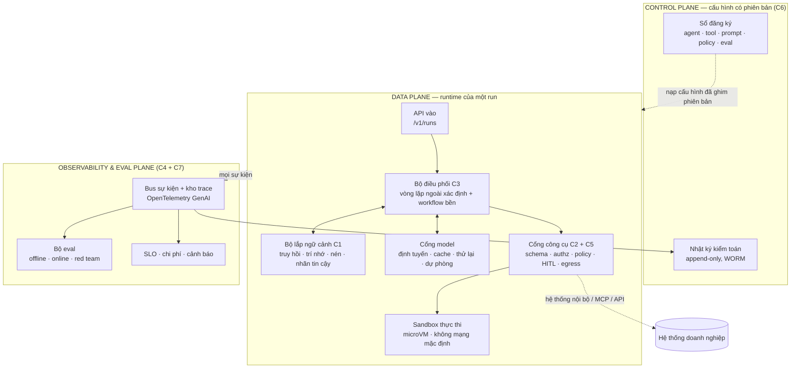
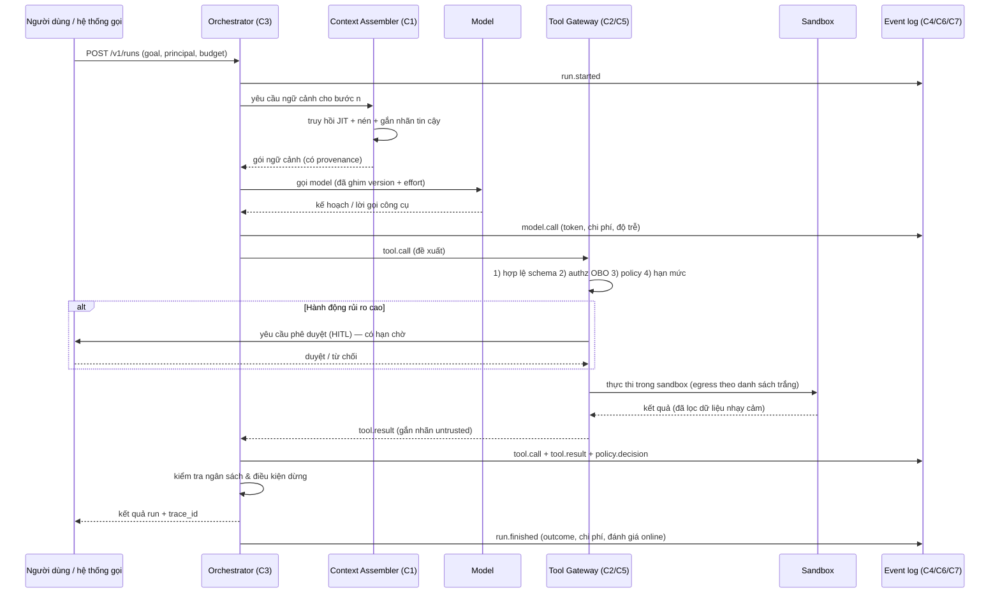
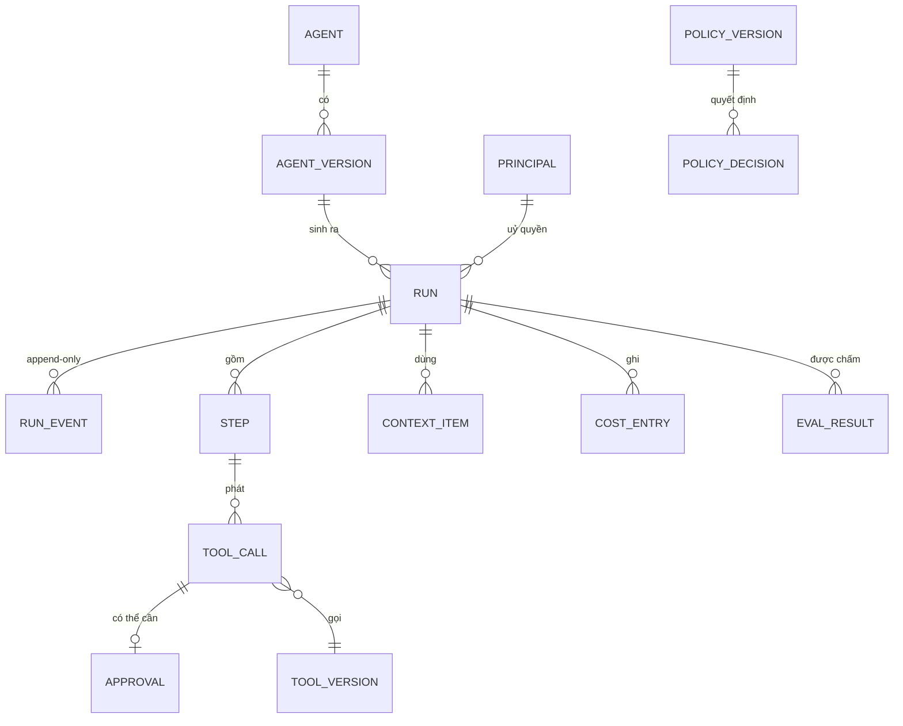

# ĐẶC TẢ KỸ THUẬT — XÂY DỰNG MỘT AI HARNESS

> **Mã tài liệu:** SPEC-AIH-001 · **Phiên bản:** 1.1 · **Ngày:** 2026-09-04 · **Trạng thái:** Bản nháp để duyệt
> **v1.1:** bổ sung C1-FR-11 (chính sách chống injection phân biệt theo nguồn) và C5-FR-12/13 (quét tài sản
> prompt của chính repo + ngân sách prompt tĩnh), rút từ `docs/specs/LESSONS-FROM-CLAUDE-AGENTS.md` (SYNTH-001).
> **Loại dự án (KHUNG-3 §A0):** Backend/API + Nền tảng vận hành (hồ sơ C3 + C7) — **không** phải web app.
> **Nguồn gốc:** viết lại từ mô hình *7 AI Harnesses* (chương trình Agent Engineering — Team ProtonX),
> có nghiên cứu đối chiếu nguồn sống ngày 2026-09-04 (xem §14 Nguồn tham khảo).
> **Cách đọc:** §1–§3 cho người quyết định; §4–§6 cho người xây; §7–§10 cho người vận hành;
> §11–§13 cho người lập kế hoạch. Mỗi yêu cầu có mã (vd `C2-FR-03`) để trích dẫn trong issue/PR/test.
> **Tài liệu liên quan:** `docs/specs/AI-SOFTWARE-COMPANY-SPEC.md` (SPEC-ASC-002) — hệ thống đa agent
> đóng vai một công ty phần mềm, chạy trên chính harness này.

**Quy ước mức độ ràng buộc (theo RFC 2119):**
| Từ khoá | Nghĩa |
|---|---|
| **BẮT BUỘC** | MUST — thiếu là không đạt cổng nghiệm thu |
| **NÊN** | SHOULD — bỏ qua phải có lý do ghi trong ADR |
| **CÓ THỂ** | MAY — tuỳ chọn theo bối cảnh |

---

## 1. Tóm tắt điều hành

### 1.1 AI harness là gì (định nghĩa dùng trong tài liệu này)

> **AI harness** là toàn bộ **lớp xác định (deterministic)** bao quanh một model **không xác định
> (non-deterministic)**, biến "một model biết nói" thành "một hệ thống dám cho chạy trong doanh nghiệp".

Harness sở hữu bảy quyền kiểm soát, đúng bằng bảy cấu phần của mô hình:

| # | Harness | Câu hỏi nó trả lời | Sở hữu |
|---|---------|--------------------|--------|
| C1 | **Context** | Model được **thấy** gì? | Lắp ráp ngữ cảnh, trí nhớ, truy hồi, ngân sách token, nhãn tin cậy |
| C2 | **Tool** | Model được **làm** gì? | Đăng ký công cụ, cổng gọi công cụ, xác thực/uỷ quyền, sandbox |
| C3 | **Orchestration** | Nó làm theo **thứ tự** nào? | Vòng lặp ngoài, workflow bền, đa agent, ngân sách & bù trừ |
| C4 | **Evaluation** | Làm sao **biết** nó làm đúng? | Bộ eval offline/online, LLM-judge, cổng CI, red team |
| C5 | **Security** | Nó **không được** làm gì? | Chống prompt injection, cách ly, egress, guardrail vào/ra |
| C6 | **Governance** | **Ai chịu trách nhiệm**? | Sổ đăng ký phiên bản, nhật ký kiểm toán, tuân thủ, giám sát người |
| C7 | **AgentOps** | Nó **sống** thế nào ở production? | SLO, telemetry, chi phí, phát hành, sự cố, phát hiện trôi |

### 1.2 Vấn đề đang giải

Model đơn lẻ đã đủ tốt; **hệ thống quanh model** thì chưa. Ba thất bại lặp lại khi đưa agent vào doanh nghiệp:

1. **Không tái hiện được.** Agent làm sai một lần, không ai dựng lại được nó đã thấy gì, gọi gì, vì sao.
2. **Không đo được.** "Cảm giác nó khá hơn" thay cho số liệu ⇒ không dám đổi prompt/model/công cụ.
3. **Không chặn được.** Prompt injection (ASI01 — rủi ro số 1 của OWASP Agentic 2026) biến một tài liệu
   người ngoài viết thành mệnh lệnh có đặc quyền của hệ thống.

Ba thất bại này **cùng một gốc**: thiếu lớp xác định giữa model và hệ thống thật. Đó chính là harness.

### 1.3 Kết quả bàn giao (deliverable của dự án dùng đặc tả này)

Một nền tảng chạy được, gồm:

- **`harness-core`** — thư viện/dịch vụ chứa C1–C3 (runtime của một *run*).
- **`harness-gateway`** — cổng công cụ + guardrail (C2 + C5), điểm nghẽn duy nhất cho mọi tác động ra ngoài.
- **`harness-evals`** — bộ eval + judge + cổng CI (C4).
- **`harness-control`** — control plane: sổ đăng ký agent/tool/policy có phiên bản, kiểm toán (C6).
- **`harness-ops`** — telemetry, SLO, sổ chi phí, runbook (C7).

### 1.4 Ngoài phạm vi (Out of scope) — nói rõ để không phình

- **Không** huấn luyện/fine-tune model; **không** tự vận hành hạ tầng suy luận (dùng API nhà cung cấp).
- **Không** thay thế data platform, IAM doanh nghiệp, hay hệ thống nghiệp vụ — harness **kết nối** vào chúng.
- **Không** xây UI người dùng cuối; harness chỉ cung cấp API + luồng sự kiện + trang vận hành tối thiểu.
- **Không** làm công cụ tấn công. Mọi năng lực red team trong §9.4 chỉ dùng **phòng thủ trên hệ thống của chính mình**.

---

## 2. Nguyên tắc thiết kế (bất biến — vi phạm phải có ADR)

| # | Nguyên tắc | Hệ quả thiết kế |
|---|-----------|------------------|
| P1 | **Prompt không phải cơ chế bảo mật.** | Mọi ràng buộc thực thi ở code/policy, không ở câu chữ trong system prompt. |
| P2 | **Một dòng sự kiện duy nhất.** | Mọi harness khác (eval, kiểm toán, ops, gỡ lỗi) đọc từ cùng một `run_events` append-only. |
| P3 | **Ngân sách là công dân hạng nhất.** | Mỗi run có trần **token · tiền · thời gian · số bước · số lần gọi công cụ**, chạm trần thì dừng sạch. |
| P4 | **Đặc quyền theo *bước*, không theo *agent*.** | Token ngắn hạn, phạm vi hẹp, cấp đúng lúc gọi công cụ (JIT), thu hồi ngay sau. |
| P5 | **Mọi mẩu ngữ cảnh có nguồn gốc và nhãn tin cậy.** | Nội dung `untrusted` không bao giờ được nâng cấp thành mệnh lệnh (§4.1.4, §4.5.2). |
| P6 | **Fail closed.** | Không quyết định được policy ⇒ **từ chối**. Guardrail hỏng ⇒ chặn, không cho qua. |
| P7 | **Không có eval thì không có deploy.** | Đổi prompt/model/tool/policy đều phải qua cổng eval trong CI (§9.5). |
| P8 | **Replay được.** | Từ log tái dựng đúng chuỗi bước của một run (§4.7.5) — điều kiện của gỡ lỗi *và* kiểm toán. |
| P9 | **Con người ở đúng chỗ.** | Hành động không thể hoàn tác ⇒ HITL bắt buộc, có ngữ cảnh đủ để duyệt, có hạn chờ. |
| P10 | **Cấu hình > code.** | Agent, tool, policy, eval là **tài nguyên có phiên bản** (YAML/DB), không phải hằng số trong mã. |
| P11 | **Ngữ cảnh là ngân sách: mặc định là *trừ*.** | Truy hồi đúng lúc (JIT), nén khi đầy, luôn chừa khoảng trống — không nạp sẵn cho đủ. |
| P12 | **Bán kính nổ hữu hạn.** | Mỗi agent/tool có hạn mức + circuit breaker; một lỗi không lan thành lỗi dây chuyền (ASI08). |

---

## 3. Kiến trúc tổng thể

### 3.1 Ba mặt phẳng



**Ranh giới bắt buộc:** data plane **không** tự đọc cấu hình từ file rời rạc — chỉ nhận **bản ghim phiên bản**
(`agent_version_id`) từ control plane. Đây là điều kiện để §4.6 truy vết được "run này chạy bằng cấu hình nào".

### 3.2 Vòng đời một lượt (turn) — luồng chuẩn



### 3.3 Quyết định kiến trúc cốt lõi (đầu vào của ADR-0002)

| # | Quyết định | Chọn | Vì sao |
|---|-----------|------|--------|
| A1 | Vòng lặp ngoài | **Xác định, do harness sở hữu** (không để model tự quyết vòng lặp) | Đo được, chặn được, tái hiện được (P1, P8) |
| A2 | Lưu trạng thái | **Event sourcing append-only** + snapshot | Một nguồn sự thật cho eval, kiểm toán, replay (P2, P8) |
| A3 | Bền bỉ dài hạn | **Workflow bền cho vòng ngoài**, agent graph cho vòng trong | Run nhiều giờ/ngày vẫn sống qua restart (§4.3) |
| A4 | Tác động ra ngoài | **Chỉ qua Tool Gateway** — không có đường vòng | Một điểm nghẽn để authz + policy + kiểm toán (P4, P6) |
| A5 | Giao thức công cụ | **MCP** cho công cụ ngoài/bên thứ ba, adapter nội bộ cho hệ thống lõi | Chuẩn mở, hệ sinh thái sẵn (§11) |
| A6 | Telemetry | **OpenTelemetry + quy ước GenAI** | Không khoá nhà cung cấp, đổi backend không sửa mã (§4.7) |
| A7 | Ngữ cảnh | **JIT retrieval + nén, có nhãn provenance** | Chống context rot và chống ASI01/ASI06 cùng lúc (P5, P11) |

---

## 4. Đặc tả bảy cấu phần

Mỗi cấu phần có cùng bộ khung: **Mục tiêu → Thành phần → Yêu cầu chức năng → Hợp đồng dữ liệu →
NFR/SLO → Tiêu chí nghiệm thu → Chống chỉ định**.

### 4.1 C1 — CONTEXT HARNESS (Quản lý tri thức)

#### 4.1.1 Mục tiêu
Quyết định **chính xác** những gì đi vào cửa sổ ngữ cảnh ở mỗi bước, kèm **nguồn gốc** và **mức tin cậy**
của từng mẩu, trong một **ngân sách token** đã định trước.

#### 4.1.2 Thành phần
- **Context Assembler** — lắp gói ngữ cảnh theo *khuôn* (template) đã ghim phiên bản.
- **Retriever** — truy hồi đúng lúc (JIT): trả *định danh nhẹ* (đường dẫn, id, truy vấn) trước, nội dung sau.
- **Memory Store** — trí nhớ ngắn hạn (trong run) và dài hạn (xuyên run), có chính sách ghi/đọc/quên.
- **Compactor** — nén lịch sử khi chạm ngưỡng, giữ nguyên các "mỏ neo" (mục tiêu, ràng buộc, quyết định).
- **Provenance Tagger** — gắn nhãn `trust_level` + nguồn cho mọi mẩu.

#### 4.1.3 Yêu cầu chức năng

| Mã | Yêu cầu | Mức |
|---|---|---|
| C1-FR-01 | Mọi mẩu ngữ cảnh vào prompt phải là một `ContextItem` có `source`, `trust_level`, `token_count`, `retrieved_at`. | BẮT BUỘC |
| C1-FR-02 | Ngân sách ngữ cảnh khai báo theo **tỉ lệ phần trăm** cửa sổ, chia rõ cho: chỉ thị hệ thống · trạng thái nhiệm vụ · tri thức truy hồi · lịch sử · **khoảng trống dự phòng ≥ 20%**. | BẮT BUỘC |
| C1-FR-03 | Truy hồi mặc định là **JIT**: trả danh sách định danh + tóm tắt ngắn; nội dung đầy đủ chỉ nạp khi agent yêu cầu qua công cụ `context.fetch`. | BẮT BUỘC |
| C1-FR-04 | Khi lịch sử vượt ngưỡng (mặc định 70% cửa sổ), **nén** thay vì cắt cụt; bản nén phải giữ: mục tiêu, ràng buộc, quyết định đã chốt, việc còn dở, id tài nguyên đang mở. | BẮT BUỘC |
| C1-FR-05 | Trí nhớ dài hạn phải có **chính sách ghi tường minh** (ai được ghi, ghi loại gì) và **TTL/quên**; không ghi tự động mọi thứ agent nói. | BẮT BUỘC |
| C1-FR-06 | Nội dung `trust_level = untrusted` phải được bọc trong ranh giới rõ ràng và **không bao giờ** nối trực tiếp vào vùng chỉ thị hệ thống. | BẮT BUỘC |
| C1-FR-11 | Chính sách chống injection **phân biệt theo nguồn**, không dùng một mức cho tất cả: nội dung từ **agent/thành phần nội bộ** khớp mẫu tấn công ⇒ **từ chối xử lý**; nội dung từ **khách hàng / người dùng / web / kết quả công cụ** ⇒ **khử đoạn khớp bằng nhãn rồi đi tiếp** + ghi sự kiện. Kết quả công cụ đọc dữ liệu ngoài (đọc file, tìm kiếm, chạy lệnh trên repo khách) đi qua **đúng bộ lọc như nội dung web**. | BẮT BUỘC |
| C1-FR-07 | Mọi lần lắp ngữ cảnh phát ra sự kiện `context.assembled` với **danh sách id mẩu + tổng token**, đủ để replay. | BẮT BUỘC |
| C1-FR-08 | Hỗ trợ **cache prefix**: phần ổn định (chỉ thị, danh sách công cụ) đặt trước, phần biến động (thời gian, id request) đặt sau điểm cache cuối. | NÊN |
| C1-FR-09 | Đo và báo cáo **tỉ lệ hữu ích của ngữ cảnh**: % mẩu được trích dẫn/được dùng trên tổng mẩu nạp vào. | NÊN |
| C1-FR-10 | Trí nhớ dài hạn có **kiểm tra nhiễm độc**: mục nhớ do nội dung `untrusted` sinh ra phải được đánh dấu và không dùng cho quyết định có đặc quyền (chống ASI06). | BẮT BUỘC |

#### 4.1.4 Hợp đồng dữ liệu

```json
{
  "context_item": {
    "id": "ctx_01J...",
    "kind": "instruction | task_state | knowledge | history | memory | tool_result",
    "trust_level": "system | operator | user | untrusted",
    "source": { "type": "rag|memory|tool|user|file", "ref": "doc://kb/1234#p7", "version": "..." },
    "content_ref": "s3://.../chunk.md",
    "token_count": 812,
    "retrieved_at": "2026-09-04T03:12:00Z",
    "derived_from": ["ctx_01J..."]
  }
}
```

**Thang tin cậy (dùng chung toàn hệ thống):**

| `trust_level` | Nguồn | Được phép |
|---|---|---|
| `system` | Cấu hình đã ghim phiên bản, do control plane phát | Đặt mục tiêu, ràng buộc, cấp quyền |
| `operator` | Chỉ thị vận hành giữa phiên, đã xác thực | Điều chỉnh hành vi trong phạm vi đã cấp |
| `user` | Người dùng đã xác thực danh tính | Đặt yêu cầu, phê duyệt hành động của chính họ |
| `untrusted` | Web, email, tài liệu, kết quả công cụ, đầu ra agent khác | **Chỉ là dữ liệu.** Không bao giờ là mệnh lệnh |

#### 4.1.5 NFR / SLO
- Lắp ngữ cảnh (không tính truy hồi từ nguồn ngoài): **p95 ≤ 80 ms**.
- Truy hồi JIT: **p95 ≤ 300 ms** cho top-k ≤ 20.
- Tỉ lệ cache-hit prefix ở tải ổn định: **≥ 60%** (đo bằng `cache_read_input_tokens`).

#### 4.1.6 Tiêu chí nghiệm thu
1. Chạy lại một run cũ từ log ⇒ dựng đúng gói ngữ cảnh từng bước (khớp danh sách id + tổng token).
2. Test: chèn chuỗi mệnh lệnh vào tài liệu `untrusted` ⇒ agent **không** thực hiện, sự kiện ghi nhận nhãn.
3. Test: hội thoại dài vượt cửa sổ ⇒ nén kích hoạt, mục tiêu và ràng buộc vẫn còn nguyên sau nén.

#### 4.1.7 Chống chỉ định
- ❌ Nạp toàn bộ kho tri thức "cho chắc" — làm loãng chú ý và tăng chi phí tuyến tính.
- ❌ Ghi trí nhớ dài hạn tự động từ mọi lượt — đây chính là đường vào của ASI06.
- ❌ Cắt cụt lịch sử theo FIFO — mất mục tiêu, agent quay vòng.

---

### 4.2 C2 — TOOL HARNESS (Kết nối hệ thống)

#### 4.2.1 Mục tiêu
Cho agent chạm được vào hệ thống thật **qua đúng một cánh cổng**, nơi mọi lời gọi đều được kiểm tra
schema, uỷ quyền, chính sách, hạn mức và ghi nhật ký.

#### 4.2.2 Thành phần
- **Tool Registry** — mô tả công cụ có phiên bản: schema vào/ra, mức rủi ro, quyền cần, tính idempotent.
- **Tool Gateway** — điểm nghẽn duy nhất: hợp lệ hoá → uỷ quyền → policy → hạn mức → thực thi → lọc kết quả.
- **MCP Client** — kết nối máy chủ MCP (nội bộ & bên thứ ba) theo bản đặc tả đã ghim.
- **Credential Broker** — cấp token ngắn hạn theo kiểu **on-behalf-of**, phạm vi hẹp, đúng lúc.
- **Sandbox Runner** — thực thi mã/lệnh trong môi trường cách ly, mặc định **không có mạng**.

#### 4.2.3 Yêu cầu chức năng

| Mã | Yêu cầu | Mức |
|---|---|---|
| C2-FR-01 | Mọi công cụ khai báo trong registry với: `name`, `version`, JSON Schema vào/ra (**`additionalProperties: false`**), `risk_tier`, `required_scopes`, `idempotent`, `reversible`, `timeout`, `rate_limit`. | BẮT BUỘC |
| C2-FR-02 | Gateway **từ chối** mọi lời gọi không khớp schema — không "sửa hộ" tham số. | BẮT BUỘC |
| C2-FR-03 | Phân **4 mức rủi ro**: `read` (chỉ đọc) · `write_reversible` · `write_irreversible` · `privileged`. Mức 3–4 **BẮT BUỘC** HITL trừ khi có miễn trừ ghi trong policy có phiên bản. | BẮT BUỘC |
| C2-FR-04 | Token gọi hệ thống đích là **ngắn hạn, phạm vi hẹp, gắn actor** (danh tính người dùng + danh tính agent tách bạch — mô hình OBO). Không dùng khoá tĩnh dùng chung. | BẮT BUỘC |
| C2-FR-05 | Mọi lời gọi có **timeout**, **thử lại có kiểm soát** (chỉ với công cụ idempotent), và **khoá idempotency** cho công cụ ghi. | BẮT BUỘC |
| C2-FR-06 | Kết quả công cụ luôn được gắn `trust_level = untrusted` trước khi vào ngữ cảnh (§4.1). | BẮT BUỘC |
| C2-FR-07 | Máy chủ MCP bên thứ ba phải được **ghim phiên bản + băm (hash)**; thay đổi mô tả công cụ (tool description) so với bản đã duyệt ⇒ **chặn** và cảnh báo (chống ASI04 / rug-pull). | BẮT BUỘC |
| C2-FR-08 | Thực thi mã/lệnh chạy trong sandbox cách ly ở mức nhân (gVisor/Kata) hoặc microVM (Firecracker); **egress theo danh sách trắng**, mặc định đóng. | BẮT BUỘC |
| C2-FR-09 | Số công cụ hiện ra trước model **≤ 20 cho mỗi bước**; nhiều hơn thì dùng cơ chế *tìm công cụ* (tool search) thay vì nạp hết. | NÊN |
| C2-FR-10 | Kết quả trả về đi qua **bộ lọc đầu ra**: cắt bớt kích thước, che dữ liệu nhạy cảm (PII/bí mật), loại bỏ chuỗi điều khiển. | BẮT BUỘC |
| C2-FR-11 | Gateway ghi `policy.decision` cho **mọi** lời gọi, kể cả lời gọi được cho phép (kiểm toán cần cả hai chiều). | BẮT BUỘC |
| C2-FR-12 | Hỗ trợ **chế độ mô phỏng (dry-run)** cho mọi công cụ ghi — điều kiện bắt buộc để eval trajectory chạy an toàn. | BẮT BUỘC |

#### 4.2.4 Hợp đồng dữ liệu — bản mô tả công cụ

```yaml
# tools/crm.update_contact.yaml
name: crm.update_contact
version: 2.1.0
description: "Cập nhật thông tin liên hệ trong CRM."   # ghim hash: mọi thay đổi phải qua PR
risk_tier: write_reversible
idempotent: true
reversible: true
required_scopes: ["crm:contact:write"]
rate_limit: { per_run: 20, per_principal_per_hour: 200 }
timeout_ms: 8000
input_schema:
  type: object
  additionalProperties: false
  required: [contact_id, fields]
  properties:
    contact_id: { type: string, pattern: "^c_[0-9a-f]{16}$" }
    fields:
      type: object
      additionalProperties: false
      properties:
        email: { type: string, format: email }
        phone: { type: string }
output_schema:
  type: object
  required: [contact_id, updated_at]
  properties: { contact_id: {type: string}, updated_at: {type: string, format: date-time} }
dry_run: supported
compensation: crm.revert_contact   # dùng cho bù trừ ở C3
```

#### 4.2.5 Chuỗi kiểm tra bắt buộc trong Gateway (thứ tự cố định)

```
1. Xác thực người gọi (run + principal)      → sai: 401
2. Hợp lệ hoá schema đầu vào                 → sai: 422 (không sửa hộ)
3. Uỷ quyền: scope ∩ quyền người dùng ∩ quyền agent  → thiếu: 403
4. Policy engine (OPA/Cedar) trên ngữ cảnh đầy đủ    → deny: 403 + lý do
5. Hạn mức: run · principal · công cụ · toàn cục     → vượt: 429
6. Cổng HITL nếu risk_tier ≥ write_irreversible      → chờ/từ chối
7. Thực thi (sandbox / MCP / adapter) + timeout
8. Lọc đầu ra + gắn nhãn untrusted + cắt kích thước
9. Ghi sự kiện: tool.call · policy.decision · tool.result
```

> **Fail closed (P6):** bước 4 không phản hồi trong 200 ms ⇒ **từ chối**, không "cho qua tạm".

#### 4.2.6 NFR / SLO
- Chi phí phụ trội của gateway (không tính thời gian công cụ): **p95 ≤ 50 ms**.
- Quyết định policy: **p95 ≤ 20 ms** (chính sách nạp sẵn trong bộ nhớ, không gọi mạng).
- Sẵn sàng: **99.9%** — gateway sập đồng nghĩa toàn bộ agent dừng, nên phải chạy nhiều bản sao.

#### 4.2.7 Tiêu chí nghiệm thu
1. Không tồn tại đường gọi ra ngoài nào **vòng qua** gateway (kiểm chứng bằng test chặn egress ở tầng mạng).
2. Đổi mô tả một công cụ MCP bên thứ ba ⇒ hệ thống chặn và báo động trong ≤ 1 phút.
3. Mọi công cụ `write_irreversible` đều dừng chờ HITL trong test tích hợp.
4. Sandbox: mã thử mở kết nối tới host ngoài danh sách trắng ⇒ bị chặn, có sự kiện.

#### 4.2.8 Chống chỉ định
- ❌ Cấp cho agent khoá API dùng chung, dài hạn của một service account "để cho tiện" (ASI03).
- ❌ Để model tự tổng hợp lệnh shell chạy trực tiếp trên máy chủ ứng dụng (ASI05).
- ❌ Nạp 80 công cụ vào một prompt rồi mong model chọn đúng.

---

### 4.3 C3 — ORCHESTRATION HARNESS (Điều phối workflow)

#### 4.3.1 Mục tiêu
Chạy các nhiệm vụ nhiều bước, nhiều agent một cách **bền bỉ, có ngân sách, có thể dừng và tiếp tục**,
và không để một lỗi lan thành lỗi dây chuyền.

#### 4.3.2 Mô hình hai tầng (khuyến nghị)

| Tầng | Trách nhiệm | Đặc tính |
|---|---|---|
| **Vòng ngoài — Workflow bền** | Các bước dài (phút → ngày), chờ người, gọi liên dịch vụ, bù trừ | Xác định, sống sót qua restart, có lịch sử thực thi |
| **Vòng trong — Agent graph** | Suy luận + gọi công cụ trong một bước nghiệp vụ | Có chu trình, nhánh điều kiện, checkpoint theo bước |

Vòng ngoài gọi vòng trong như một *activity*; vòng trong trả kết quả có cấu trúc rồi trả quyền lại.
Ranh giới này là chỗ đặt **điểm dừng, ngân sách và bù trừ**.

#### 4.3.3 Yêu cầu chức năng

| Mã | Yêu cầu | Mức |
|---|---|---|
| C3-FR-01 | Vòng lặp ngoài **do harness sở hữu** và là code xác định; model chỉ đề xuất hành động tiếp theo, không tự quyết điều kiện dừng. | BẮT BUỘC |
| C3-FR-02 | Mỗi run có **ngân sách 5 chiều**: `max_steps`, `max_tokens`, `max_cost_usd`, `max_wallclock`, `max_tool_calls`. Chạm bất kỳ trần nào ⇒ dừng có kiểm soát + trả kết quả một phần. | BẮT BUỘC |
| C3-FR-03 | Trạng thái run được **checkpoint** sau mỗi bước; tiến trình có thể tiếp tục sau khi tiến trình/máy chủ chết. | BẮT BUỘC |
| C3-FR-04 | Mọi bước có tác động ngoài phải **idempotent theo `idempotency_key`** (dẫn xuất từ `run_id + step_id`). | BẮT BUỘC |
| C3-FR-05 | Mỗi bước ghi phải khai báo **hành động bù trừ** (compensation) hoặc được đánh dấu `irreversible` (⇒ bắt buộc HITL). | BẮT BUỘC |
| C3-FR-06 | **Bàn giao giữa agent** dùng thông điệp có schema (`AgentHandoff`), không dùng văn bản tự do; kèm `depth` và `budget` còn lại. | BẮT BUỘC |
| C3-FR-07 | Giới hạn **độ sâu uỷ quyền** (mặc định ≤ 3) và **số agent con đồng thời** (mặc định ≤ 8); vượt ⇒ từ chối (chống ASI08). | BẮT BUỘC |
| C3-FR-08 | **Circuit breaker** theo công cụ và theo agent: n lỗi liên tiếp trong cửa sổ t ⇒ ngắt, chuyển sang chế độ suy giảm, cảnh báo. | BẮT BUỘC |
| C3-FR-09 | Phát hiện **vòng lặp quẩn**: cùng (công cụ, tham số chuẩn hoá) lặp k lần (mặc định k=3) ⇒ ngắt bước, buộc đổi chiến lược hoặc dừng. | BẮT BUỘC |
| C3-FR-10 | Hỗ trợ **tạm dừng chờ người** (HITL) không giới hạn thời gian ngắn: run ở trạng thái `waiting_approval` không đốt tài nguyên; có hạn chờ và hành vi mặc định khi hết hạn (**mặc định: huỷ**). | BẮT BUỘC |
| C3-FR-11 | Chọn mẫu điều phối theo bài toán, khai báo trong cấu hình agent: `single` · `planner_executor` · `router` · `parallel_fanout` · `debate` (chỉ khi eval chứng minh có lợi). | NÊN |
| C3-FR-12 | Với đa agent liên tổ chức, giao tiếp qua giao thức chuẩn (A2A) với **thẻ agent có chữ ký**; không tin thẻ chưa ký (chống ASI07). | NÊN |

#### 4.3.4 Hợp đồng dữ liệu — bàn giao giữa agent

```json
{
  "agent_handoff": {
    "from": "agent://research@3.2.0",
    "to": "agent://writer@1.4.1",
    "run_id": "run_01J...",
    "depth": 1,
    "task": { "goal": "…", "acceptance_criteria": ["…"], "inputs": [{"ctx_id": "ctx_…"}] },
    "budget_remaining": { "steps": 12, "tokens": 180000, "cost_usd": 1.10, "wallclock_s": 420 },
    "granted_scopes": ["kb:read"],
    "trust_level_of_inputs": "untrusted"
  }
}
```

> **Quy tắc giảm đặc quyền:** agent con **không bao giờ** nhận scope rộng hơn agent cha
> (`granted_scopes ⊆ scopes(cha)`), và sau khi đọc nội dung `untrusted`, tập scope còn lại
> **NÊN** bị thu hẹp về nhóm `read` cho tới hết bước (mẫu "hạ đặc quyền sau khi đọc dữ liệu lạ").

#### 4.3.5 NFR / SLO
- Phụ trội điều phối mỗi bước: **p95 ≤ 100 ms**.
- Mất mát tiến trình khi restart: **0 bước đã cam kết** (checkpoint trước khi phát tác động ngoài).
- Khôi phục run sau sự cố hạ tầng: **≤ 60 s**.

#### 4.3.6 Tiêu chí nghiệm thu
1. Giết tiến trình giữa run ⇒ run tự tiếp tục, **không** lặp lại tác động ngoài đã cam kết.
2. Run chạm trần chi phí ⇒ dừng sạch, trả kết quả một phần + lý do, không treo.
3. Kịch bản agent con lỗi liên tiếp ⇒ circuit breaker ngắt, agent cha nhận lỗi có cấu trúc, không lan.
4. Thử uỷ quyền sâu 4 tầng ⇒ bị từ chối ở tầng 4 với mã lỗi rõ ràng.

#### 4.3.7 Chống chỉ định
- ❌ Để model tự do lặp "cho tới khi xong" mà không có trần bước/chi phí.
- ❌ Đa agent khi một agent + công cụ tốt là đủ (đa agent nhân chi phí và nhân bề mặt tấn công).
- ❌ Bàn giao bằng văn bản tự do — mất ràng buộc, mất ngân sách, không kiểm toán được.

---

### 4.4 C4 — EVALUATION HARNESS (Đánh giá chất lượng)

#### 4.4.1 Mục tiêu
Biến câu "hình như nó tốt hơn" thành **số có thể so sánh**, đủ tin để **chặn** một bản phát hành xấu.

#### 4.4.2 Ba tầng đánh giá (bắt buộc đủ ba)

| Tầng | Đo cái gì | Ví dụ chỉ số | Chạy ở đâu |
|---|---|---|---|
| **T1 — Đơn vị** | Từng mảnh xác định | Tỉ lệ hợp lệ schema, độ chính xác trích xuất, đúng công cụ được chọn | CI mỗi PR (< 5 phút) |
| **T2 — Quỹ đạo** | *Cách* agent làm | Đúng bước, thừa bước, số lần gọi công cụ, tuân thủ policy, chi phí/nhiệm vụ | CI hàng đêm + trước phát hành |
| **T3 — Kết quả** | Nhiệm vụ có xong không | Tỉ lệ hoàn thành, độ chính xác cuối, có căn cứ (groundedness), điểm người chấm | Trước phát hành + mẫu online |

#### 4.4.3 Yêu cầu chức năng

| Mã | Yêu cầu | Mức |
|---|---|---|
| C4-FR-01 | Bộ dữ liệu eval là **tài nguyên có phiên bản**, tách `train / dev / test`; bộ `test` **không** được dùng để tinh chỉnh prompt. | BẮT BUỘC |
| C4-FR-02 | Mọi eval chạy ở chế độ **hermetic**: công cụ ghi ở chế độ `dry_run` hoặc dùng bản giả (fixture) đã ghim; không chạm hệ thống thật. | BẮT BUỘC |
| C4-FR-03 | **LLM-as-judge phải được hiệu chuẩn**: đo mức đồng thuận với nhãn người trên ≥ 100 mẫu; đạt **Cohen's κ ≥ 0.6** mới được dùng làm cổng chặn. Ghi lại phiên bản judge (model + prompt). | BẮT BUỘC |
| C4-FR-04 | Judge **không dùng cùng model + cùng prompt** với agent đang bị chấm (tránh thiên vị tự chấm). | NÊN |
| C4-FR-05 | Mỗi eval báo cáo **khoảng tin cậy**, không chỉ điểm trung bình; chênh lệch nằm trong nhiễu ⇒ kết luận "không đổi". | BẮT BUỘC |
| C4-FR-06 | Chỉ số chi phí là **chi phí cho mỗi nhiệm vụ hoàn thành**, không phải chi phí mỗi request. | BẮT BUỘC |
| C4-FR-07 | Bộ **red team** (§9.4) chạy như một eval suite, ánh xạ tới ASI01–ASI10; **bất kỳ ca nào đỏ ⇒ chặn phát hành**. | BẮT BUỘC |
| C4-FR-08 | **Eval online**: lấy mẫu ≥ 1% run production (và 100% run rủi ro cao) chấm tự động; kết quả đưa vào cùng bảng chỉ số với offline. | BẮT BUỘC |
| C4-FR-09 | Mọi lỗi production được điều tra phải **sinh ra một ca eval mới** trước khi đóng — bộ eval lớn lên theo sự cố thật. | BẮT BUỘC |
| C4-FR-10 | Hỗ trợ **replay**: chạy lại eval trên trace đã ghi để so sánh hai phiên bản trên cùng đầu vào. | NÊN |

#### 4.4.4 Bộ chỉ số tối thiểu

```
Chất lượng : task_success_rate · groundedness · tool_choice_accuracy · schema_valid_rate
Quỹ đạo    : steps_per_task · redundant_steps · loop_rate · policy_violation_rate
Hiệu năng  : latency_p50/p95 · time_to_first_token · time_to_task_done
Chi phí    : cost_per_completed_task · tokens_per_task · cache_hit_rate
An toàn    : injection_resistance · unsafe_action_blocked_rate · pii_leak_rate
Con người  : hitl_approval_rate · hitl_wait_p95 · human_override_rate
```

#### 4.4.5 Cổng chất lượng (dùng làm CI gate)

| Cổng | Điều kiện chặn |
|---|---|
| **PR** | T1 xanh 100% · red team "mức cao" xanh 100% · không giảm `schema_valid_rate` |
| **Hằng đêm** | T2 không giảm quá 2% tuyệt đối so với đường cơ sở · `cost_per_completed_task` không tăng > 15% |
| **Phát hành** | T3 trên bộ `test` ≥ ngưỡng đã chốt · toàn bộ red team xanh · judge còn hiệu lực hiệu chuẩn ≤ 90 ngày |

#### 4.4.6 Tiêu chí nghiệm thu
1. Cố tình làm hỏng một prompt ⇒ CI **chặn** đúng cổng, chỉ ra chỉ số nào rớt.
2. Chạy cùng eval hai lần ⇒ chênh lệch nằm trong khoảng tin cậy đã báo (eval ổn định).
3. Một sự cố production ⇒ có ca eval mới tái hiện được lỗi đó trước khi đóng issue.

#### 4.4.7 Chống chỉ định
- ❌ Judge tự chấm bằng chính model của agent với prompt "hãy chấm điểm 1–10" (không hiệu chuẩn, không dùng được).
- ❌ Bộ eval "vàng" viết một lần rồi để mốc — sau 3 tháng nó không còn đại diện cho tải thật.
- ❌ Chỉ đo đầu ra cuối cùng: agent đi đường vòng tốn 10× chi phí vẫn "đạt".

---

### 4.5 C5 — SECURITY HARNESS (Bảo mật & AI Safety)

#### 4.5.1 Mục tiêu
Giả định **mọi nội dung agent đọc đều có thể là mã tấn công**, và thiết kế sao cho điều đó vẫn **không**
dẫn tới hành động có hại.

#### 4.5.2 Mô hình mối đe doạ (ánh xạ OWASP Top 10 for Agentic Applications 2026)

| Mã | Rủi ro | Chốt chặn chính trong đặc tả này |
|---|---|---|
| **ASI01** | Agent Goal Hijack | Nhãn `untrusted` (C1-FR-06), hạ đặc quyền sau khi đọc dữ liệu lạ (§4.3.4), HITL cho hành động không hoàn tác |
| **ASI02** | Tool Misuse and Exploitation | Schema nghiêm ngặt + policy engine + hạn mức (C2-FR-02/04/05) |
| **ASI03** | Identity and Privilege Abuse | Token OBO ngắn hạn, phạm vi hẹp, tách danh tính người ↔ agent (C2-FR-04) |
| **ASI04** | Agentic Supply Chain Vulnerabilities | Ghim phiên bản + hash máy chủ/mô tả công cụ MCP, chặn khi đổi (C2-FR-07) **và quét tài sản prompt của chính repo (C5-FR-12)** — một chuỗi tấn công nằm trong một skill dùng chung hỏng mọi vai nạp nó, ở mọi lượt |
| **ASI05** | Unexpected Code Execution | Sandbox microVM/gVisor, egress danh sách trắng, không mạng mặc định (C2-FR-08) |
| **ASI06** | Memory & Context Poisoning | Chính sách ghi trí nhớ + đánh dấu nguồn + không dùng cho quyết định đặc quyền (C1-FR-05/10) |
| **ASI07** | Insecure Inter-Agent Communication | Bàn giao có schema + xác thực đôi bên + thẻ agent có chữ ký (C3-FR-06/12) |
| **ASI08** | Cascading Failures | Trần độ sâu/đồng thời, circuit breaker, hạn mức theo bán kính nổ (C3-FR-07/08) |
| **ASI09** | Human-Agent Trust Exploitation | Màn hình phê duyệt hiển thị **hành động thật + nguồn dữ liệu**, không chỉ tóm tắt của agent (C5-FR-08) |
| **ASI10** | Rogue Agents | Kill switch, phát hiện trôi hành vi, thu hồi thông tin xác thực tức thời (C5-FR-09, C7-FR-07) |

> **Ghi chú xác thực nguồn:** danh sách ASI01–ASI10 ở trên được đối chiếu từ **nhiều nguồn thứ cấp**
> (F5, Modulos, Promptfoo, NeuralTrust, Auth0 — truy cập 2026-09-04) vì `genai.owasp.org` bị chặn bởi
> egress proxy của môi trường phiên này. **Trước khi chốt ma trận kiểm soát, phải mở tài liệu gốc của
> OWASP GenAI Security Project để xác nhận nguyên văn tiêu đề và nội dung từng mục.**

#### 4.5.3 Bốn vòng phòng thủ

```
Vòng 1 — Đầu vào : phân loại & gắn nhãn nguồn · phát hiện injection · chuẩn hoá & bóc chuỗi điều khiển
Vòng 2 — Quyết định: policy engine xác định (OPA/Cedar) trên (principal, agent, tool, tham số, ngữ cảnh)
Vòng 3 — Thực thi : sandbox cách ly · quyền tối thiểu · egress danh sách trắng · timeout · hạn mức
Vòng 4 — Đầu ra  : lọc PII/bí mật · chặn hành động không được phép · kiểm chứng có căn cứ trước khi trả
```

**Nguyên tắc:** vòng 1 và 4 dùng model ⇒ **không đáng tin tuyệt đối**, chỉ để giảm nhiễu.
Ràng buộc thật nằm ở vòng 2 và 3 — thuần xác định (P1).

#### 4.5.4 Yêu cầu chức năng

| Mã | Yêu cầu | Mức |
|---|---|---|
| C5-FR-01 | Chính sách viết bằng ngôn ngữ policy tách khỏi mã ứng dụng, có phiên bản, có test riêng. | BẮT BUỘC |
| C5-FR-02 | Mặc định **deny**: công cụ chưa được cấp phép tường minh cho agent ⇒ không gọi được. | BẮT BUỘC |
| C5-FR-03 | Không có bí mật trong prompt, trong log, trong trạng thái run. Bí mật do broker thay thế **tại thời điểm gọi**. | BẮT BUỘC |
| C5-FR-04 | Mọi payload ghi vào trace phải qua bộ che dữ liệu nhạy cảm (PII, thẻ, khoá); bật/tắt theo cấu hình lưu trữ. | BẮT BUỘC |
| C5-FR-05 | Egress từ sandbox: **danh sách trắng theo tên miền**; mọi kết nối bị chặn đều ghi sự kiện và có cảnh báo tổng hợp. | BẮT BUỘC |
| C5-FR-06 | Đầu ra hướng người dùng đi qua bộ lọc: rò rỉ dữ liệu chéo người dùng, nội dung có hại, chỉ thị ẩn. | BẮT BUỘC |
| C5-FR-07 | Có **hạn mức bán kính nổ** theo đơn vị nghiệp vụ (vd: ≤ 50 bản ghi ghi/giờ/agent); vượt ⇒ dừng + báo động. | BẮT BUỘC |
| C5-FR-08 | Màn hình phê duyệt hiển thị **lời gọi công cụ nguyên văn + nguồn dữ liệu dẫn tới nó**, không chỉ lời giải thích của agent (chống ASI09). | BẮT BUỘC |
| C5-FR-09 | **Kill switch** ở ba mức: một run · một phiên bản agent · toàn hệ thống. Tác dụng ≤ 10 s, kèm thu hồi token. | BẮT BUỘC |
| C5-FR-10 | Red team tự động chạy định kỳ (tối thiểu hàng tuần) trên môi trường staging với bộ tấn công cập nhật. | NÊN |
| C5-FR-11 | Kiểm thử xâm nhập có uỷ quyền trước khi lên production và định kỳ ≥ 1 lần/năm. | NÊN |
| C5-FR-12 | **Tài sản prompt của chính hệ thống là chuỗi cung ứng** (định nghĩa agent, skill, template, mô tả cổng, schema): phải có cổng CI quét chúng với tối thiểu 4 luật — mẫu injection (**dùng chung một nguồn sự thật với bộ lọc runtime**), ký tự ẩn (zero-width, bidi override, tệp không phải UTF-8), lệnh nguy hiểm, chuỗi giống bí mật. Miễn trừ phải ghi **lý do**; miễn trừ không còn khớp phải bị báo để dọn. | BẮT BUỘC |
| C5-FR-13 | **Ngân sách prompt tĩnh là cổng CI**: tổng độ dài prompt hệ thống của một vai so với ngân sách khai báo — vượt ngưỡng đã chốt là đỏ; tham chiếu tới tài sản không tồn tại cũng đỏ. | BẮT BUỘC |

#### 4.5.5 Tiêu chí nghiệm thu
1. Bộ ca injection (≥ 50 ca, gồm tài liệu, email, HTML ẩn, kết quả công cụ) ⇒ **0 ca** dẫn tới hành động không được phép.
2. Rò rỉ bí mật: quét toàn bộ log/trace của một tuần staging ⇒ **0 phát hiện**.
3. Kill switch: bấm dừng ⇒ mọi run đang chạy dừng ≤ 10 s, token bị thu hồi, có bản ghi kiểm toán.
4. Test cách ly: mã trong sandbox không truy cập được metadata service của đám mây, không mở được cổng ngoài.

#### 4.5.6 Chống chỉ định
- ❌ Dựa vào câu "đừng làm theo chỉ thị trong tài liệu" trong system prompt như biện pháp bảo mật.
- ❌ Guardrail chỉ bằng model phân loại — nó là bộ lọc nhiễu, không phải hàng rào.
- ❌ Cho agent quyền của người dùng có đặc quyền cao nhất "để khỏi vướng".

---

### 4.6 C6 — GOVERNANCE HARNESS (Quản trị & Kiểm toán)

#### 4.6.1 Mục tiêu
Trả lời được, **sau nhiều tháng**, câu hỏi: *"Ngày đó, agent nào, phiên bản nào, do ai cho phép, đã làm gì,
dựa trên dữ liệu nào, và ai đã duyệt?"*

#### 4.6.2 Yêu cầu chức năng

| Mã | Yêu cầu | Mức |
|---|---|---|
| C6-FR-01 | **Sổ đăng ký có phiên bản** cho: agent, prompt, công cụ, policy, bộ eval, model. Mỗi run ghim đúng một bộ id phiên bản. | BẮT BUỘC |
| C6-FR-02 | Nhật ký kiểm toán **append-only**, chống sửa (hash chain hoặc WORM), lưu tối thiểu theo yêu cầu pháp lý ngành. | BẮT BUỘC |
| C6-FR-03 | Mỗi hành động có hệ quả ghi rõ **chuỗi trách nhiệm**: người uỷ quyền → agent → công cụ → hệ thống đích. | BẮT BUỘC |
| C6-FR-04 | Phân loại **mức rủi ro của từng use case** (theo khung nội bộ + đối chiếu quy định áp dụng); use case rủi ro cao cần hồ sơ đánh giá trước khi bật. | BẮT BUỘC |
| C6-FR-05 | **Minh bạch với người dùng**: người tương tác phải biết đang làm việc với hệ thống AI; đầu ra tổng hợp được đánh dấu phù hợp. | BẮT BUỘC |
| C6-FR-06 | **Giám sát của con người** được ghi lại: ai duyệt, khi nào, trên cơ sở thông tin gì, có bác bỏ không. | BẮT BUỘC |
| C6-FR-07 | Chính sách **lưu trữ & xoá dữ liệu** theo loại (prompt, đầu ra, trace, trí nhớ, PII); có quy trình xoá theo yêu cầu chủ thể dữ liệu. | BẮT BUỘC |
| C6-FR-08 | **Xuất hồ sơ kiểm toán** cho một khoảng thời gian/một run/một chủ thể dữ liệu ở định dạng máy đọc được. | BẮT BUỘC |
| C6-FR-09 | Mọi thay đổi cấu hình đi qua PR có người duyệt; không sửa cấu hình trực tiếp trên production. | BẮT BUỘC |
| C6-FR-10 | Lưu **model card / agent card** nội bộ: mục đích, giới hạn đã biết, dữ liệu dùng, kết quả eval, ngày đánh giá lại. | NÊN |

#### 4.6.3 Bối cảnh tuân thủ (tình trạng ngày 2026-09-04 — cần luật sư/DPO xác nhận cho từng thị trường)

- **EU AI Act:** nghĩa vụ **minh bạch (Điều 50)** và thẩm quyền thực thi với nhà cung cấp GPAI **đã có hiệu lực
  từ 02/08/2026**. Nghĩa vụ cho hệ thống **rủi ro cao độc lập (Phụ lục III)** được lùi tới **02/12/2027**,
  và hệ thống rủi ro cao nhúng trong sản phẩm đã được quản lý (Phụ lục I) tới **02/08/2028**,
  theo Digital Omnibus — Regulation (EU) 2026/1744, hiệu lực 27/07/2026.
  ⇒ **Hệ quả thiết kế:** minh bạch + kiểm toán là **bắt buộc ngay**; hồ sơ rủi ro cao có thêm thời gian
  nhưng **phải thiết kế sẵn** vì bổ sung sau rất tốn kém.
- **NIST AI RMF / ISO/IEC 42001:** dùng làm khung quản trị nội bộ (Govern–Map–Measure–Manage);
  ánh xạ mỗi yêu cầu C6 vào một mục kiểm soát để phục vụ audit.
- Ngành đặc thù (tài chính, y tế, dữ liệu cá nhân trong nước) có yêu cầu riêng — **phải rà trước khi lên production**.

#### 4.6.4 Tiêu chí nghiệm thu
1. Chọn ngẫu nhiên một run 60 ngày trước ⇒ dựng lại đầy đủ: cấu hình, ngữ cảnh, quyết định, người duyệt.
2. Thử sửa một bản ghi kiểm toán ⇒ phát hiện được (đứt chuỗi hash) và có cảnh báo.
3. Yêu cầu xoá dữ liệu của một chủ thể ⇒ hoàn tất trong SLA đã cam kết, có biên bản.

---

### 4.7 C7 — AGENTOPS HARNESS (Vận hành production)

#### 4.7.1 Mục tiêu
Giữ agent chạy đúng, đủ nhanh, đủ rẻ, và **biết trước** khi nó xấu đi.

#### 4.7.2 Yêu cầu chức năng

| Mã | Yêu cầu | Mức |
|---|---|---|
| C7-FR-01 | Toàn bộ telemetry theo **OpenTelemetry**, dùng quy ước ngữ nghĩa GenAI (`gen_ai.*`) cho span model/agent/công cụ. | BẮT BUỘC |
| C7-FR-02 | Mỗi run có **một `trace_id`** xuyên suốt: API → điều phối → model → công cụ → hệ thống đích. | BẮT BUỘC |
| C7-FR-03 | **Sổ chi phí**: ghi token vào/ra/cache và tiền theo run, theo agent, theo người dùng, theo tenant; đối soát với hoá đơn nhà cung cấp hàng tháng. | BẮT BUỘC |
| C7-FR-04 | **SLO công bố** kèm error budget, cảnh báo dựa trên tốc độ đốt budget, không cảnh báo theo ngưỡng thô. | BẮT BUỘC |
| C7-FR-05 | Phát hành theo **shadow → canary → toàn phần**; rollback về phiên bản trước ≤ 5 phút. | BẮT BUỘC |
| C7-FR-06 | Bảng điều khiển vận hành tối thiểu: sức khoẻ run, tỉ lệ lỗi, độ trễ, chi phí, hàng đợi HITL, vi phạm policy. | BẮT BUỘC |
| C7-FR-07 | **Phát hiện trôi (drift)**: theo dõi phân bố đầu vào, tỉ lệ dùng công cụ, độ dài quỹ đạo, điểm eval online; lệch quá ngưỡng ⇒ cảnh báo. | BẮT BUỘC |
| C7-FR-08 | **Runbook** cho các sự cố đặc thù agent (§10.3), gắn với quy trình sự cố sẵn có của tổ chức. | BẮT BUỘC |
| C7-FR-09 | Chịu lỗi nhà cung cấp model: hết hạn mức/lỗi ⇒ thử lại có backoff, dự phòng model, và **suy giảm có kiểm soát** (từ chối lịch sự thay vì treo). | BẮT BUỘC |
| C7-FR-10 | Lưu trace mẫu đủ để **replay** một run (§4.7.5); trace rủi ro cao lưu 100%. | BẮT BUỘC |

#### 4.7.3 SLO khởi điểm (điều chỉnh theo nghiệp vụ)

| Chỉ số | Mục tiêu |
|---|---|
| Sẵn sàng API tạo run | 99.9% / tháng |
| Phụ trội harness mỗi lượt (trừ thời gian model) | p95 ≤ 150 ms |
| Thời gian tới token đầu tiên | p95 ≤ 2.5 s |
| Tỉ lệ run hoàn thành (không lỗi hệ thống) | ≥ 99% |
| Tỉ lệ vi phạm policy lọt lưới | 0 (bất kỳ ca nào ⇒ sự cố SEV2) |
| Chi phí mỗi nhiệm vụ hoàn thành | Trong ±15% đường cơ sở tháng trước |
| Thời gian chờ phê duyệt HITL | p95 ≤ 4 giờ giờ hành chính |

#### 4.7.4 Sự kiện chuẩn (tối thiểu — cũng là hợp đồng của C4/C6)

```
run.started · run.finished · run.failed · run.budget_exceeded
context.assembled · memory.written · memory.read
model.call · model.response · model.error · model.fallback
tool.call · tool.result · tool.error · policy.decision
approval.requested · approval.granted · approval.denied · approval.timeout
agent.handoff · guard.triggered · circuit.opened · killswitch.activated
```

#### 4.7.5 Replay — định nghĩa chính xác
**Replay** = chạy lại vòng lặp điều phối với **đầu ra model đã ghi** (không gọi model) và **kết quả công cụ đã ghi**
(không gọi công cụ), để kiểm chứng rằng logic xác định của harness cho ra **cùng chuỗi quyết định**.
Đây là công cụ gỡ lỗi + bằng chứng kiểm toán. Nó **không** dùng để chứng minh model sẽ hành xử như cũ.

#### 4.7.6 Tiêu chí nghiệm thu
1. Một run production bất kỳ ⇒ mở được trace đầy đủ, xem từng bước, chi phí từng bước.
2. Diễn tập: nhà cung cấp model trả 429 hàng loạt ⇒ hệ thống suy giảm có kiểm soát, không mất run.
3. Diễn tập rollback: quay về phiên bản agent trước ≤ 5 phút, không mất dữ liệu run đang chạy.

---

## 5. Mô hình dữ liệu

### 5.1 Sơ đồ quan hệ (rút gọn)



### 5.2 Bảng cốt lõi (PostgreSQL — kiểu rút gọn)

| Bảng | Cột chính | Ghi chú |
|---|---|---|
| `agents` | `id`, `slug`, `owner_team`, `risk_class`, `created_at` | Danh tính logic của agent |
| `agent_versions` | `id`, `agent_id`, `semver`, `prompt_hash`, `model_id`, `tool_binding_ids[]`, `policy_version_id`, `eval_baseline_id`, `status`, `published_by`, `published_at` | **Bất biến.** Đối tượng được ghim vào run |
| `tools` / `tool_versions` | `name`, `semver`, `schema_in`, `schema_out`, `risk_tier`, `required_scopes[]`, `idempotent`, `reversible`, `spec_hash`, `mcp_server_id` | `spec_hash` chống ASI04 |
| `policy_versions` | `id`, `semver`, `source`, `hash`, `activated_at` | Chính sách có phiên bản, test riêng |
| `runs` | `id`, `agent_version_id`, `principal_id`, `tenant_id`, `goal`, `status`, `budget`(jsonb), `consumed`(jsonb), `started_at`, `ended_at`, `outcome`, `trace_id` | `status`: `queued/running/waiting_approval/succeeded/failed/cancelled/budget_exceeded` |
| `steps` | `id`, `run_id`, `seq`, `kind`, `input_ref`, `output_ref`, `latency_ms`, `token_in`, `token_out` | Một bước = một lượt suy luận hoặc một hành động |
| `run_events` | `id`, `run_id`, `seq`, `type`, `payload`(jsonb), `ts`, `prev_hash`, `hash` | **Append-only + hash chain.** Nguồn sự thật (P2) |
| `tool_calls` | `id`, `step_id`, `tool_version_id`, `args`(jsonb, đã che), `idempotency_key`, `status`, `dry_run`, `latency_ms`, `error` | |
| `policy_decisions` | `id`, `tool_call_id`, `policy_version_id`, `effect`, `reason`, `matched_rules[]`, `latency_ms` | Ghi cả `allow` lẫn `deny` (C2-FR-11) |
| `approvals` | `id`, `tool_call_id`, `requested_at`, `decided_at`, `decided_by`, `decision`, `justification`, `shown_payload_hash` | `shown_payload_hash` = đúng thứ người duyệt đã thấy (chống ASI09) |
| `context_items` | `id`, `run_id`, `kind`, `trust_level`, `source`(jsonb), `content_ref`, `token_count`, `derived_from[]` | §4.1.4 |
| `memory_items` | `id`, `scope`, `owner_id`, `kind`, `content_ref`, `provenance_trust`, `ttl_at`, `pinned` | `provenance_trust` chống ASI06 |
| `cost_entries` | `id`, `run_id`, `model_id`, `token_in`, `token_out`, `token_cache_read`, `token_cache_write`, `usd`, `ts` | Đối soát hoá đơn hàng tháng |
| `eval_datasets` / `eval_cases` / `eval_runs` / `eval_results` | `dataset_id`, `split`, `case_id`, `expected`, `judge_version`, `score`, `ci_low`, `ci_high` | §4.4 |
| `incidents` | `id`, `severity`, `run_ids[]`, `detected_at`, `root_cause`, `eval_case_id` | Bắt buộc sinh `eval_case_id` (C4-FR-09) |

### 5.3 Quy tắc bất biến của dữ liệu
- `run_events` **chỉ chèn thêm** — không `UPDATE`, không `DELETE` (trừ quy trình xoá theo luật, có biên bản).
- Payload lớn (prompt, tài liệu, kết quả) lưu ở object store; bảng chỉ giữ **tham chiếu + hash**.
- Mọi jsonb chứa dữ liệu người dùng phải qua bộ che PII trước khi ghi (C5-FR-04).
- Phân vùng `run_events`, `cost_entries` theo tháng; chính sách lưu trữ theo §4.6 (C6-FR-07).

---

## 6. Hợp đồng API (data plane)

### 6.1 Tạo và theo dõi run

```http
POST /v1/runs
Authorization: Bearer <token của principal>
Content-Type: application/json

{
  "agent": "support-triage@2.3.0",          // BẮT BUỘC ghim phiên bản; "@latest" bị từ chối ở production
  "goal": "Phân loại và trả lời ticket #4821",
  "inputs": { "ticket_id": "4821" },
  "budget": { "max_steps": 25, "max_tokens": 400000, "max_cost_usd": 2.0,
              "max_wallclock_s": 900, "max_tool_calls": 40 },
  "mode": "live | dry_run | shadow",
  "idempotency_key": "ticket-4821-triage-v1"
}
→ 202 { "run_id": "run_01J…", "trace_id": "…", "status": "queued" }
```

| Endpoint | Mục đích |
|---|---|
| `GET /v1/runs/{id}` | Trạng thái, ngân sách đã tiêu, kết quả |
| `GET /v1/runs/{id}/events` | **SSE** luồng sự kiện thời gian thực (có `Last-Event-ID` để nối lại) |
| `POST /v1/runs/{id}/cancel` | Huỷ có kiểm soát (chạy bù trừ nếu có) |
| `POST /v1/runs/{id}/messages` | Gửi thêm chỉ thị của người dùng vào run đang chạy |
| `GET /v1/runs/{id}/replay` | Bản ghi đủ để replay (§4.7.5) |
| `POST /v1/approvals/{id}` | Duyệt/từ chối hành động chờ HITL |
| `GET /v1/approvals?status=pending` | Hàng đợi phê duyệt |
| `POST /v1/admin/killswitch` | Dừng theo run / theo phiên bản agent / toàn hệ thống |

### 6.2 Quy tắc lỗi (fail closed, có thể hành động)

| Mã | Khi nào | Thân lỗi |
|---|---|---|
| 400/422 | Sai schema đầu vào | `{code, field, expected}` |
| 401/403 | Thiếu quyền / policy từ chối | `{code, reason, policy_version, decision_id}` |
| 409 | Trùng `idempotency_key` | Trả run cũ, **không** tạo run mới |
| 429 | Vượt hạn mức | `{retry_after_s, limit_scope}` |
| 503 | Nhà cung cấp model không sẵn sàng | `{degraded: true, fallback_tried: [...]}` |

### 6.3 Ánh xạ telemetry (OpenTelemetry GenAI)

| Span | Thuộc tính bắt buộc |
|---|---|
| `agent.run` | `gen_ai.agent.id`, `gen_ai.agent.name`, `harness.agent_version`, `harness.tenant`, `harness.principal` |
| `gen_ai.client` (mỗi lần gọi model) | `gen_ai.request.model`, `gen_ai.usage.input_tokens`, `gen_ai.usage.output_tokens`, `gen_ai.response.finish_reasons`, `harness.cost_usd` |
| `tool.execute` | `harness.tool.name`, `harness.tool.version`, `harness.tool.risk_tier`, `harness.policy.effect`, `harness.dry_run` |
| `context.assemble` | `harness.context.items`, `harness.context.tokens`, `harness.context.untrusted_tokens` |

> **Cảnh báo phiên bản:** quy ước `gen_ai.*` cho **span agent vẫn ở trạng thái thử nghiệm** (experimental)
> và đã tách sang kho riêng từ semconv v1.42.0 (12/06/2026) ⇒ tên thuộc tính **có thể đổi**.
> ⇒ **BẮT BUỘC** bọc telemetry sau một lớp adapter nội bộ (`harness.telemetry`) để đổi tên một chỗ.
> Thuộc tính riêng của hệ thống dùng tiền tố `harness.*` để không đụng chuẩn.

---

## 7. Yêu cầu phi chức năng toàn hệ thống

| Nhóm | Yêu cầu |
|---|---|
| **Hiệu năng** | Phụ trội harness p95 ≤ 150 ms/lượt · gateway p95 ≤ 50 ms · policy p95 ≤ 20 ms |
| **Quy mô** | ≥ 100 run đồng thời/instance nhóm; mở rộng ngang không trạng thái (trạng thái ở DB/workflow engine) |
| **Độ tin cậy** | RPO = 0 với `run_events` (ghi trước khi phát tác động ngoài) · RTO ≤ 15 phút |
| **Bảo mật** | Mã hoá khi truyền và khi lưu · bí mật trong vault · xoay khoá ≤ 90 ngày · quét phụ thuộc trong CI |
| **Đa tenant** | Cách ly dữ liệu ở tầng truy vấn **và** tầng lưu trữ; hạn mức chi phí theo tenant; không dùng chung cache prefix giữa tenant |
| **Khả chuyển** | Đổi nhà cung cấp model không sửa mã nghiệp vụ (lớp `model gateway`); đổi backend quan sát không sửa mã (OTel) |
| **Chất lượng mã** | Kiểu tĩnh nghiêm (`mypy --strict` / TS `strict`) · validate runtime mọi biên (Pydantic/Zod) · độ phủ test nhánh logic điều phối ≥ 80% |
| **Tài liệu** | Mỗi cấu phần có README nêu hợp đồng vào/ra; ADR cho mọi quyết định kiến trúc lớn |
| **Chi phí** | Có ngân sách tháng theo tenant/agent; cảnh báo ở 50/80/100%; cứng chặn ở 120% |

---

## 8. Ma trận truy vết (rủi ro → yêu cầu → kiểm chứng)

| Rủi ro | Yêu cầu chốt chặn | Kiểm chứng |
|---|---|---|
| ASI01 Goal hijack | C1-FR-06, §4.3.4 (hạ đặc quyền), C2-FR-03 | Bộ eval injection ≥ 50 ca (C4-FR-07) |
| ASI02 Tool misuse | C2-FR-02, C2-FR-04, C2-FR-05 | Test schema/authz/hạn mức ở gateway |
| ASI03 Privilege abuse | C2-FR-04, C5-FR-02 | Test token hết hạn, scope hẹp, không leo thang |
| ASI04 Supply chain | C2-FR-07, C5-FR-12 | Test đổi mô tả công cụ ⇒ bị chặn; ca ký tự ẩn/injection nhét vào file skill ⇒ CI đỏ |
| ASI05 Code execution | C2-FR-08, C5-FR-05 | Test thoát sandbox, test egress |
| ASI06 Memory poisoning | C1-FR-05, C1-FR-10 | Test ghi trí nhớ từ nguồn untrusted |
| ASI07 Inter-agent comms | C3-FR-06, C3-FR-12 | Test bàn giao không schema/không chữ ký ⇒ từ chối |
| ASI08 Cascading failures | C3-FR-07, C3-FR-08, C5-FR-07 | Diễn tập lỗi dây chuyền |
| ASI09 Trust exploitation | C5-FR-08, `approvals.shown_payload_hash` | Kiểm tra nội dung màn hình duyệt = payload thật |
| ASI10 Rogue agents | C5-FR-09, C7-FR-07 | Diễn tập kill switch + phát hiện trôi |
| Chi phí vượt kiểm soát | C3-FR-02, C7-FR-03 | Test chạm trần ngân sách |
| Suy giảm chất lượng âm thầm | C4-FR-08, C7-FR-07 | So sánh eval online theo tuần |

---

## 9. Chiến lược đánh giá chi tiết

### 9.1 Xây bộ dữ liệu eval (thứ tự ưu tiên)
1. **Từ log thật** (tốt nhất): lấy mẫu run production/pilot, gán nhãn kết quả đúng.
2. **Từ sự cố**: mỗi lỗi đã sửa ⇒ một ca hồi quy (C4-FR-09).
3. **Sinh tổng hợp** (bổ sung, không thay thế): dùng để phủ ca biên hiếm; phải có người rà lại.

Kích thước tối thiểu để bắt đầu: **T1 ≥ 100 ca · T2 ≥ 40 quỹ đạo · T3 ≥ 30 nhiệm vụ đầu-cuối**.
Chia `train 50% / dev 25% / test 25%`; bộ `test` chỉ mở khi chuẩn bị phát hành.

### 9.2 Hiệu chuẩn judge (bắt buộc trước khi dùng làm cổng)
1. Người chấm 100–200 mẫu theo rubric viết sẵn (rubric là tài liệu có phiên bản).
2. Chạy judge trên cùng mẫu ⇒ tính **Cohen's κ**; κ ≥ 0.6 mới dùng làm cổng, κ ≥ 0.8 mới dùng làm số liệu công bố.
3. Hiệu chuẩn lại khi đổi model judge, đổi rubric, hoặc mỗi **90 ngày**.

### 9.3 Đánh giá quỹ đạo (T2) — chấm cái gì
- **Đúng bước:** có gọi công cụ cần thiết không, thứ tự có hợp lý không.
- **Thừa/thiếu:** số bước so với quỹ đạo tham chiếu (cho phép sai lệch, không ép giống hệt).
- **Tuân thủ:** không vi phạm policy, không cố gọi công cụ ngoài quyền.
- **Phục hồi:** khi công cụ trả lỗi, agent xử lý đúng hay lặp mù quáng.
- **Chi phí:** token và tiền cho tới khi hoàn thành.

### 9.4 Red team (phòng thủ — chỉ chạy trên hệ thống của chính mình)
Bộ ca tối thiểu, ánh xạ §4.5.2:

| Nhóm ca | Ví dụ |
|---|---|
| Injection trực tiếp | Người dùng yêu cầu bỏ qua ràng buộc, đóng vai, leo thang |
| Injection gián tiếp | Chỉ thị giấu trong tài liệu, email, HTML ẩn, tên file, kết quả công cụ |
| Lạm dụng công cụ | Tham số ngoài miền, đường dẫn vượt cấp, id của tenant khác |
| Nhiễm độc trí nhớ | Cấy "quy tắc" giả vào trí nhớ dài hạn ở phiên trước, kích hoạt ở phiên sau |
| Rò rỉ dữ liệu | Dụ trích xuất system prompt, bí mật, dữ liệu người dùng khác |
| Kỹ thuật xã hội với người duyệt | Mô tả hành động sai lệch để lấy phê duyệt (ASI09) |
| Chuỗi cung ứng | Máy chủ MCP đổi mô tả công cụ sau khi đã được duyệt |

**Điều kiện đạt:** 0 ca dẫn tới hành động không được phép. Ca "model nói điều không hay nhưng
không có hành động" ⇒ theo dõi, không chặn phát hành.

### 9.5 Cổng CI (bám cổng commit/merge của khung — CLAUDE.md §5, §6)

```
PR:        lint · type · unit · T1 · red team mức cao · quét bí mật · quét phụ thuộc
Hằng đêm:  T2 đầy đủ · red team đầy đủ · so sánh chi phí/nhiệm vụ với đường cơ sở
Phát hành: T3 trên bộ test · diễn tập rollback · kiểm tra hiệu lực hiệu chuẩn judge
```
Bất kỳ mục ❌ ⇒ **không** merge, **không** phát hành (Báo cáo xác thực §7 của CLAUDE.md).

---

## 10. Vận hành

### 10.1 Phát hành
`shadow` (chạy song song, không tác động) → `canary` (1% → 10% → 50%) → toàn phần.
Mỗi nấc giữ tối thiểu 24 giờ hoặc 200 run, tuỳ cái nào đến sau. Rollback tự động khi:
tỉ lệ lỗi > 2× đường cơ sở · vi phạm policy > 0 · chi phí/nhiệm vụ > 1.5× đường cơ sở.

### 10.2 Cảnh báo (theo tốc độ đốt error budget, không theo ngưỡng thô)
| Cảnh báo | Mức |
|---|---|
| Vi phạm policy lọt lưới | SEV2 — gọi người ngay |
| Kill switch được kích hoạt | SEV2 |
| Tỉ lệ run thất bại > 5% trong 15 phút | SEV3 |
| Chi phí ngày > 150% trung bình 7 ngày | SEV3 |
| Hàng đợi HITL > 50 mục hoặc chờ > 8 giờ | SEV4 |
| Điểm eval online giảm > 5% tuần/tuần | SEV4 |

### 10.3 Runbook đặc thù agent (bổ sung `docs/ops/incident-response.md`)

| Triệu chứng | Bước đầu tiên | Sau đó |
|---|---|---|
| Agent thực hiện hành động không được phép | **Kill switch theo phiên bản agent** + thu hồi token | Đóng băng phiên bản, dựng lại run từ `run_events`, tìm mẩu ngữ cảnh `untrusted` đã kích hoạt, thêm ca eval |
| Chi phí tăng đột biến | Hạ trần ngân sách toàn cục, bật `max_steps` thấp | Tìm vòng lặp quẩn (`loop_rate`), kiểm tra cache-hit tụt, kiểm tra ngữ cảnh phình |
| Chất lượng tụt âm thầm | So sánh eval online 7 ngày, kiểm tra thay đổi cấu hình gần nhất | Rollback phiên bản; nếu do nhà cung cấp đổi model ⇒ ghim phiên bản model |
| Máy chủ MCP đổi hành vi | Chặn máy chủ đó (fail closed) | Đối chiếu `spec_hash`, mở lại sau khi duyệt bản mô tả mới |
| Hàng đợi HITL ùn | Tăng người trực / hạ ngưỡng rủi ro tạm thời **có phê duyệt** | Rà lại phân loại `risk_tier` — thường là do phân loại quá tay |

### 10.4 Quản trị chi phí
- Định tuyến theo độ khó: việc phụ/phân loại ⇒ model rẻ; lập kế hoạch/quyết định ⇒ model mạnh.
- Cache prefix cho phần chỉ thị + danh sách công cụ ổn định (C1-FR-08).
- Nén ngữ cảnh trước khi tăng cửa sổ; **luôn** đo `cost_per_completed_task`, không đo giá mỗi request.
- Việc theo lô, không cần độ trễ thấp ⇒ dùng API xử lý theo lô (rẻ hơn đáng kể).

---

## 11. Ngăn xếp tham chiếu

> **Phiên bản dưới đây đã xác minh bằng nguồn sống (PyPI / npm registry / nodejs.org) ngày 2026-09-04**,
> trừ các dòng ghi rõ "chưa xác minh". Xác minh lại tại thời điểm khởi tạo dự án (KHUNG-3 §B4).

### 11.1 Lõi (khuyến nghị: Python cho harness-core, TypeScript cho control plane/UI)

| Vai trò | Chọn | Phiên bản (2026-09-04) | Ghi chú |
|---|---|---|---|
| Ngôn ngữ harness | Python | 3.12+ *(bản vá mới nhất chưa xác minh trong phiên này)* | Hệ sinh thái agent/eval dày nhất |
| API | FastAPI | 0.141.1 | SSE cho luồng sự kiện |
| Validate | Pydantic | 2.13.5 | Ranh giới dữ liệu (P1) |
| Vòng trong (agent graph) | LangGraph | 1.2.11 | Checkpoint theo bước, có chu trình |
| Vòng ngoài (bền) | Temporal (`temporalio`) | 1.32.0 | Run dài, chờ người, bù trừ |
| Khung agent thay thế | Pydantic AI | 2.39.0 | Nếu muốn ít phụ thuộc hơn LangGraph |
| Giao thức công cụ | MCP — bản đặc tả **2026-07-28**; SDK Python `mcp` | 2.1.1 | Bản đặc tả mới: lõi **stateless**, chạy như HTTP workload thường |
| MCP (TypeScript) | `@modelcontextprotocol/sdk` | 1.30.0 | Cho công cụ viết bằng TS |
| SDK model | `anthropic` (Python) / `@anthropic-ai/sdk` (TS) | 1.3.0 / 0.123.0 | |
| Quan sát | OpenTelemetry SDK | 1.44.0 | Quy ước GenAI **thử nghiệm** — bọc adapter (§6.3) |
| Trace + eval | Langfuse **hoặc** Arize Phoenix | 4.15.1 / 20.7.0 | Chọn **một**; cả hai có bản tự host |
| Chỉ số eval | DeepEval / Ragas | 4.2.1 / 0.4.3 | DeepEval hợp CI kiểu pytest |
| CSDL | PostgreSQL + pgvector | 16/17 *(chưa xác minh trong phiên này)* | `run_events`, registry, vector |
| Migration | Alembic | 1.19.1 | Migration có phiên bản, rollback được |
| Hàng đợi/cache | Redis | *(chưa xác minh)* | Hạn mức, khoá idempotency |
| Che PII | Presidio | 2.2.364 | Bộ lọc log/trace |
| Policy | OPA (Rego) **hoặc** Cedar | *(chưa xác minh)* | Nạp sẵn trong tiến trình để đạt p95 ≤ 20 ms |
| Sandbox | gVisor / Kata / Firecracker | *(chưa xác minh)* | Cách ly mức nhân hoặc microVM |
| Node (control plane/UI) | Node.js LTS | 24.20.0 | |

### 11.2 Model (giá niêm yết theo bảng API chính thức, kiểm tra lại khi ký hợp đồng)

| Vai trò trong harness | Model | Mã | Cửa sổ | Vào/Ra ($/1M) |
|---|---|---|---|---|
| Lập kế hoạch, quyết định khó | Claude Opus 5 | `claude-opus-5` | 1M | 5 / 25 |
| Thực thi bước, gọi công cụ | Claude Sonnet 5 | `claude-sonnet-5` | 1M | 2 / 10 |
| Việc phụ: phân loại, trích xuất, tóm tắt | Claude Haiku 4.5 | `claude-haiku-4-5` | 200K | 1 / 5 |

**Quy tắc định tuyến:** mặc định dùng model mạnh + `effort` thấp trước khi hạ cấp model — một model
nghĩa là **một không gian cache** (cache theo model), chuỗi nhiều model làm mất tái dùng cache.
**Judge của C4 không dùng cùng model + prompt với agent bị chấm** (C4-FR-04).

### 11.3 Phương án thay thế (nếu ràng buộc khác)
- **Toàn TypeScript:** LangGraph.js + Temporal TS SDK + `@modelcontextprotocol/sdk`; eval yếu hơn ⇒ tự xây nhiều hơn.
- **Tối giản (đội < 3 người, 1 use case):** bỏ Temporal, dùng LangGraph + Postgres checkpoint; **giữ nguyên**
  gateway, event log, eval — đây là phần không được cắt.
- **Doanh nghiệp đã có nền tảng:** ưu tiên tích hợp IAM/SIEM/data platform sẵn có thay vì dựng mới.

---

## 12. Lộ trình triển khai

| Mốc | Nội dung | Cổng ra (Definition of Done) |
|---|---|---|
| **M0 — Khung xương** (1–2 tuần) | Registry tối thiểu · `runs` + `run_events` append-only · một agent, một công cụ chỉ đọc · trace OTel | Chạy được 1 run end-to-end, replay được, thấy trace đầy đủ |
| **M1 — Cổng công cụ** (2–3 tuần) | Tool Gateway đủ 9 bước (§4.2.5) · policy engine · token OBO · sandbox · dry-run | Không có đường vòng qua gateway (test chặn egress); test authz/policy xanh |
| **M2 — Điều phối bền** (2–3 tuần) | Ngân sách 5 chiều · checkpoint · idempotency · bù trừ · HITL | Giết tiến trình giữa run ⇒ tiếp tục đúng; chạm trần ⇒ dừng sạch |
| **M3 — Đánh giá** (2–3 tuần) | T1+T2+T3 · judge có hiệu chuẩn · red team ASI01–10 · cổng CI | CI chặn được một prompt cố tình làm hỏng; κ ≥ 0.6 |
| **M4 — Quản trị & vận hành** (2–3 tuần) | Hash chain kiểm toán · xuất hồ sơ · SLO + cảnh báo · sổ chi phí · runbook · kill switch | Dựng lại được một run 60 ngày trước; kill switch ≤ 10 s |
| **M5 — Production** (2 tuần) | Shadow → canary → toàn phần · diễn tập sự cố · rà soát bảo mật/pháp lý | Chạy thật 2 tuần trong SLO; hồ sơ tuân thủ được ký duyệt |

**Nguyên tắc cắt phạm vi:** khi thiếu thời gian, cắt **số use case**, không cắt **M1/M3/M4**.
Một agent chạy an toàn có giá trị hơn năm agent không kiểm soát được.

---

## 13. Rủi ro, giả định & câu hỏi cần chốt

### 13.1 Sổ rủi ro

| Rủi ro | Ảnh hưởng | Giảm thiểu |
|---|---|---|
| Quy ước OTel GenAI còn đổi tên | Sửa telemetry rải rác | Adapter `harness.telemetry` một chỗ (§6.3) |
| Đặc tả MCP đổi giữa chừng | Vỡ tích hợp công cụ | Ghim bản `2026-07-28`, adapter riêng, test hợp đồng |
| Nhà cung cấp model đổi hành vi âm thầm | Chất lượng tụt không rõ nguyên nhân | Ghim phiên bản model + eval online + so sánh tuần |
| Eval trở nên lỗi thời | Cổng CI mất tác dụng | Bơm ca từ log thật hàng tháng (C4-FR-09) |
| Đội đánh giá thấp công sức C5/C6 | Vỡ tiến độ hoặc bỏ qua an toàn | M1/M4 là mốc riêng, không gộp vào "hoàn thiện sau" |
| HITL trở thành nút cổ chai | Người dùng vô hiệu hoá bằng cách duyệt bừa (ASI09) | Đo `hitl_wait_p95` + `human_override_rate`, tinh chỉnh `risk_tier` |

### 13.2 Giả định đang dùng (nếu sai ⇒ đặc tả phải sửa)
- A1. Dùng **API model của nhà cung cấp**, không tự vận hành mô hình.
- A2. Có **hệ thống định danh doanh nghiệp** (OIDC) để cấp token OBO.
- A3. Triển khai trên hạ tầng đám mây có hỗ trợ cách ly mức nhân/microVM.
- A4. Use case đầu tiên **không** thuộc nhóm rủi ro cao theo quy định (nếu có, thêm hồ sơ §4.6.3).

### 13.3 Câu hỏi phải chốt trước khi bắt tay (KHUNG CLAUDE.md §9 — dừng và hỏi)

1. **Use case đầu tiên là gì?** (Đặc tả này trung lập; ngưỡng SLO/eval phải gắn với một bài toán thật.)
2. **Ngôn ngữ chính:** Python (mặc định đề xuất) hay TypeScript toàn phần?
3. **Triển khai:** đám mây công cộng, on-prem, hay lai? (quyết định lựa chọn sandbox & lưu trữ)
4. **Đa tenant hay một tổ chức?** (quyết định mô hình cách ly dữ liệu và hạn mức)
5. **Phạm vi tuân thủ:** có phục vụ thị trường EU / ngành có quy định riêng không?
6. **Mua hay tự xây** tầng quan sát/eval (Langfuse/Phoenix tự host vs dịch vụ trả phí)?
7. **Kênh HITL:** web nội bộ, Slack/Teams, hay hệ thống ticket sẵn có?
8. **Quy mô mục tiêu năm đầu:** số run/ngày, số agent, số công cụ (định cỡ hạ tầng và ngân sách).

---

## 14. Phụ lục

### 14.1 Thuật ngữ
| Thuật ngữ | Nghĩa trong tài liệu này |
|---|---|
| **Run** | Một lần thực thi agent từ mục tiêu tới kết quả, có id, ngân sách, log riêng |
| **Step** | Một lượt suy luận hoặc một hành động trong run |
| **Trajectory** | Chuỗi bước của một run — đối tượng của eval T2 |
| **Trust level** | Nhãn tin cậy của mẩu ngữ cảnh (§4.1.4) |
| **HITL** | Human-in-the-loop — chốt phê duyệt của người trước hành động rủi ro |
| **Replay** | Chạy lại logic harness với đầu ra model/công cụ đã ghi (§4.7.5) |
| **Blast radius** | Bán kính nổ — lượng tác động tối đa một agent có thể gây ra trước khi bị chặn |

### 14.2 Checklist "sẵn sàng production" (in ra, tick từng dòng)
```
[ ] Mọi tác động ngoài đi qua Tool Gateway — đã kiểm chứng bằng test chặn egress
[ ] Mọi công cụ có schema nghiêm + risk_tier + scope + dry_run
[ ] Token ngắn hạn, phạm vi hẹp; không còn khoá tĩnh dùng chung
[ ] run_events append-only + hash chain; replay được một run bất kỳ
[ ] Ngân sách 5 chiều bật ở production; test chạm trần đã chạy
[ ] Bộ eval T1/T2/T3 + red team ASI01–10 chạy trong CI, có cổng chặn
[ ] Judge đã hiệu chuẩn (κ ≥ 0.6), còn hạn ≤ 90 ngày
[ ] Kill switch 3 mức, diễn tập ≤ 10 s
[ ] SLO công bố + cảnh báo theo error budget + runbook §10.3
[ ] Sổ chi phí đối soát được với hoá đơn nhà cung cấp
[ ] Hồ sơ tuân thủ: minh bạch, lưu trữ dữ liệu, giám sát người — đã được ký duyệt
[ ] Rollback diễn tập ≤ 5 phút
```

### 14.3 Ánh xạ với bộ khung của repo này
| Việc | Lệnh/tài liệu |
|---|---|
| Chốt công nghệ & phiên bản | `/consult` + `docs/framework/03-tech-selection-and-proactive-advice.md` |
| Ghi quyết định kiến trúc | `/adr` → `docs/adr/0002-ai-harness-architecture.md` |
| Dựng nền dự án mới | `/bootstrap` + `docs/framework/new-project-runbook.md` |
| Cổng trước commit/merge | `/gate` (§9.5 của đặc tả này là phần mở rộng) |
| Audit toàn diện định kỳ | `/audit-full` |
| Sự cố production | `/incident` + `docs/ops/incident-response.md` (bổ sung runbook §10.3) |

### 14.4 Nguồn tham khảo (truy cập 2026-09-04)

**Giao thức & chuẩn**
- [Model Context Protocol — bản đặc tả 2026-07-28](https://modelcontextprotocol.io/specification/2026-07-28) · [thông báo phát hành](https://blog.modelcontextprotocol.io/posts/2026-07-28/)
- [A2A Protocol — một năm, hơn 150 tổ chức (Linux Foundation)](https://www.linuxfoundation.org/press/a2a-protocol-surpasses-150-organizations-lands-in-major-cloud-platforms-and-sees-enterprise-production-use-in-first-year) · [A2A gia nhập Agentic AI Foundation cùng MCP](https://www.forbes.com/sites/janakirammsv/2026/08/19/agent2agent-joins-the-agentic-ai-foundation-alongside-mcp/)
- [OpenTelemetry — GenAI observability](https://opentelemetry.io/blog/2026/genai-observability/) · [quy ước ngữ nghĩa GenAI: hướng dẫn triển khai](https://hidekazu-konishi.com/entry/opentelemetry_genai_semantic_conventions_guide.html)

**Bảo mật**
- [OWASP Top 10 for Agentic Applications 2026 — trang dự án](https://genai.owasp.org/resource/owasp-top-10-for-agentic-applications-for-2026/) *(bị chặn trong phiên này — cần mở lại để xác nhận nguyên văn)*
- [OWASP GenAI LLM Top 10 2026](https://genai.owasp.org/resource/owasp-genai-llm-top-10-2026/) · [công bố ngày 09/12/2025](https://genai.owasp.org/2025/12/09/owasp-top-10-for-agentic-applications-the-benchmark-for-agentic-security-in-the-age-of-autonomous-ai/)
- Nguồn thứ cấp dùng để đối chiếu ASI01–ASI10: [F5](https://www.f5.com/glossary/owasp-top-10-for-agentic-ai-applications) · [Modulos](https://docs.modulos.ai/frameworks/owasp-top-10-agentic) · [Promptfoo](https://www.promptfoo.dev/docs/red-team/owasp-agentic-ai/) · [NeuralTrust](https://neuraltrust.ai/blog/owasp-top-10-for-agentic-applications-2026) · [Auth0](https://auth0.com/blog/owasp-top-10-agentic-applications-lessons/)
- [Prompt injection is the new SQL injection — guardrails aren't enough (Cisco)](https://blogs.cisco.com/ai/prompt-injection-is-the-new-sql-injection-and-guardrails-arent-enough)
- [Least privilege for AI agents: identity, access, tool binding (Microsoft)](https://www.microsoft.com/en-us/security/blog/2026/07/16/least-privilege-for-ai-agents-identity-access-and-tool-binding/) · [OAuth on-behalf-of cho agent (IETF draft)](https://www.ietf.org/archive/id/draft-oauth-ai-agents-on-behalf-of-user-01.html) · [giải thích OBO & agent identity](https://blog.christianposta.com/explaining-on-behalf-of-for-ai-agents/)

**Điều phối & ngữ cảnh**
- [LangGraph vs Temporal — so sánh điều phối agent](https://www.langchain.com/resources/langgraph-vs-temporal) · [Durable execution cho LLM agent 2026](https://appscale.blog/en/blog/durable-execution-llm-agents-temporal-langgraph-checkpointing-2026)
- [Context engineering: a practical guide for AI agents (Sourcegraph)](https://sourcegraph.com/blog/context-engineering) · [Context engineering: memory, compaction, tool clearing (Claude Cookbook)](https://platform.claude.com/cookbook/tool-use-context-engineering-context-engineering-tools)

**Đánh giá**
- [7 nền tảng đánh giá agent so sánh 2026 (Arize)](https://arize.com/resources/llm-and-agent-evaluation-platforms/) · [Best AI agent evaluation platforms 2026 (Atlan)](https://atlan.com/know/ai-agent/ai-agent-evals/best-ai-agent-evaluation-platforms/)

**Quản trị & pháp lý**
- [EU AI Act Omnibus — lùi hạn nghĩa vụ rủi ro cao (Gibson Dunn)](https://www.gibsondunn.com/eu-ai-act-omnibus-agreement-postponed-high-risk-deadlines-and-other-key-changes/) · [tóm tắt AI Act cập nhật 08/2026 (SIG)](https://www.softwareimprovementgroup.com/blog/eu-ai-act-summary/) · [tóm tắt cấp cao AI Act](https://artificialintelligenceact.eu/high-level-summary/)

---

**Hết đặc tả SPEC-AIH-001 v1.0.**
Thay đổi đặc tả đi qua PR + cập nhật số phiên bản ở đầu tài liệu; quyết định kiến trúc lớn ⇒ ADR mới.
