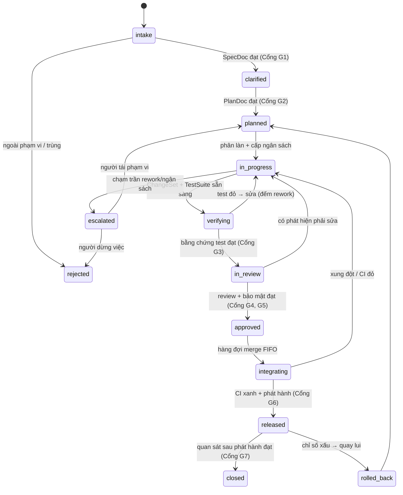
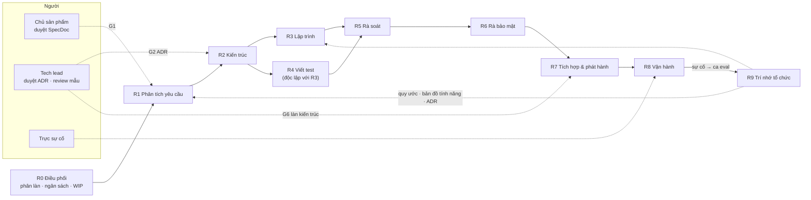

# ĐẶC TẢ — CÔNG TY LẬP TRÌNH AI (hệ thống đa agent)

> **Mã tài liệu:** SPEC-ASC-002 · **Phiên bản:** 1.1 · **Ngày:** 2026-09-04 · **Trạng thái:** Bản nháp để duyệt
> **v1.1:** sửa lỗi "bằng chứng do model tự khai" (§5.4, G3a) và thêm §15 — các cơ chế rút từ một triển khai
> thật, xem `docs/specs/LESSONS-FROM-CLAUDE-AGENTS.md` (SYNTH-001).
> **Nền tảng chạy trên:** `docs/specs/AI-HARNESS-SPEC.md` (SPEC-AIH-001) — tài liệu này **không** lặp lại
> phần hạ tầng harness; nó đặc tả **tổ chức** chạy trên hạ tầng đó.
> **Loại:** hệ thống đa agent thực hiện trọn vòng đời phát triển phần mềm, có người ở các chốt đã định.
> **Cách đọc:** §1–§3 là phần quyết định thiết kế; §4–§6 để xây; §7–§9 để vận hành và đo;
> §10 là phần dễ làm sai nhất — đọc trước khi thêm bất kỳ vai nào.

---

## 1. Luận điểm thiết kế

### 1.1 Cái gì thật sự là nút thắt

Dữ liệu ngành năm 2025–2026 nói cùng một điều: **AI làm tăng sản lượng nhưng làm giảm độ ổn định.**
Throughput tăng ~2–18%, trong khi tỉ lệ lỗi thay đổi và sự cố tăng mạnh; báo cáo ghi nhận
**sự cố trên mỗi PR tăng ~243%**, **72% tổ chức đã có ít nhất một sự cố production do mã AI sinh ra**,
và ở phân vị 75, **PR do agent tạo phải chờ review lâu gấp ~5.3 lần** PR thường.

Kết luận trực tiếp cho thiết kế:

> **Nút thắt của một công ty lập trình AI không phải là viết code — mà là NĂNG LỰC XÁC MINH.**
> Sinh code gần như miễn phí; niềm tin vào code thì không. Vì vậy **sản phẩm thật sự của tổ chức này
> là các CỔNG (gate) và BẰNG CHỨNG (evidence)**, còn agent viết code chỉ là nguyên liệu đầu vào.

Mọi quyết định trong đặc tả này bám một bất đẳng thức duy nhất:

```
Số việc chạy song song  ≤  Năng lực xác minh  (không phải: ≤ năng lực sinh code)
```

Vi phạm bất đẳng thức này là cách nhanh nhất để có một "công ty AI" tạo ra 50 PR/ngày và một đống nợ
kỹ thuật không ai dám merge.

### 1.2 Công ty là gì, nói theo ngôn ngữ kỹ thuật

Một công ty phần mềm **không phải** là một tập chức danh. Nó là:

| Thành phần | Trong đặc tả này |
|---|---|
| **Đơn vị công việc** có vòng đời | `WorkItem` + máy trạng thái (§3.1) |
| **Hợp đồng bàn giao** giữa các vai | Artifact có schema + tiêu chí chấp nhận (§5) |
| **Cổng** — điều kiện để đi tiếp | §6, mỗi cổng có chủ sở hữu duy nhất |
| **Phân tách đặc quyền** — ai được động vào cái gì | §3.4 |
| **Trí nhớ tổ chức** — cái công ty học được | §7 |
| **Đường leo thang** khi bế tắc | §6.4 |

Chức danh chỉ là **cấu hình** trên harness: một vai = (chính sách hệ thống + phạm vi công cụ +
khuôn ngữ cảnh + model/effort + cổng nó sở hữu). Không có "agent thông minh hơn" — chỉ có
**agent bị ràng buộc khác nhau**.

### 1.3 Bảy luật bất biến của tổ chức

| # | Luật | Vì sao |
|---|------|--------|
| **L1** | **Người viết không được là người duyệt.** Agent lập trình không có quyền merge; agent rà soát không có quyền ghi vào nhánh. | Phân tách đặc quyền là thứ duy nhất khiến "review" có nghĩa. Cùng một agent tự chấm mình luôn cho điểm cao. |
| **L2** | **Test sinh từ đặc tả, không sinh từ diff.** Agent viết test **không được đọc** `ChangeSet` trước khi viết bộ test theo spec. | Test viết từ code chỉ hoá thạch cái bug đang có. Đây là lỗi phổ biến nhất và tai hại nhất của "công ty AI". |
| **L3** | **Agent rà soát chỉ nhận diff + spec, không nhận lời giải thích của agent viết code.** | Chặn "thuyết phục giữa agent" — bản nội bộ của ASI09. Lý lẽ hay không làm code đúng hơn. |
| **L4** | **Năng lực xác minh là trần của WIP.** Hàng đợi review vượt ngưỡng ⇒ **dừng nhận việc mới**, không tăng agent viết code. | §1.1. |
| **L5** | **Mỗi vai tồn tại vì một lớp lỗi đo được.** 60 ngày không bắt được lỗi thuộc lớp đó ⇒ **xoá vai**. | Chống phình tổ chức theo kiểu bắt chước sơ đồ công ty thật. |
| **L6** | **Không có "họp".** Mặc định là hợp đồng artifact, không phải hội thoại giữa agent. Tranh luận đa agent chỉ bật khi eval chứng minh có lợi trên chính bài toán này. | Hội thoại giữa agent đốt token và tạo cảm giác an tâm giả. |
| **L7** | **Con người giữ đúng ba chốt:** chốt *yêu cầu*, chốt *kiến trúc*, chốt *phát hành rủi ro cao*. | Đây là ba chỗ sai thì tốn nhất, và là ba chỗ AI kém nhất: hiểu ý định, cân đánh đổi dài hạn, chịu trách nhiệm. |

---

## 2. Phạm vi & quan hệ với SPEC-AIH-001

### 2.1 Thừa hưởng nguyên vẹn từ harness (không đặc tả lại)
Vòng lặp ngoài xác định · `run_events` append-only · Tool Gateway là điểm nghẽn duy nhất ·
nhãn tin cậy ngữ cảnh · ngân sách 5 chiều · HITL · kill switch · telemetry OTel · bộ eval.

### 2.2 Cái tài liệu này thêm vào

| Thêm | Nội dung |
|---|---|
| **`WorkItem`** — đơn vị công việc cấp tổ chức, đứng **trên** `run` của harness | §3.1 |
| **Vai (Role)** — cấu hình agent có phạm vi công cụ và cổng riêng | §4 |
| **Artifact có hợp đồng** — sản phẩm bàn giao giữa các vai | §5 |
| **Cổng tổ chức** — khác cổng kỹ thuật của harness | §6 |
| **Trí nhớ tổ chức** — feature map, quy ước, ADR, vòng học từ sự cố | §7 |
| **Mức tự chủ L0–L4** — lộ trình trao quyền có điều kiện đo được | §11 |

### 2.3 Ánh xạ WorkItem ↔ run
Một `WorkItem` sinh **nhiều** `run` (mỗi lần một vai làm việc = một run trên harness).
`WorkItem.ledger` chỉ trỏ tới `run_id`; không nhân bản dữ liệu — nguồn sự thật vẫn là `run_events` (P2).

### 2.4 Ngoài phạm vi
Không đặc tả sản phẩm cụ thể mà công ty này xây · không thay thế hệ thống quản lý công việc sẵn có
(tích hợp vào, không dựng mới) · không bàn mô hình kinh doanh/định giá (đó là tài liệu khác).

---

## 3. Mô hình tổ chức

### 3.1 `WorkItem` — máy trạng thái



**Bất biến:** trạng thái chỉ đổi khi có **artifact đạt cổng**, không đổi vì một agent "nói là xong".

### 3.2 Ba làn — không phải việc nào cũng đi cùng một đường

| Làn | Áp dụng cho | Vai tham gia | Chốt người | Ngân sách mặc định |
|---|---|---|---|---|
| **Làn nhanh** | Sửa lỗi nhỏ có phạm vi rõ, nâng phiên bản phụ thuộc, sửa lint/typo, cập nhật tài liệu | R3, R4, R5, R7 | Không (từ mức tự chủ L2) | ≤ 15 bước · ≤ $1 · ≤ 30 phút |
| **Làn chuẩn** | Tính năng mới, sửa lỗi có ảnh hưởng chéo, refactor có phạm vi | R1→R7 đầy đủ | Duyệt SpecDoc (G1) | ≤ 120 bước · ≤ $15 · ≤ 8 giờ |
| **Làn kiến trúc** | Đổi schema, đổi hợp đồng API, breaking change, chạm bảo mật/thanh toán/dữ liệu người dùng thật | R1→R8 + ADR bắt buộc | Duyệt SpecDoc **và** ADR **và** phát hành | Không định trước — người cấp theo giai đoạn |

**Quy tắc phân làn (R0 quyết, ghi lý do):** nghi ngờ ⇒ **lên làn cao hơn**, không xuống.
Một việc bị đẩy xuống làn thấp sai là cách sự cố production ra đời.

### 3.3 Sơ đồ đội hình



> **Chú ý mũi tên R2 → R4:** agent viết test nhận việc từ **kế hoạch/đặc tả**, không từ agent lập trình.
> Đây là hiện thực của luật **L2** trên sơ đồ.

### 3.4 Phân tách đặc quyền (ma trận quyền — thực thi ở Tool Gateway, không phải bằng prompt)

| Vai | Đọc repo | Ghi nhánh | Chạy test | Merge | Đọc bí mật production | Gọi API bên ngoài |
|---|---|---|---|---|---|---|
| R0 Điều phối | ✅ | ❌ | ❌ | ❌ | ❌ | ❌ |
| R1 Phân tích | ✅ | ❌ (chỉ ghi `docs/`) | ❌ | ❌ | ❌ | ✅ (tra cứu) |
| R2 Kiến trúc | ✅ | ❌ (chỉ ghi `docs/adr/`) | ❌ | ❌ | ❌ | ✅ (tra cứu) |
| R3 Lập trình | ✅ | ✅ (nhánh của chính work item) | ✅ (sandbox) | ❌ | ❌ | ❌ |
| R4 Viết test | ✅ | ✅ (**chỉ** thư mục test) | ✅ (sandbox) | ❌ | ❌ | ❌ |
| R5 Rà soát | ✅ | ❌ | ✅ (chỉ chạy, không sửa) | ❌ | ❌ | ❌ |
| R6 Rà bảo mật | ✅ | ❌ | ✅ | ❌ | ❌ | ❌ |
| R7 Tích hợp | ✅ | ✅ (nhánh tích hợp) | ✅ | ✅ **có điều kiện cổng** | ❌ | ❌ |
| R8 Vận hành | ✅ | ❌ | ❌ | ❌ | ❌ (chỉ metric/log đã che) | ❌ |
| R9 Trí nhớ | ✅ | ✅ (**chỉ** `docs/`) | ❌ | ❌ | ❌ | ❌ |

**Không có vai nào có toàn quyền.** Không tồn tại "agent CTO". Quyền merge của R7 bị chặn bởi
điều kiện cổng kiểm tra ở gateway, không phải bởi lời dặn trong prompt (L1 + nguyên tắc P1 của harness).

---

## 4. Đặc tả các vai

Khuôn chung cho mọi vai:
`Vai = (lớp lỗi nó bắt, đầu vào, đầu ra, phạm vi công cụ, model/effort, cổng sở hữu, dấu hiệu vai này hỏng)`

> **Cột "model/effort" là khuyến nghị khởi điểm**, phải chỉnh theo đo đạc thật. Một quy tắc giữ nguyên:
> **R5 (rà soát) dùng model khác R3 (lập trình)** — hai model khác nhau có điểm mù khác nhau; cùng model
> nghĩa là điểm mù tương quan, và review mất phần lớn giá trị.

### 4.1 R0 — Điều phối giao hàng (Delivery Orchestrator)

| | |
|---|---|
| **Lớp lỗi nó bắt** | Làm sai việc · phạm vi phình · chạy song song quá năng lực xác minh · việc kẹt không ai biết |
| **Đầu vào** | Hàng đợi yêu cầu, trạng thái toàn bộ `WorkItem`, chỉ số hàng đợi review |
| **Đầu ra** | Quyết định phân làn (có lý do), cấp ngân sách, thứ tự ưu tiên, cảnh báo WIP |
| **Công cụ** | Đọc repo, đọc/ghi hệ quản lý công việc. **Không** ghi mã, **không** merge |
| **Model** | `claude-opus-5`, effort `medium` — việc phán đoán, ít token |
| **Cổng sở hữu** | **G0 — Nhận việc:** đủ thông tin tối thiểu? trùng việc đang chạy? đúng làn? |
| **Dấu hiệu hỏng** | `review_queue_depth` tăng liên tục · nhiều việc `escalated` vì phạm vi mơ hồ · WIP vượt trần |

**Quy tắc WIP (thực thi bằng code, không bằng phán đoán):**
```
WIP_max = floor(năng_lực_review_mỗi_giờ × thời_gian_review_mục_tiêu)
Nếu review_queue_depth > 2 × WIP_max  ⇒  NGỪNG nhận việc mới, báo người.
Không bao giờ xử lý ùn review bằng cách tăng số agent lập trình.
```

### 4.2 R1 — Phân tích yêu cầu (Intake / BA)

| | |
|---|---|
| **Lớp lỗi nó bắt** | Hiểu sai ý định · thiếu tiêu chí chấp nhận · yêu cầu mâu thuẫn với hệ thống hiện có |
| **Đầu vào** | Yêu cầu thô (issue, ticket, mô tả của người), `docs/FEATURE-MAP.md`, `PROJECT.md` |
| **Đầu ra** | **`SpecDoc`** (§5.2): vấn đề, phạm vi/ngoài phạm vi, tiêu chí chấp nhận kiểm chứng được, ca biên, tác động chéo |
| **Công cụ** | Đọc repo, tra cứu tài liệu, hỏi người (HITL) |
| **Model** | `claude-opus-5`, effort `high` |
| **Cổng sở hữu** | **G1 — Đặc tả rõ:** mọi tiêu chí chấp nhận đều **kiểm chứng được bằng máy hoặc bằng bước thao tác cụ thể**; ≤ 1 câu hỏi mở còn lại |
| **Dấu hiệu hỏng** | Việc quay lại `in_progress` nhiều vòng vì "hiểu sai yêu cầu"; người phải viết lại spec |

> **Bắt buộc:** yêu cầu mơ hồ ⇒ R1 **dừng và hỏi người**, không tự đoán (CLAUDE.md §9).
> Số câu hỏi gộp một lần, không hỏi lắt nhắt.

### 4.3 R2 — Kiến trúc (Architect)

| | |
|---|---|
| **Lớp lỗi nó bắt** | Giải pháp đặt sai chỗ · phá vỡ hợp đồng hiện có · thiếu migration/rollback · trùng lặp với thứ đã có |
| **Đầu vào** | `SpecDoc`, `docs/CONVENTIONS.md`, `docs/adr/`, sơ đồ phụ thuộc |
| **Đầu ra** | **`PlanDoc`** (§5.3): các bước, file đụng tới, hợp đồng interface, chiến lược test, migration + rollback, rủi ro. **ADR** nếu là quyết định kiến trúc |
| **Công cụ** | Đọc repo, ghi `docs/adr/`. **Không** ghi mã |
| **Model** | `claude-opus-5`, effort `xhigh` |
| **Cổng sở hữu** | **G2 — Kế hoạch đạt:** mỗi bước ≤ nửa ngày người · có chiến lược test cho từng tiêu chí chấp nhận · có đường lui |
| **Dấu hiệu hỏng** | Phải sửa kiến trúc giữa lúc lập trình · migration lỗi · phát hiện trùng lặp sau khi merge |

### 4.4 R3 — Lập trình (Implementer)

| | |
|---|---|
| **Lớp lỗi nó bắt** | (Vai sản xuất — không phải vai bắt lỗi) |
| **Đầu vào** | `SpecDoc` + `PlanDoc` + quy ước + **chỉ những file trong phạm vi kế hoạch** |
| **Đầu ra** | **`ChangeSet`** (§5.4): diff theo từng commit conventional, ghi chú tự đánh giá, danh sách file ngoài kế hoạch (nếu có, phải giải trình) |
| **Công cụ** | Đọc repo, ghi nhánh `work/<id>`, chạy test trong sandbox, chạy lint/type |
| **Model** | `claude-sonnet-5`, effort `xhigh` |
| **Cổng sở hữu** | **G3a — Tự kiểm:** build/type/lint/format xanh; không bí mật; không code chết; diff trong phạm vi |
| **Dấu hiệu hỏng** | Diff vượt phạm vi kế hoạch · sửa test để test xanh · số vòng rework > 2 |

> **Cấm tuyệt đối:** R3 **không được sửa test do R4 viết** để làm cho test xanh. Muốn đổi test ⇒
> mở yêu cầu tới R4 kèm lý do; R4 quyết. Vi phạm luật này là con đường ngắn nhất tới "xanh mà sai".

### 4.5 R4 — Viết test (Test Author) — độc lập với R3

| | |
|---|---|
| **Lớp lỗi nó bắt** | **Code chạy nhưng không đúng đặc tả** · thiếu ca biên · thiếu test hồi quy cho lỗi cũ |
| **Đầu vào** | `SpecDoc` + `PlanDoc` + **hợp đồng interface**. **KHÔNG đọc `ChangeSet` ở lượt đầu** (luật L2) |
| **Đầu ra** | **`TestSuite`**: test theo từng tiêu chí chấp nhận + ca biên + test hồi quy cho lỗi liên quan trong `incidents` |
| **Công cụ** | Đọc repo (trừ diff của R3 ở lượt 1), ghi **chỉ** thư mục test, chạy test |
| **Model** | `claude-sonnet-5`, effort `high` |
| **Cổng sở hữu** | **G3b — Bằng chứng test:** mỗi tiêu chí chấp nhận có ≥ 1 test ánh xạ 1–1; mọi nhánh logic phức tạp có ≥ 1 ca biên |
| **Dấu hiệu hỏng** | Lỗi lọt tới production ở vùng "đã có test" · test chỉ khẳng định lại cách cài đặt |

**Quy trình hai lượt:**
1. **Lượt mù:** viết test từ spec ⇒ chạy trên nhánh của R3 ⇒ **kỳ vọng có test đỏ**.
   Test đỏ ở đây là *tín hiệu tốt*: nó nói spec và code chưa khớp.
2. **Lượt bổ sung:** sau khi R3 sửa xong, R4 mới được xem diff để thêm test cho nhánh mã phát sinh.
   Test thêm ở lượt 2 được đánh dấu `derived_from_diff: true` và **không** được tính vào độ phủ tiêu chí chấp nhận.

### 4.6 R5 — Rà soát (Reviewer)

| | |
|---|---|
| **Lớp lỗi nó bắt** | Lỗi logic/ca biên · sai quy ước · trùng lặp · độ phức tạp thừa · lỗi hiệu năng rõ ràng |
| **Đầu vào** | **Chỉ:** diff + `SpecDoc` + `PlanDoc` + `docs/CONVENTIONS.md` + kết quả test. **Không** nhận phần "ghi chú tự đánh giá" của R3 (luật L3) |
| **Đầu ra** | **`ReviewReport`** (§5.5): danh sách phát hiện có mức độ, mỗi phát hiện kèm **kịch bản thất bại cụ thể** (đầu vào → kết quả sai) |
| **Công cụ** | Đọc repo, chạy test. **Không ghi** |
| **Model** | `claude-opus-5`, effort `xhigh` — **bắt buộc khác model của R3** |
| **Cổng sở hữu** | **G4 — Rà soát đạt:** 0 phát hiện mức *Chặn*; phát hiện mức *Nên sửa* có quyết định ghi lại |
| **Dấu hiệu hỏng** | Lỗi lọt production mà diff đã đi qua review · review toàn nhận xét chung chung không có kịch bản thất bại |

> **Quy tắc chống review hình thức:** một phát hiện không nêu được **kịch bản thất bại cụ thể**
> thì không phải phát hiện — nó là ý kiến, xếp vào mục *Gợi ý*, không chặn cổng.

### 4.7 R6 — Rà bảo mật (Security Reviewer)

| | |
|---|---|
| **Lớp lỗi nó bắt** | Thiếu kiểm tra quyền · injection (SQL/lệnh/prompt) · lộ bí mật · lộ dữ liệu chéo người dùng · phụ thuộc có lỗ hổng · logic nhạy cảm đặt sai phía client |
| **Đầu vào** | Diff + `SpecDoc` + mô hình mối đe doạ của hệ thống + kết quả quét phụ thuộc/bí mật |
| **Đầu ra** | `SecurityReport` — cùng khuôn `ReviewReport`, thêm ánh xạ tới OWASP tương ứng |
| **Công cụ** | Đọc repo, chạy công cụ quét (SAST, quét bí mật, quét phụ thuộc) |
| **Model** | `claude-opus-5`, effort `xhigh` |
| **Cổng sở hữu** | **G5 — Bảo mật đạt:** 0 phát hiện Cao/Nghiêm trọng; thay đổi chạm xác thực/phân quyền/thanh toán/dữ liệu người dùng ⇒ **bắt buộc người xem** |
| **Dấu hiệu hỏng** | Lỗ hổng phát hiện sau phát hành ở vùng diff đã qua G5 |

**Kích hoạt bắt buộc (không tuỳ chọn):** diff chạm `auth`, `payment`, `migration`, `policy`,
biến môi trường, cấu hình CI/CD, hoặc thêm phụ thuộc mới ⇒ R6 chạy, dù ở làn nào.

### 4.8 R7 — Tích hợp & phát hành (Integrator / Release)

| | |
|---|---|
| **Lớp lỗi nó bắt** | Xung đột merge · CI đỏ · migration không chạy được · phát hành không quay lui được · thứ tự merge sai |
| **Đầu vào** | `WorkItem` trạng thái `approved`, hàng đợi merge |
| **Đầu ra** | **`ReleaseRecord`** (§5.6): commit đã merge, kết quả CI, migration đã chạy, cách quay lui, phạm vi ảnh hưởng |
| **Công cụ** | Ghi nhánh tích hợp, chạy CI, merge (**có điều kiện cổng**), kích hoạt phát hành |
| **Model** | `claude-sonnet-5`, effort `medium` (việc quy trình, ít phán đoán) |
| **Cổng sở hữu** | **G6 — Sẵn sàng phát hành:** toàn bộ cổng trước đã đạt · nhánh đã cập nhật với `main` · CI xanh trên **đúng commit sẽ merge** · migration thuận & nghịch đã chạy thử · có kế hoạch quay lui |
| **Dấu hiệu hỏng** | `main` đỏ sau merge · phải hotfix ngay sau phát hành · quay lui thất bại |

**Quy tắc hàng đợi:** **FIFO, không nhảy cóc** — việc nào được duyệt trước merge trước; merge xong mới
cập nhật nhánh kế tiếp với `main` rồi tới lượt sau (khớp CLAUDE.md §8).

### 4.9 R8 — Vận hành (Ops / On-call agent)

| | |
|---|---|
| **Lớp lỗi nó bắt** | Hồi quy sau phát hành · trôi chỉ số · chi phí tăng bất thường · sự cố không ai để ý |
| **Đầu vào** | Telemetry, SLO, cảnh báo, `ReleaseRecord` gần nhất |
| **Đầu ra** | Phân loại sự cố (SEV), giả thuyết nguyên nhân **kèm bằng chứng**, đề xuất giảm thiểu, dự thảo post-mortem |
| **Công cụ** | Đọc metric/log (đã che dữ liệu nhạy cảm), đọc repo. **Không** đụng production |
| **Model** | `claude-haiku-4-5` cho phân loại thường trực; leo thang lên `claude-opus-5` khi SEV1/SEV2 |
| **Cổng sở hữu** | **G7 — Đóng việc:** sau phát hành N giờ, chỉ số trong ngưỡng ⇒ `closed`; ngoài ngưỡng ⇒ `rolled_back` |
| **Dấu hiệu hỏng** | Người phát hiện sự cố trước agent · cảnh báo nhiễu tới mức bị bỏ qua |

> **Ranh giới cứng:** R8 **không** tự thao tác lên production. Nó chuẩn bị lệnh + bằng chứng,
> người trực bấm. Đây là chốt L7 thứ ba.

### 4.10 R9 — Trí nhớ tổ chức (Archivist)

| | |
|---|---|
| **Lớp lỗi nó bắt** | Trôi quy ước · tài liệu lệch code · cùng một lỗi lặp lại · kiến thức chết theo từng work item |
| **Đầu vào** | `WorkItem` đã đóng, `ReviewReport`, `incidents`, ADR mới |
| **Đầu ra** | Cập nhật `docs/FEATURE-MAP.md`, `docs/CONVENTIONS.md`, chỉ mục ADR, **ca eval mới sinh từ sự cố** |
| **Công cụ** | Đọc repo, ghi **chỉ** `docs/` |
| **Model** | `claude-haiku-4-5`, effort mặc định — việc cơ học, phạm vi rõ |
| **Cổng sở hữu** | Không sở hữu cổng chặn; nhưng **G7 không đóng được** nếu sự cố chưa sinh ca eval (C4-FR-09 của harness) |
| **Dấu hiệu hỏng** | Cùng một lớp lỗi xuất hiện lần thứ ba · quy ước trong tài liệu khác quy ước trong code |

### 4.11 Vai của con người (không thể uỷ quyền cho agent)

| Vai người | Chốt sở hữu | Việc thật sự phải làm |
|---|---|---|
| **Chủ sản phẩm** | G1 — duyệt `SpecDoc` | Xác nhận "đây đúng là thứ cần làm", chấp nhận ngoài-phạm-vi |
| **Tech lead** | G2 (ADR) + review mẫu | Duyệt quyết định kiến trúc; **rà tay ngẫu nhiên ≥ 10% PR** để hiệu chuẩn niềm tin vào R5 |
| **Người trực sự cố** | Thao tác production | Bấm nút quay lui/khắc phục; quyết định mức SEV |
| **Người phê duyệt bảo mật** | G5 với thay đổi nhạy cảm | Xem tận mắt diff chạm quyền/thanh toán/dữ liệu thật |

> **Vì sao "review mẫu 10%" là bắt buộc:** đó là cách duy nhất biết R5 có còn tốt không.
> Không có mẫu người chấm, `first_pass_gate_rate` chỉ đo mức độ dễ tính của agent rà soát.

---

## 5. Hợp đồng bàn giao (artifact)

Mọi bàn giao giữa các vai là **artifact có schema**, không phải hội thoại (luật L6).
Artifact không hợp lệ ⇒ trả về vai sinh ra nó, tính một vòng rework.

### 5.1 `WorkItem` — đơn vị công việc

```json
{
  "id": "W-1042",
  "title": "Cho phép xuất báo cáo doanh thu theo tháng",
  "lane": "standard",                 // fast | standard | architecture
  "state": "in_review",
  "origin": { "type": "issue", "ref": "#318", "requested_by": "user:po@…" },
  "budget":   { "steps": 120, "cost_usd": 15, "wallclock_h": 8, "rework_max": 3 },
  "consumed": { "steps": 71,  "cost_usd": 6.4, "wallclock_h": 3.2, "rework": 1 },
  "artifacts": { "spec": "SPEC-W1042", "plan": "PLAN-W1042",
                 "changeset": "CS-W1042", "tests": "TS-W1042",
                 "review": "RV-W1042", "security": "SR-W1042" },
  "gates": { "G1": "passed", "G2": "passed", "G3a": "passed", "G3b": "passed",
             "G4": "pending", "G5": "not_started", "G6": "not_started", "G7": "not_started" },
  "ledger": ["run_01J…", "run_01K…"],   // trỏ tới run_events của harness, không nhân bản
  "blocked_on": null,
  "escalations": []
}
```

### 5.2 `SpecDoc` (R1 → G1)
```yaml
work_item: W-1042
problem: "…"                       # 1–2 câu, nói vấn đề của người dùng, không nói giải pháp
in_scope:   ["…"]
out_of_scope: ["…"]                # bắt buộc — chống phình phạm vi
acceptance_criteria:               # mỗi mục PHẢI kiểm chứng được
  - id: AC-1
    given: "người dùng có vai kế toán"
    when:  "chọn tháng 8/2026 và bấm Xuất"
    then:  "nhận file CSV đúng schema R-01, ≤ 5 giây với ≤ 50k dòng"
    verifiable_by: "test tự động"   # test tự động | bước thao tác cụ thể
edge_cases: ["tháng không có dữ liệu", "quyền bị thu hồi giữa chừng", "múi giờ"]
cross_impact: ["module báo cáo", "hạn mức xuất file"]
open_questions: []                 # G1 yêu cầu ≤ 1, và phải được người trả lời
```

### 5.3 `PlanDoc` (R2 → G2)
```yaml
work_item: W-1042
steps:                              # mỗi bước ≤ nửa ngày người
  - id: S-1
    goal: "Thêm endpoint POST /reports/revenue"
    files: ["api/reports.py", "api/schemas/report.py"]
    contract: "đầu vào {month, format} → 202 + job_id | 4xx theo bảng lỗi"
test_strategy:
  AC-1: "test tích hợp endpoint + test hiệu năng 50k dòng"
migration: { forward: "…", rollback: "…", data_backfill: false }
risks: ["khoá bảng khi tổng hợp — dùng truy vấn chỉ đọc từ replica"]
adr_required: false                 # true ⇒ chuyển làn kiến trúc, cần Tech lead duyệt
files_touched_expected: 6           # dùng để phát hiện diff vượt phạm vi ở G3a
```

### 5.4 `ChangeSet` (R3 → G3a)
```yaml
work_item: W-1042
branch: work/W-1042
commits: [{ sha: "…", message: "feat(reports): thêm endpoint xuất doanh thu" }]
files_changed: 6
files_outside_plan: []              # khác rỗng ⇒ phải giải trình, R5 xem kỹ chỗ này
# BẰNG CHỨNG DO CODE ĐIỀN — R3 không được ghi vào khối này (v1.1, xem SYNTH-001 §3.1)
evidence:
  verified_by: runner               # runner | unverified — model khai gì ở đây cũng bị ghi đè
  stack: python-uv                  # nhận diện từ repo thật; không nhận ra ⇒ verified_by: unverified
  build: pass
  lint: pass
  tests: { passed: 128, failed: 0 }
  secrets_scan: pass
  commit: "…"                       # runner tự commit rồi ghi lại, không tin lời khai
notes_for_reviewer: "…"             # KHÔNG chuyển cho R5 (luật L3); chỉ để người đọc khi cần
```

### 5.5 `ReviewReport` / `SecurityReport` (R5, R6 → G4, G5)
```yaml
work_item: W-1042
reviewer: "R5@opus-5"               # ghi model để đối chiếu về sau
findings:
  - id: F-1
    severity: blocking              # blocking | should_fix | suggestion
    file: "api/reports.py:88"
    claim: "Không kiểm tra quyền khi month thuộc kỳ đã khoá sổ"
    failure_scenario: "kế toán viên đã bị thu hồi quyền vẫn xuất được kỳ 07/2026"
    maps_to: "AC-1 · OWASP A01"     # với SecurityReport thì bắt buộc trường này
verdict: changes_requested          # approved | changes_requested
human_sample_reviewed: false        # true khi Tech lead rà tay mẫu
```

### 5.6 `ReleaseRecord` (R7 → G6)
```yaml
work_item: W-1042
merged_commit: "…"
ci: { run_id: "…", status: green, on_commit: "…" }   # phải đúng commit được merge
migration: { applied: ["2026_09_04_add_report_jobs"], rollback_tested: true }
affected: ["api/reports", "hạn mức xuất file"]
rollback_plan: "revert commit + chạy migration nghịch; không mất dữ liệu"
canary: { enabled: true, percent: 10, watch_minutes: 60 }
```

---

## 6. Cổng chất lượng

### 6.1 Bảng cổng — mỗi cổng có **đúng một** chủ sở hữu

| Cổng | Tên | Chủ | Điều kiện đạt (tóm tắt) | Chặn cái gì |
|---|---|---|---|---|
| **G0** | Nhận việc | R0 | Đủ thông tin tối thiểu · không trùng · đã phân làn có lý do | Việc rác vào hệ thống |
| **G1** | Đặc tả rõ | R1 + **Chủ sản phẩm** | Tiêu chí chấp nhận kiểm chứng được · ngoài-phạm-vi đã ghi · ≤ 1 câu hỏi mở | Làm sai việc |
| **G2** | Kế hoạch đạt | R2 (+ **Tech lead** nếu có ADR) | Bước ≤ nửa ngày · có chiến lược test cho từng AC · có đường lui | Sai kiến trúc |
| **G3a** | Bằng chứng mã | **Runner (code), không phải R3** | `evidence.verified_by = runner` · build/lint/test **thật theo stack của repo** xanh · không bí mật · diff trong phạm vi. Worktree không đổi ⇒ từ chối (không có PR rỗng); không chạy được ⇒ `unverified`, **không** đi tiếp | Bằng chứng giả |
| **G3b** | Bằng chứng test | R4 | Mỗi AC có test ánh xạ 1–1 · ca biên đủ · test viết mù đã chạy | "Xanh mà sai" |
| **G4** | Rà soát đạt | R5 | 0 phát hiện *Chặn* · mỗi phát hiện có kịch bản thất bại | Lỗi logic |
| **G5** | Bảo mật đạt | R6 (+ **người** với thay đổi nhạy cảm) | 0 phát hiện Cao/Nghiêm trọng · quét phụ thuộc & bí mật xanh | Lỗ hổng |
| **G6** | Sẵn sàng phát hành | R7 (+ **Tech lead** ở làn kiến trúc) | Nhánh cập nhật với `main` · CI xanh đúng commit · migration hai chiều đã thử · có kế hoạch quay lui | `main` đỏ, không quay lui được |
| **G7** | Đóng việc | R8 | Sau N giờ quan sát, chỉ số trong ngưỡng · sự cố (nếu có) đã sinh ca eval | Hồi quy âm thầm |

**Bất biến:** cổng chỉ có hai kết quả — **đạt** hoặc **không đạt**. Không có "đạt có điều kiện".
Muốn bỏ qua một cổng ⇒ phải là **quyết định của người**, ghi vào `WorkItem.escalations` kèm lý do.

### 6.2 Ma trận trách nhiệm (RACI rút gọn)

| Hoạt động | Quyết định | Làm | Được hỏi | Được báo |
|---|---|---|---|---|
| Chốt yêu cầu | **Chủ sản phẩm** | R1 | R2 | R0 |
| Chốt kiến trúc | **Tech lead** | R2 | R5, R6 | R0, R9 |
| Viết mã | R3 | R3 | — | R0 |
| Viết test | R4 | R4 | R2 | R5 |
| Duyệt thay đổi | R5 (+R6) | R5, R6 | — | R0 |
| Merge & phát hành | R7 *(có điều kiện cổng)* | R7 | R8 | Tất cả |
| Thao tác production | **Người trực** | Người trực | R8 | Tất cả |
| Cập nhật trí nhớ tổ chức | R9 | R9 | R5 | — |

### 6.3 Trần rework — chống vòng lặp vô tận

```
Mỗi WorkItem có rework_max (mặc định: 3 vòng).
Vòng 1 → 2: bình thường, agent tự sửa.
Vòng 3    : R0 bắt buộc xem lại — thường là SpecDoc hoặc PlanDoc sai, không phải mã sai.
Vượt 3    : chuyển state = escalated → NGƯỜI xử lý. Cấm sửa tiếp một cách máy móc.
```
> Ba vòng rework hầu như luôn là **triệu chứng của đặc tả sai**, không phải của lập trình kém.
> Sửa mã lần thứ tư là đốt tiền để đi sai hướng nhanh hơn.

### 6.4 Đường leo thang

| Tình huống | Leo thang tới | Trong bao lâu |
|---|---|---|
| Yêu cầu mơ hồ / nhiều cách hiểu | Chủ sản phẩm | Ngay, gộp câu hỏi một lần |
| Cần quyết định kiến trúc / breaking change | Tech lead + ADR | Ngay |
| Vượt trần rework hoặc trần ngân sách | R0 → Tech lead | Ngay |
| Phát hiện bảo mật Cao/Nghiêm trọng | Người phê duyệt bảo mật | ≤ 1 giờ |
| Sự cố production SEV1/SEV2 | Người trực (theo `docs/ops/incident-response.md`) | Ngay |
| Hai vai bất đồng và không giải quyết được bằng artifact | Tech lead | Không để agent "tranh luận" thêm vòng nào |

---

## 7. Trí nhớ tổ chức — thứ biến N agent thành một công ty

Một tập agent chạy song song **không phải là công ty**. Công ty là thứ **tích luỹ**.
Bốn vòng học bắt buộc, tất cả do R9 giữ:

| Vòng học | Đầu vào | Đầu ra | Nhịp |
|---|---|---|---|
| **Sự cố → ca eval** | `incidents` | Ca eval hồi quy trong bộ eval của harness (C4-FR-09) | Ngay khi đóng sự cố; **G7 không đóng nếu thiếu** |
| **Phát hiện review lặp lại → quy ước** | `ReviewReport` 30 ngày | Mục mới trong `docs/CONVENTIONS.md` + luật lint nếu tự động hoá được | Hàng tháng |
| **Thay đổi → bản đồ tính năng** | `ReleaseRecord` | `docs/FEATURE-MAP.md` cập nhật | Mỗi lần phát hành |
| **Quyết định → ADR** | `PlanDoc` có `adr_required` | ADR mới trong `docs/adr/` | Khi phát sinh |

**Quy tắc "lỗi lần thứ ba":** cùng một lớp phát hiện xuất hiện lần thứ 3 ⇒ **không** chỉ sửa lần đó nữa,
mà phải chọn một trong ba: (a) thêm luật lint/kiểm tra tự động, (b) sửa quy ước + khuôn mã,
(c) sửa hướng dẫn của vai liên quan. Ghi lại đã chọn cái nào.

> Đây là chỗ khác biệt lớn nhất giữa "chạy nhiều agent" và "có một công ty": công ty **giảm dần**
> tỉ lệ lỗi trên cùng một lớp; một đống agent thì lặp lại nó mãi mãi với giá rẻ hơn một chút.

---

## 8. Ngân sách, chi phí & định tuyến model

### 8.1 Ước tính chi phí một `WorkItem` làn chuẩn (0 vòng rework)

> Tính theo giá niêm yết: Opus 5 `$5/$25` · Sonnet 5 `$2/$10` · Haiku 4.5 `$1/$5` (mỗi 1M token vào/ra).
> **Đây là con số để lập ngân sách khởi điểm, không phải cam kết** — phải đo lại trên bài toán thật.

| Vai | Model | Token vào (ước) | Token ra (ước) | Chi phí |
|---|---|---|---|---|
| R1 Phân tích | Opus 5 | 80k | 10k | ~$0.65 |
| R2 Kiến trúc | Opus 5 | 120k | 12k | ~$0.90 |
| R3 Lập trình | Sonnet 5 | 600k | 60k | ~$1.80 |
| R4 Viết test | Sonnet 5 | 200k | 25k | ~$0.65 |
| R5 Rà soát | Opus 5 | 150k | 15k | ~$1.13 |
| R6 Rà bảo mật | Opus 5 | 100k | 8k | ~$0.70 |
| R7 Tích hợp | Sonnet 5 | 60k | 5k | ~$0.17 |
| R9 Trí nhớ | Haiku 4.5 | 50k | 5k | ~$0.08 |
| | | | **Tổng** | **~$6.1** |

Mỗi vòng rework thêm ~**$3.5** (R3 + R4 + R5 chạy lại). Cache prefix tốt cắt được phần lớn chi phí
token vào lặp lại — đo bằng `cache_read_input_tokens` (C1-FR-08 của harness).

### 8.2 Tỉ lệ chi phí xác minh — chỉ số sức khoẻ quan trọng

```
chi_phí_xác_minh = R4 + R5 + R6  ≈ $2.48 / $6.1  ≈ 40%
```

> **Heuristic:** nếu chi phí xác minh **< 20%** tổng chi, tổ chức đang sinh code nhanh hơn khả năng
> tin được nó — đúng cái bẫy ở §1.1. Nếu **> 60%**, hoặc đặc tả quá mơ hồ (R1 yếu) hoặc đang review
> những thứ đáng lẽ nên tự động hoá bằng lint/type.

### 8.3 Quy tắc định tuyến model
1. **Nâng `effort` trước, đổi model sau.** Đổi model làm mất tái dùng cache (cache theo model).
2. **R5 ≠ model của R3** — điểm mù không tương quan (§4).
3. Việc cơ học phạm vi rõ (R7, R9, phân loại của R8) ⇒ model rẻ; việc phán đoán (R1, R2, R5, R6) ⇒ model mạnh.
4. Ngân sách theo `WorkItem`, **không** theo agent. Chạm trần ⇒ `escalated`, không tự nâng trần.

---

## 9. Đo lường công ty

### 9.1 Bộ chỉ số

| Nhóm | Chỉ số | Ngưỡng khởi điểm |
|---|---|---|
| **Giao hàng (DORA)** | Tần suất phát hành · Thời gian từ commit tới production · **Tỉ lệ thay đổi gây lỗi** · Thời gian khôi phục | Tỉ lệ thay đổi gây lỗi **không được cao hơn** đường cơ sở người trước khi bật agent |
| **Chất lượng quy trình** | `first_pass_gate_rate` (qua cổng lần đầu) | ≥ 70% để lên mức tự chủ kế tiếp |
| | `rework_rounds` trung bình | ≤ 1.0 |
| | `escaped_defect_rate` (lỗi lọt production / work item) | Giảm hoặc bằng đường cơ sở |
| **Nút thắt** | `review_queue_depth` · `review_wait_p95` | Vượt 2× WIP_max ⇒ **dừng nhận việc** |
| **Con người** | `human_intervention_rate` (ngoài 3 chốt định sẵn) | ≤ 15% ở mức L2+ |
| | `human_sample_review_rate` | ≥ 10% PR, **không được giảm** |
| **Chi phí** | `cost_per_merged_pr` · `cost_per_escaped_defect` | Theo dõi xu hướng, không đặt trần cứng ban đầu |
| **An toàn** | Vi phạm phân tách đặc quyền (agent viết tự duyệt) | **0** — bất kỳ ca nào là sự cố SEV2 |

### 9.2 Chỉ số **cấm** dùng làm KPI
Số PR · số dòng code · số commit · "số agent đang chạy" · tốc độ sinh code.
Tất cả đều tăng dễ dàng bằng cách làm hỏng chất lượng, và đó chính xác là thất bại ở §1.1.

### 9.3 Đường cơ sở bắt buộc trước khi bật
Đo **8 tuần** chỉ số DORA + `escaped_defect_rate` của quy trình hiện tại (người) **trước** khi đưa agent vào.
Không có đường cơ sở thì mọi tuyên bố "AI giúp nhanh hơn" là không kiểm chứng được — và cũng
không phát hiện được lúc độ ổn định tụt.

---

## 10. Chống chỉ định (đọc kỹ — đây là chỗ hầu hết thất bại)

| ❌ Sai lầm | Vì sao hỏng | Làm đúng |
|---|---|---|
| **Thêm vai cho "giống công ty thật"** (agent CTO, agent VP, agent scrum master) | Mỗi vai thêm vào là thêm token, thêm độ trễ, thêm bề mặt lỗi — mà không bắt thêm lớp lỗi nào | Luật **L5**: vai nào không bắt được lớp lỗi đo được thì xoá |
| **Agent tự viết test cho code của chính nó** | Test hoá thạch bug; CI xanh vô nghĩa | Luật **L2**: R4 độc lập, viết mù từ spec |
| **Cho agent rà soát đọc lời giải thích của agent viết code** | Lý lẽ thuyết phục làm review dễ tính | Luật **L3**: chỉ diff + spec |
| **Cùng một model cho viết và duyệt** | Điểm mù tương quan — nó không thấy cái nó không thấy | R5 dùng model khác R3 |
| **Chạy 20 work item song song khi năng lực review là 3** | Hàng đợi review nổ; PR chờ lâu; merge ẩu | Luật **L4**: WIP ≤ năng lực xác minh |
| **Auto-merge khi CI xanh, mà CI chỉ có test do agent viết từ diff** | Tự chứng nhận vòng tròn | Auto-merge chỉ ở làn nhanh, và chỉ khi bộ test bao gồm test viết mù từ spec |
| **Cho một agent toàn quyền "để nhanh"** | Mất phân tách đặc quyền — sập cả L1 lẫn nguyên tắc bảo mật của harness | Ma trận quyền §3.4, thực thi ở Tool Gateway |
| **Để agent "họp"/tranh luận cho chắc** | Đốt token, tạo cảm giác an tâm giả, không tăng độ đúng | Hợp đồng artifact; bật tranh luận chỉ khi eval chứng minh |
| **Dùng số PR làm KPI** | Tối ưu đúng cái làm hỏng hệ thống | §9.2 |
| **Bỏ chốt người vì "agent làm tốt rồi"** | Mất khả năng hiệu chuẩn; trôi âm thầm nhiều tuần mới lộ | Giữ `human_sample_review_rate` ≥ 10% ở mọi mức tự chủ |
| **Sửa mã vòng thứ 4** | Gần như luôn là spec sai, không phải code sai | Trần rework §6.3 ⇒ leo thang |

---

## 11. Mức tự chủ L0–L4 — lộ trình trao quyền có điều kiện

Không "bật công ty AI" trong một lần. Mỗi mức có **điều kiện vào đo được**, và **luôn có đường lùi**.

| Mức | Agent được làm | Người vẫn giữ | Điều kiện để lên mức kế |
|---|---|---|---|
| **L0 — Trợ lý** | Đề xuất spec/plan/diff dưới dạng bản nháp | Mọi thứ | Đã có đường cơ sở 8 tuần (§9.3) + harness M0–M1 xong |
| **L1 — Sinh PR** | R1→R5 chạy, mở PR kèm test và báo cáo review | Người review và merge **mọi** PR | `first_pass_gate_rate` ≥ 70% trong 4 tuần · `escaped_defect_rate` ≤ đường cơ sở |
| **L2 — Tự chủ làn nhanh** | Tự merge **làn nhanh** khi mọi cổng xanh | Duyệt spec làn chuẩn · review mẫu ≥ 10% · mọi việc làn kiến trúc | **200 lần merge liên tiếp** ở làn nhanh không có lỗi lọt mức nghiêm trọng · vi phạm phân tách đặc quyền = 0 |
| **L3 — Tự chủ làn chuẩn** | Chạy trọn tính năng làn chuẩn | Chốt G1 (spec) · chốt G6 với thay đổi nhạy cảm · review mẫu | 8 tuần ở L2 với `change_failure_rate` ≤ đường cơ sở · `human_intervention_rate` ≤ 15% |
| **L4 — Tự chủ trong hàng rào** | Toàn bộ làn nhanh + chuẩn, tự phát hành theo canary | Chốt spec · giám sát · kill switch · **làn kiến trúc vẫn luôn có người** | Chỉ áp dụng cho hệ thống rủi ro thấp; cần phê duyệt quản trị (SPEC-AIH-001 §4.6) |

**Đường lùi bắt buộc:** bất kỳ mức nào, nếu 2 tuần liên tiếp `escaped_defect_rate` xấu hơn đường cơ sở
hoặc có 1 vi phạm phân tách đặc quyền ⇒ **tự động hạ một mức**, không cần họp bàn.

### 11.1 Lộ trình triển khai (ghép với mốc của harness)

| Đợt | Nội dung | Phụ thuộc harness | Cổng ra |
|---|---|---|---|
| **Đ1** | `WorkItem` + máy trạng thái + sổ cái trỏ `run_events` · R3 + R5 (hai vai tối thiểu có ý nghĩa) | M0–M1 | Một PR đi trọn G3a→G4 với người merge |
| **Đ2** | R1 + R2 + G1/G2 · làn nhanh vs chuẩn · trần rework | M2 | Việc mơ hồ bị chặn ở G1 thay vì lộ ra ở G4 |
| **Đ3** | **R4 độc lập** + quy trình hai lượt · G3b | M3 | Test viết mù bắt được ≥ 1 sai lệch spec/code thật |
| **Đ4** | R6 + R7 + G5/G6 · hàng đợi merge FIFO · canary | M3–M4 | `main` không đỏ trong 4 tuần |
| **Đ5** | R8 + R9 + G7 · bốn vòng học §7 · bảng chỉ số §9 | M4–M5 | Một sự cố thật đi trọn vòng: sự cố → ca eval → quy ước |

> **Thứ tự này có chủ đích:** R4 (viết test độc lập) đến **trước** R6/R7 vì nó là vai bảo vệ mạnh nhất
> trên mỗi đồng bỏ ra. Nếu chỉ đủ nguồn lực cho ba vai: **R3, R4, R5**.

---

## 12. Rủi ro & câu hỏi cần chốt

### 12.1 Sổ rủi ro

| Rủi ro | Ảnh hưởng | Giảm thiểu |
|---|---|---|
| **Năng lực người ở 3 chốt là trần thật của cả hệ thống** | Mở rộng agent không làm tăng sản lượng | Công thức định cỡ §12.2 — quyết định số work item song song từ số người, không từ số agent |
| Chất lượng review của R5 trôi mà không ai biết | Lỗi lọt production tăng dần | `human_sample_review_rate` ≥ 10%, theo dõi độ lệch giữa người và R5 |
| Nợ kỹ thuật tích tụ nhanh hơn tốc độ nhận ra | Hệ thống dần khó sửa | Chỉ số refactor/trùng lặp trong bảng §9; R9 vòng học quy ước |
| Agent tối ưu để "qua cổng" thay vì làm đúng | Cổng thành nghi thức | Xoay ca eval; review mẫu người; cấm R3 sửa test của R4 |
| Đặc tả sai lan xuống toàn bộ chuỗi rất nhanh | Rework nhiều vòng, tốn gấp bội | Trần rework §6.3 quy về xem lại spec, không xem lại mã |
| Chi phí tăng phi tuyến khi tăng song song | Vượt ngân sách | Ngân sách theo `WorkItem` + trần WIP + theo dõi `cost_per_merged_pr` |

### 12.2 Công thức định cỡ (dùng để trả lời "chạy được bao nhiêu việc song song")

```
Số work item song song tối đa
  = min(
      năng_lực_review_mẫu_của_người / 0.10,        # ràng buộc human_sample_review_rate ≥ 10%
      năng_lực_duyệt_spec_của_chủ_sản_phẩm,        # chốt G1
      WIP_max theo hàng đợi review                  # luật L4
    )
```
Ba số ở trên đều là **số người**, không phải số agent. Đây là câu trả lời trung thực cho câu hỏi
"công ty AI này lớn cỡ nào": nó lớn bằng **năng lực xác minh**, không bằng số agent bật lên.

### 12.3 Câu hỏi phải chốt trước khi xây

1. **Công ty này làm sản phẩm gì, trên repo nào?** (một codebase có sẵn hay greenfield — đổi hoàn toàn phần R2/R9)
2. **Có bao nhiêu người thật cho 3 chốt L7?** (con số này quyết định quy mô — §12.2)
3. **Đường cơ sở 8 tuần đã có chưa?** Nếu chưa, đó là việc đầu tiên, trước cả Đ1.
4. **Mức tự chủ mục tiêu trong 6 tháng:** L1, L2 hay L3?
5. **Ngưỡng phân làn cụ thể:** cái gì được tính là "làn nhanh" trong bối cảnh của bạn?
6. **Hệ quản lý công việc hiện có** (Jira/Linear/GitHub Issues) — tích hợp vào, không dựng mới.
7. **Mức chấp nhận lỗi lọt:** hệ thống này phục vụ nội bộ hay khách hàng trả tiền?
8. **Ngân sách token/tháng** và ai chịu trách nhiệm khi vượt.

---

## 13. Ánh xạ vào bộ khung của repo này

| Thành phần trong đặc tả | Đã có sẵn trong repo | Ghi chú |
|---|---|---|
| Cổng G3a/G4 | `/gate` + Báo cáo xác thực (CLAUDE.md §5, §7) | Dùng nguyên, thêm ràng buộc "R3 không sửa test của R4" |
| Cổng G4/G5 | skill `code-review`, `security-review` | R5/R6 chạy đúng hai skill này |
| G2 + ADR | `/adr` + `docs/adr/` | `PlanDoc.adr_required = true` ⇒ bắt buộc |
| R1 (đặc tả) | `/consult` + `PROJECT.md` | `SpecDoc` là bản rút gọn theo work item |
| R9 (trí nhớ) | `docs/FEATURE-MAP.md`, `docs/CONVENTIONS.md`, `/completion` | Bốn vòng học §7 |
| R8 (vận hành) | `/incident` + `docs/ops/incident-response.md` | G7 nối vào post-mortem |
| Hàng đợi merge FIFO | CLAUDE.md §8 | Đã là quy ước của khung |
| Mức tự chủ L0–L4 | `/auto` + `docs/framework/models-and-automation.md` | `/auto` hiện tương ứng ~L1–L2 |

---

## 14. Nguồn tham khảo (truy cập 2026-09-04)

- [Google DORA: software delivery caught up to AI coding tools (TechTarget)](https://www.techtarget.com/searchsoftwarequality/news/366631712/Google-DORA-Software-delivery-caught-up-to-AI-coding-tools) · [DORA 2025 — tác động của AI lên chỉ số (Faros)](https://www.faros.ai/blog/key-takeaways-from-the-dora-report-2025)
- [AI coding agent deployment metrics: 10x deployments, 83% more failures](https://larridin.com/blog/ai-coding-agent-dora-metrics) · [AI-native DORA metrics: đo giao hàng thời agent](https://larridin.com/blog/ai-native-dora-metrics)
- [The state of AI-native software delivery 2026 (Encore)](https://encore.dev/guides/state-of-ai-native-delivery-2026)
- [AI coding agents in 2026: coherence through orchestration, not autonomy (Mike Mason)](https://mikemason.ca/writing/ai-coding-agents-jan-2026/)
- [Effective strategies for asynchronous software engineering agents (arXiv)](https://arxiv.org/pdf/2603.21489) · [LLM-based multi-agent systems for software engineering (arXiv)](https://arxiv.org/pdf/2404.04834) · [Code as agent harness (arXiv)](https://arxiv.org/html/2605.18747v1)
- [Building production-ready AI agents in 2026 (MLflow)](https://mlflow.org/articles/building-production-ready-ai-agents-in-2026/)
- Nền tảng kỹ thuật: `docs/specs/AI-HARNESS-SPEC.md` (SPEC-AIH-001) và `docs/adr/0002-ai-harness-architecture.md`

---

---

## 15. Bổ sung v1.1 — cơ chế rút từ một triển khai thật

> Nguồn: `docs/specs/LESSONS-FROM-CLAUDE-AGENTS.md` (SYNTH-001), đọc repo `seeker19110/Claude-Agents`
> tại commit `a3544c1`. Mỗi mục dưới đây là **yêu cầu bổ sung**, mã `ASC-FR-xx`, ràng buộc BẮT BUỘC trừ khi ghi khác.

### 15.1 Tầng năng lực (skill) tách khỏi vai

| Mã | Yêu cầu |
|---|---|
| ASC-FR-01 | Năng lực dùng chung (test, bảo mật, quan sát, hợp đồng API…) là **tệp skill riêng**, không nhúng vào từng vai. Vai khai `skills` (nạp **toàn văn** — vai **chủ quản** lĩnh vực) và `skills_core` (nạp **rút gọn**: mục tiêu + quy trình + checklist — vai chỉ phải **tuân thủ**). |
| ASC-FR-02 | **Mỗi skill phải có ≥ 1 vai chủ quản nạp toàn văn.** Skill mồ côi ⇒ **lỗi khởi động hệ thống**, không phải cảnh báo. |
| ASC-FR-03 | Skill phải có mục `Quy trình` và `Checklist`; thiếu ⇒ lỗi khi nạp. |
| ASC-FR-04 | Cổng CI so **prompt tĩnh** (thân vai + toàn văn skill) với ngân sách khai báo của vai; vượt ngưỡng ⇒ đỏ. |

> *Lý do có số:* nhân bản năng lực qua nhiều vai đẩy prompt hệ thống lên ~175k token — một việc đi qua 6 vai
> tốn ~60k token **trước khi đọc dòng dữ liệu nào**. Bản rút gọn ~23% độ dài.
> Phân chia này biến giới hạn token thành **ranh giới trách nhiệm**: chủ quản quyết định sâu, vai khác chỉ phải đạt checklist.

### 15.2 Phân quyền ghi **tri thức** (bổ sung ma trận §3.4)

| Mã | Yêu cầu |
|---|---|
| ASC-FR-05 | Kho tri thức chung chia **namespace** (`prd`, `architecture`, `api-contract`, `schema`, `threat-model`, `infra`, `docs`, `knowledge`, `contract`…). **Mỗi namespace đúng một vai được ghi; mọi vai được đọc.** |
| ASC-FR-06 | Bảng namespace → chủ ghi là **nguồn sự thật có test**, đối chiếu với khai báo của vai; lệch ⇒ CI đỏ. |
| ASC-FR-07 | Quyền sở hữu **được phép đổi theo giai đoạn** và phải ghi rõ (vd `api-contract`: R2 khởi tạo → R3 backend cập nhật các phiên bản sau). |
| ASC-FR-08 | Artifact tri thức đi qua bus mang **toàn văn** (bus là nguồn sự thật, replay dựng lại được); bản lưu ra kho tệp chỉ là bản sao để người đọc và so sánh. |

### 15.3 Ngữ cảnh theo vai

| Mã | Yêu cầu |
|---|---|
| ASC-FR-09 | Mỗi vai khai **danh sách namespace được đọc toàn văn** và **trần ký tự đầu vào riêng** (không vượt trần toàn cục). Vai rà soát/QA/vận hành đặt trần thấp; vai lập trình cao hơn. |
| ASC-FR-10 | Namespace ngoài danh sách chỉ còn tóm tắt + cờ **`content_omitted`** — vai **biết mình đang thiếu** để đi hỏi hoặc mở tệp, **không đoán**. |
| ASC-FR-11 | Cắt ngữ cảnh phải **có nhãn** tại chỗ cắt và phát sự kiện `context_trimmed`. |

### 15.4 Cổng: tách rõ máy kiểm và người kiểm

| Mã | Yêu cầu |
|---|---|
| ASC-FR-12 | Checklist mỗi cổng chia **hai phần**: *(a)* **Code gửi kèm** — đúng các khoá mà hệ thống sinh ra, hiển thị trong hàng đợi duyệt; *(b)* **Người tự kiểm thêm** — không có khoá, người duyệt phải tự đọc và trả lời. |
| ASC-FR-13 | **Four-eyes cưỡng chế bằng code**: người duyệt ≠ người tạo; vi phạm là **lỗi ném ra**, không phải quy ước trong tài liệu. |
| ASC-FR-14 | Gate có **hạn chờ (mặc định 24h) và nhắc ở giữa hạn (12h)**. **Quá hạn KHÔNG tự đi tiếp** — chuyển leo thang cho người. *(Thay quy tắc "mặc định huỷ" ở §6.4 v1.0.)* |
| ASC-FR-15 | **Bế tắc là một loại cổng**, không phải ngoại lệ: việc `blocked` hoặc bị giám sát escalate ⇒ mở cổng `escalation` (duyệt = mở lại kèm gợi ý, từ chối = đóng việc). |

### 15.5 Cổng nghiệm thu khách hàng (bổ sung máy trạng thái §3.1)

| Mã | Yêu cầu |
|---|---|
| ASC-FR-16 | Với công ty **có khách hàng**, thêm cổng **`acceptance`** sau khi phát hành production: có trong hàng đợi duyệt, có hạn, có nhắc. |
| ASC-FR-17 | **Chữ ký của khách đóng cổng**; hệ thống **từ chối** nếu người ký trùng vai đại diện công ty. Kết quả `conditional` đóng cổng ở dạng *yêu cầu sửa*, phần còn lại đi qua luồng **thay đổi yêu cầu**. Việc chỉ `closed` khi khách chấp nhận. |
| ASC-FR-18 | Kịch bản nghiệm thu **ánh xạ 1–1 với tiêu chí Must** trong đặc tả đã duyệt; **không** thêm tiêu chí mới ở bước nghiệm thu. Lỗi đã biết phải nêu **trước** khi ký. |
| ASC-FR-19 | Bộ mẫu tài liệu thương mại là một phần của hệ: SOW/tiêu chí nghiệm thu · kịch bản UAT · yêu cầu thay đổi · biên bản sự cố · ghi chú phát hành · runbook. |

### 15.6 Điều kiện dispatch và nhãn rủi ro

| Mã | Yêu cầu |
|---|---|
| ASC-FR-20 | Việc **không có ước lượng token thì không được dispatch**; ngân sách cấp = ước lượng × 1.5. Việc phải ≤ 1 ngày người và ≤ trần token đã chốt. |
| ASC-FR-21 | **`risk_tags` là trường dữ liệu có schema**, không phải phán đoán: `auth · payment · pii · crypto · upload · admin · external-api`. Có bất kỳ tag nào ⇒ **bắt buộc** thêm rà soát bảo mật (R6) trước khi vào hàng đợi phát hành. |
| ASC-FR-22 | Phụ thuộc giữa các việc (`depends_on`) và độ ưu tiên là trường dữ liệu; việc có phụ thuộc chưa xong ở trạng thái `waiting`. **Việc bị bỏ KHÔNG thoả mãn phụ thuộc**: việc đang chờ nó chuyển `blocked`, không được dispatch trên nền thiếu code. |

### 15.7 Nhánh tích hợp (thay/bổ sung hàng đợi FIFO §4.8)

| Mã | Yêu cầu |
|---|---|
| ASC-FR-23 | Việc rẽ nhánh từ **nhánh tích hợp của hệ thống**, không từ `main` của khách; ứng viên phát hành `merge --no-ff` vào nhánh tích hợp **trước** khi chạy phát hành. Xung đột ⇒ huỷ ứng viên, làm lại **trên nền mới**. `main` của khách không bị chạm cho tới bước phát hành. |
| ASC-FR-24 | Mỗi vai lập trình làm trong **worktree riêng theo việc**; vai rà soát đọc **diff thật** của nhánh đó, không đọc mô tả. |

### 15.8 Cưỡng chế "prompt là code" bằng cổng offline

| Mã | Yêu cầu |
|---|---|
| ASC-FR-25 | Định nghĩa vai và skill có **số phiên bản**; đổi nội dung ⇒ tăng phiên bản, đi qua PR, rollback bằng revert. |
| ASC-FR-26 | **Golden snapshot**: CI tái sinh ảnh chụp prompt rồi so khác biệt; quên tái sinh ⇒ đỏ. Prompt phải **nhìn thấy được trong diff**. |
| ASC-FR-27 | **Bản ghi eval bắt buộc**: danh sách vai bắt buộc có bản ghi tươi; thiếu bản ghi, **hoặc bản ghi tạo ở phiên bản prompt cũ hơn**, ⇒ CI đỏ. CI chạy **phát lại, không gọi model** — cổng có răng mà không tốn tiền. |
| ASC-FR-28 | Bản ghi eval là **artifact có phiên bản, không phải cache**: xoá đi là mất bằng chứng, không phải mất tốc độ. |

### 15.9 Định tuyến model: hai chế độ ngang hàng (bổ sung §8.3)

| Mã | Yêu cầu |
|---|---|
| ASC-FR-29 | Hệ thống hỗ trợ **hai chế độ chi phí ngang hàng**: *(a)* mua token qua API (bảng giá §8.1); *(b)* **chạy bằng gói đăng ký sẵn có** qua CLI/proxy cục bộ, xoay vòng nhiều tài khoản, gói hết hạn mức thì tự nghỉ và lượt đó đi gói kế. Đổi chế độ bằng **cấu hình, không đổi mã hay prompt**. |
| ASC-FR-30 | Vai khai **tier** (`strong` / `standard` / `light`), không khai tên model. **Không bao giờ hạ tier của yêu cầu** — chỉ nâng khi backend không có model cho tier đó. |
| ASC-FR-31 | Bảng vai → tier phải ghi **lý do** theo 4 tiêu chí: độ sâu suy luận · hậu quả nếu sai và có lớp nào bắt phía sau · độ phức tạp đầu ra · tần suất chạy. **Mọi lần đổi tier phải kèm bằng chứng eval**, kể cả lần đảo ngược quyết định cũ. |
| ASC-FR-32 | Đo **tiền**, không chỉ đo token: mỗi lượt gọi quy ra chi phí; giám sát cắt theo ngân sách việc **và** ngân sách dự án. |

### 15.10 Giao diện vận hành

| Mã | Yêu cầu |
|---|---|
| ASC-FR-33 | Trang trực ban **chỉ đọc mặc định**; quyền duyệt cổng, đổi cấu hình, giao việc mới nằm sau **cờ bật riêng biệt**; phiên có token riêng mỗi lần chạy. Least privilege áp cho **cả giao diện người dùng vận hành**, không chỉ cho agent. |

---

**Hết đặc tả SPEC-ASC-002 v1.1.**
Thay đổi đi qua PR + tăng số phiên bản ở đầu tài liệu. Thêm/xoá một vai ⇒ phải nêu **lớp lỗi**
vai đó bắt (luật L5) và cập nhật ma trận quyền §3.4 **và** ma trận chủ ghi tri thức (ASC-FR-05).
